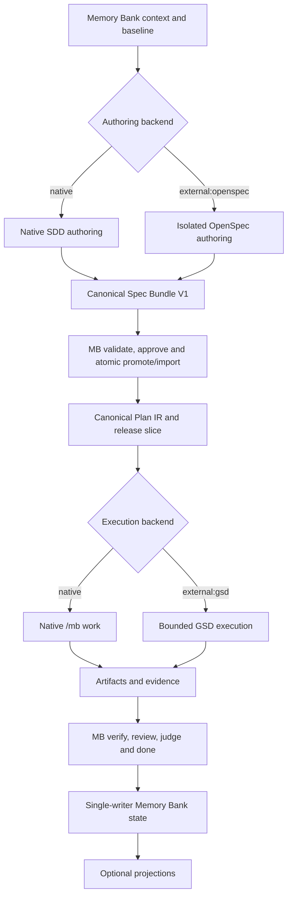
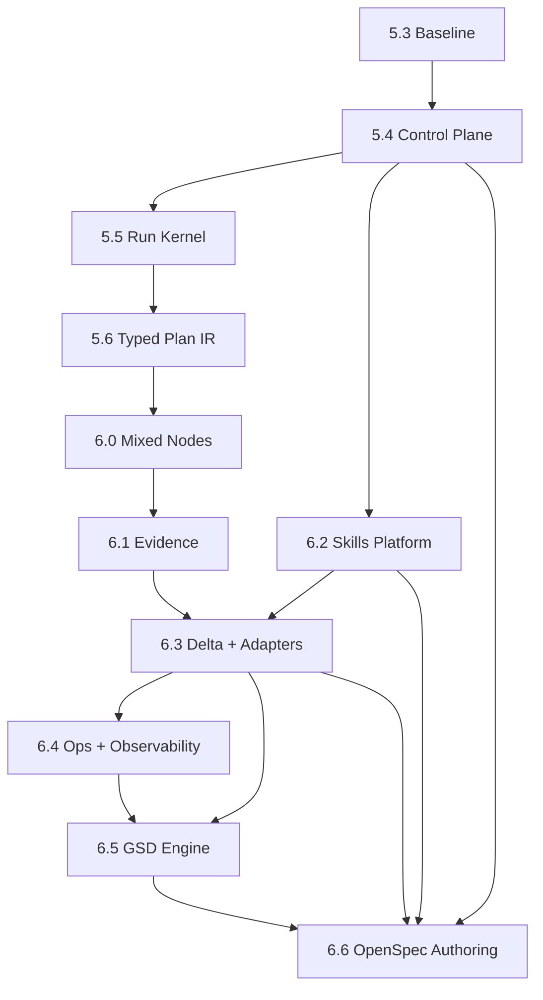

# Memory Bank Evolution: подробная SDD-спецификация и релизный план

> Назначение документа: быть исходным контекстом для самого Memory Bank. Сначала Memory Bank должен нормализовать этот документ через `/mb sdd`, проверить требования и дизайн, и только после этого переходить к реализации через `/mb work`.

## 0. Обязательный протокол запуска

Этот раздел нормативный. Исполнитель не должен начинать кодирование непосредственно из данного файла.

### 0.1 Первый запуск программы

1. Выполнить `/mb start` и зафиксировать фактический baseline: `VERSION`, HEAD SHA, состояние CI, незакоммиченные изменения, открытые specs и планы.
2. Поместить этот документ в контекст активного банка, не создавая второго хранилища состояния.
3. Выполнить discovery-часть SDD, используя этот документ как основной контекст. Задавать пользователю только вопросы о действительно неоднозначных или необратимых решениях:

   ```text
   /mb discuss mb-donor-evolution
   ```

4. Выполнить SDD-этап для umbrella-topic `mb-donor-evolution`:

   ```text
   /mb sdd mb-donor-evolution
   ```

   Native authoring остаётся default. После релиза v6.6.0 пользователь может явно выбрать
   `/mb sdd mb-donor-evolution --authoring external:openspec`; это меняет только authoring backend,
   но не владельца canonical spec и не execution backend.

5. Заполнить созданные файлы содержанием из этого документа:

   ```text
   .memory-bank/specs/mb-donor-evolution/requirements.md
   .memory-bank/specs/mb-donor-evolution/design.md
   .memory-bank/specs/mb-donor-evolution/tasks.md
   ```

6. Requirements должны использовать EARS и стабильные REQ-ID из раздела 8. Design должен закрепить контракты разделов 5–7. Tasks должны быть разбиты по релизам и не смешивать несколько релизных gates в одной задаче.
7. Выполнить строгую валидацию до реализации:

   ```bash
   bash scripts/mb-spec-validate.sh mb-donor-evolution
   bash scripts/mb-traceability-gen.sh
   ```

8. Создать plan-as-wrapper только для первого релиза. Не создавать один исполняемый mega-plan на всю программу.
9. Запустить реализацию первого релиза:

   ```text
   /mb work mb-donor-evolution --workflow governed-execution --contract
   ```

   Диапазон задач должен ограничиваться текущим релизом через wrapper frontmatter `tasks:` или `--range`.
10. После релизного gate выполнить `/mb verify`, затем `/mb done`. Публикация тега, GitHub Release, PyPI/Homebrew и push выполняются только по отдельному явному разрешению пользователя.

### 0.2 Протокол каждого следующего релиза

Перед каждым новым релизом исполнитель обязан:

1. Актуализировать umbrella-spec и создать release-slice spec или plan-as-wrapper.
2. Перепроверить зависимости и baseline предыдущего релиза.
3. Провести SDD delta-review: изменились ли требования, интерфейсы, риски или capability matrix.
4. Запустить только задачи текущего релиза через governed `/mb work`.
5. Закрыть release gate свежими доказательствами.
6. Заархивировать выполненный plan и записать измеримую ценность в `progress.md` и `CHANGELOG.md`.

### 0.3 Запрещённые shortcuts

- Не реализовывать задачи до валидного spec triple.
- Не отмечать DoD выполненным по самоотчёту агента.
- Не объединять P0–P3 в один long-running run.
- Не создавать отдельный runtime рядом с `/mb work`.
- Не создавать второй источник истины рядом с `.memory-bank/`.
- Не переносить Archon или Ruflo runtime, swarm, daemon, AgentDB или learning layer.
- Не считать существование файла доказательством его валидности или готовности.
- Не делать GitHub, issue numbers, git commits или worktrees обязательными для всех hosts.
- Не позволять OpenSpec выполнять implementation/lifecycle-команды внутри Memory Bank-managed SDD.
- Не синхронизировать OpenSpec workspace с canonical specs в фоне или без approval digest.

---

## 1. Executive summary

Цель программы — превратить Memory Bank из развитого набора памяти, SDD и governed-work инструментов в переносимый long-session engineering system, сохранив его главный контракт: **агенты помнят, состояние принадлежит проекту, дорогие режимы остаются opt-in**.

Целевая формула:

```text
Memory Bank persistent memory
+ GSD-style long-session execution kernel
+ OpenSpec-style specification control plane and optional authoring backend
+ Archon-style typed workflow execution semantics
+ Superpowers-style task isolation, file handoff and evidence discipline
+ wshobson/agents + addyosmani skill registry, portability and evals
+ CCPM task-stream and optional GitHub projection
+ selected Ruflo Plan IR and replanning semantics
- duplicate runtimes, duplicate state, swarm infrastructure and opaque learning
```

Программа разбита на одиннадцать релизов. P0 сначала создаёт надёжный baseline, control plane, resumable run-state, typed execution nodes и проверяемый Plan IR. P1 стабилизирует изолированное mixed-node wave execution, evidence/UAT и skill platform. P2 добавляет внешнюю проекцию, delta specs, общий adapter для optional external executors, bounded GSD execution и optional OpenSpec authoring. P3 завершает adaptive replanning, event-driven observability и эксплуатационную диагностику.

## 2. Проверенный baseline

На момент подготовки документа актуальная ветка `fockus/skill-memory-bank/main` содержит `VERSION=5.2.0`. Уже реализованы:

- `.memory-bank/` как долговременное состояние проекта;
- Kiro/EARS SDD triple и исполняемые `<!-- mb-task:N -->`;
- composable `/mb work` с workflow presets;
- durable work-state, budget, claims и resume primitives;
- governed verification, review ensemble, judge и bounded fix loop;
- handoff-v2, PreCompact/SessionStart recovery и progress hash chain;
- Dynamic Flow firewall, sprint contracts, trend/pivot и risk-aware gates;
- capability-aware dispatch и несколько host adapters;
- GraphRAG-lite, session memory, traceability и deterministic checks.

Следовательно, программа не должна заново создавать SDD, review, memory, handoff или adapter foundations. Она должна связать их более строгими machine contracts и long-session state machine.

### 2.1 Draft, который требуется заменить

Существующий spec `.memory-bank/specs/parallel-pipeline/` считать **superseded архитектурно**, но использовать как источник требований и тестовых сценариев.

Причины:

- он создаёт отдельный `/mb run`, конкурирующий с `/mb work`;
- он предполагает общий writable `.memory-bank` через symlink между worktrees;
- его task list остаётся невыполненным;
- GSD-style execution требует thin orchestrator, worker-specific handoffs и одного writer для канонического состояния;
- host capabilities неодинаковы, поэтому parallel worktree execution не может быть универсальным обещанием.

Новое решение: расширить `/mb work` версионированным execution engine. Допустим совместимый alias `/mb run → /mb work --parallel` только после стабилизации, но не отдельная state machine.

## 3. Цели, нецели и пользовательская ценность

### 3.1 Цели

1. Длительная работа переживает compaction, новую сессию, падение процесса и частично завершённую wave без повторного выполнения готовых задач.
2. Основной orchestrator остаётся тонким: выбирает ready nodes, выдаёт scoped manifests, принимает отчёты и единолично обновляет канонический bank state.
3. Требования, дизайн, планы, задачи, доказательства и релизы связаны проверяемыми DAG и traceability.
4. Параллельность включается только для доказанно независимых задач с безопасной изоляцией.
5. Любое заявление о завершении имеет свежий evidence manifest.
6. Skills, agents, commands и adapters имеют единый registry, совместимые контракты и evals.
7. GitHub остаётся опциональной проекцией локального состояния, а не source of truth.
8. Replanning изменяет только незавершённый хвост графа и оставляет audit trail.
9. Default sequential/economic flow остаётся доступным и предсказуемым.
10. Execution graph типизирован: AI reasoning, deterministic checks/transforms, loops, approvals и cancellation имеют разные контракты и state transitions.
11. Conditional branches, fan-in и skipped/failed dependencies обрабатываются явными `condition` и `join_policy`, а не неформальным prompt logic.
12. Авторинг спецификаций и исполнение выбираются независимо; любой authoring backend сначала нормализуется в canonical Memory Bank spec bundle и Plan IR.
13. Поддерживаются четыре независимых режима: native→native, native→GSD, OpenSpec→native и OpenSpec→GSD с одинаковой canonical semantics.

### 3.2 Нецели

- Fork, vendoring или полный порт OpenSpec CLI, Stores/worksets и beta Stores.
- Использование OpenSpec `apply`, `sync`, `archive`, `bulk-archive`, `onboard` или implementation-oriented `verify` как lifecycle authority Memory Bank.
- Полный порт GSD command surface и обязательных commit semantics.
- Полный порт Superpowers или его mandatory brainstorming/TDD для каждого типа работы.
- Полный порт Archon runtime: Bun monorepo, SQLite/PostgreSQL, server/Web UI, auth, credential vault и chat-platform adapters.
- Ruflo swarm topologies, consensus, MCP microkernel, daemon, vector memory, Q-learning или AgentDB.
- Автоматический push, merge, issue creation или release publication без разрешения.
- Универсальная параллельность на host, который не даёт безопасной изоляции.
- Замена Markdown как человекочитаемого интерфейса Memory Bank.
- Real-time dashboard до появления подтверждённой потребности.

### 3.3 North-star outcome

Пользователь должен иметь возможность запустить большой feature через SDD, закрыть сессию в любой момент и затем продолжить командой `/mb work --resume`, получив детерминированный следующий шаг, без повторной реализации и без доверия к истории чата.

---

## 4. Доноры и границы заимствования

| Донор | Что переносим | Что не переносим | Приоритет |
|---|---|---|---|
| GSD | milestone/phase/plan hierarchy, fresh contexts, thin orchestrator, wave execution, PLAN↔SUMMARY ledger, resume, UAT/gap closure, context headroom | полный CLI, обязательные commits, одинаковое worktree-обещание для всех hosts | P0–P1 |
| OpenSpec | artifact DAG, ready/blocked status, exact context files, JSON diagnostics, delta specs, validate-before-write; optional upstream authoring backend через versioned adapter | fork/vendor runtime, Stores, generated command explosion в core, file-exists=done, implementation/archive authority | P0/P2 |
| Archon `dev` | typed mixed-node execution DAG, conditions, join rules, bounded loops, approvals, run events, typed outputs, capability tiers, workflow precedence | Bun/DB/server/UI runtime, второй state store, shared-checkout parallel writers, best-effort mandatory artifacts | P0–P3 |
| Superpowers | file-based handoff, bounded task briefs, worktree/git safety, evidence-first verification, pressure evals | brainstorm-always, strict TDD для docs/config, обязательный reviewer на trivial task | P1 |
| wshobson/agents | agent/skill catalog patterns, role composition, discoverability | копирование большой коллекции агентов | P1 |
| addyosmani/agent-skills | portable skill format, progressive disclosure, skill eval methodology | дублирующие skills и framework-specific instructions в core | P1 |
| CCPM | task dependencies, stream analysis, owned/shared paths, optional GitHub mapping | shared-worktree concurrency, issue ID как local ID, direct merge/push, shell parsing YAML | P0/P2 |
| Ruflo | Plan IR: preconditions, effects, cost, replan triggers; barrier/pipeline semantics | runtime, swarm, daemon, AgentDB, learning, consensus | P0/P3 |

**Archon version boundary.** Актуальный Archon — workflow engine на ветке `dev`; анализ зафиксирован на commit [`6045848`](https://github.com/coleam00/Archon/commit/60458483ec933c12bb8cbf6a2b0c7f27b986762d) от 2026-07-09. Старый Python/Supabase продукт с RAG, Kanban и MCP task server находится только в `archive/v1-task-management-rag`. Из архивной версии допустимы лишь идеи optional external-knowledge adapter: source provenance, project-scoped retrieval, отдельный поиск prose/code examples и citations. Её task store, Supabase/pgvector и microservices не входят в core Memory Bank.

---

## 5. Архитектурные инварианты

Эти правила должны стать blocking checks.

### INV-01 — Один source of truth

Каноническое состояние живёт только в `.memory-bank/`. Runtime artifacts внутри `.memory-bank/runs/` являются частью банка, а не отдельной памятью.

### INV-02 — Один writer канонических файлов

Только orchestrator может изменять `STATUS.md/status.md`, `roadmap.md`, `checklist.md`, `progress.md`, `traceability.md` и run index. Workers пишут только в назначенный им source worktree и уникальный result directory.

### INV-03 — Fresh heavy contexts

Research, plan, plan-check, implementation, verification и gap-diagnosis должны выполняться свежими scoped agents, когда host имеет spawn capability. Orchestrator не должен писать production code в engine-v2 режиме.

### INV-04 — Explicit state

Состояние не выводится только из наличия файлов. Каждый artifact/task/run имеет явный status и validation record.

### INV-05 — Validate before dispatch/write

Artifact DAG, Plan IR, host capabilities, file ownership и release gate валидируются до запуска workers или мутации remote state.

### INV-06 — No unsafe parallel fallback

Если task scopes пересекаются, worktree base unsafe, host не поддерживает нужную изоляцию или capability probe не прошёл, система выполняет задачи последовательно либо останавливается согласно policy. Она не имитирует параллельность.

### INV-07 — Evidence before completion

`done`, release readiness и judge GO невозможны без свежего evidence manifest, связанного с baseline/head SHA и REQ-ID.

### INV-08 — Immutable completed history

Replanning не переписывает завершённые nodes и evidence. Изменения незавершённого графа сохраняются как delta с причиной.

### INV-09 — Defaults remain economical

Без явного opt-in `/mb work` продолжает экономичный последовательный flow. Новые heavyweight stages включаются по risk/flags/project config.

### INV-10 — Remote systems are projections

GitHub/Linear/другие trackers получают проекцию стабильных local IDs. Потеря remote доступа не делает локальный plan неисполняемым.

### INV-11 — Typed execution semantics

Каждый execution node имеет ровно один kind и валидный contract. Safety-critical поля для неподдерживаемого node/provider не могут silently игнорироваться или превращаться в warning.

### INV-12 — Deterministic completion wins

AI completion signal (`DONE`, `<promise>COMPLETE</promise>` и аналоги) является только hint. Переход в `verified`/`done` требует deterministic completion gate и свежей evidence.

### INV-13 — Critical journals are not best-effort

Run transition, approval, mandatory artifact и evidence ledger записываются атомарно и fail closed. Только telemetry/UI events могут быть best-effort.

### INV-14 — Provider session is an optimization

Provider session resume допускается для экономии контекста, но не является канонической памятью. Correctness и resume восстанавливаются из `.memory-bank/` artifacts/events даже при утрате provider session.

### INV-15 — External executor is subordinate

GSD, Archon или другой внешний backend может исполнять скомпилированный graph, но не изменяет canonical Memory Bank напрямую. `external succeeded` не означает `Memory Bank done` без независимой verification.

---

## 6. Целевая архитектура

`specification.authoring_backend` и `execution.backend` являются независимыми осями.
Memory Bank нормализует результат любого authoring backend до собственного approved spec bundle;
исполнители получают только canonical Plan IR и никогда не читают raw OpenSpec artifacts напрямую.

```yaml
specification:
  authoring_backend: native          # native | external:openspec
execution:
  backend: native                    # native | external:gsd
```



### 6.1 Слои

1. **Memory layer** — существующие project context, specs, plans, decisions, progress, lessons и code graph.
2. **Control plane** — artifact profiles, DAG, validators, status/instructions JSON API, authoring boundary, canonical promote/import и approval.
3. **Planning plane** — Plan IR, dependencies, scopes, risks, costs, verification и replanning rules.
4. **Workflow compilation plane** — typed execution nodes, conditions, join policies, output schemas, deterministic/AI boundaries и backend-neutral graph.
5. **Execution plane** — run state, waves, bounded loops, approvals, worker leases, worktrees/capability degradation и file handoff.
6. **Assurance plane** — evidence manifests, UAT, review/judge, gap plans и release gates.
7. **Extension plane** — skill/provider registry, native bundle projector, OpenSpec authoring adapter, native/GSD/Archon executor adapters, evals, external knowledge sources и optional projections.

### 6.2 Предлагаемая структура файлов

```text
project-root/
  .memory-bank/
    specs/<topic>/
      requirements.md
      design.md
      tasks.md
      artifact-state.json
      deltas/                    # optional, P2
    authoring/<change-id>/
      attempts/<attempt>/
        canonical-bundle.json
        semantic-diff.json
        diagnostics.json
        approvals/
        promotion-receipt.json     # native only
        external-openspec/         # external only
          descriptor.json
          source-snapshot.json
          upstream-artifacts/
          import-transaction.json
          import-receipt.json
    plans/
    runs/
      index.json
      <run-id>/
        state.json
        plan.ir.json
        events.jsonl
        context-manifest.json
        nodes/<node-id>.json
        dispatch/<task-id>.json
        results/<task-id>.json
        summaries/<task-id>.md
        artifacts/<semantic-type>/
        approvals/<node-id>-<attempt>.json
        evidence/<task-id>.json
        verification.md
        uat.md
        replans/
        external/<backend>.json  # optional external run reference only
    integrations/
      github-map.json             # optional
      engines.lock.json           # optional execution pairings
      authoring.lock.json         # optional authoring pairings
    tmp/runs/<run-id>/raw/        # ephemeral logs, never source of truth
  .mb-workspaces/
    openspec/<change-id>-<attempt>/
      openspec/                    # reconstructible isolated workspace
```

Completed run compaction may remove raw logs, but must retain `state.json`, `plan.ir.json`, `events.jsonl`, node/artifact manifests, approvals, summary, evidence index и verification result.

---

## 7. Нормативные machine contracts

Все schemas должны иметь `schema_version`, deterministic validation и migration tests. JSON mode печатает один JSON document в stdout; human-readable пояснения идут в stderr.

### 7.1 Artifact DAG profile

```yaml
schema_version: 1
profile: sdd-release
artifacts:
  - id: requirements
    path: specs/{topic}/requirements.md
    requires: []
    validators: [ears, req_id_unique]
  - id: design
    path: specs/{topic}/design.md
    requires: [requirements]
    validators: [design_sections, decision_links]
  - id: tasks
    path: specs/{topic}/tasks.md
    requires: [requirements, design]
    validators: [task_markers, covers, dod, testing]
  - id: release_plan
    path: plans/{release_plan}.md
    requires: [tasks]
    validators: [release_slice, plan_ir_ready]
apply:
  requires: [release_plan]
```

Artifact states:

```text
missing → draft → valid → ready → claimed → running → verified → done
                         ↘ blocked / failed
```

Переходы осуществляются только validator/orchestrator. `present` не равно `valid`.

### 7.2 Plan IR

```yaml
schema_version: 1
plan_id: mb-v5-5-run-kernel
release: 5.5.0
goal: "Resume a long coding session deterministically"
baseline_sha: "<git-sha>"
nodes:
  - id: RK-03
    kind: agent
    goal: "Persist resumable run state"
    phase: implement
    depends_on: [RK-01, RK-02]
    condition: null
    join_policy: all_succeeded
    conflicts_with: []
    preconditions: ["schemas validated", "bank writable"]
    expected_effects: ["run state survives process exit"]
    inputs:
      context_bundle: "artifact://run/context"
      artifacts: ["artifact://schemas/run-state"]
    output:
      semantic_type: implementation-result
      schema_ref: node-result-v1
      required: true
    context: {mode: fresh, bootstrap_artifacts: []}
    policy:
      owned_paths: ["scripts/mb-run-state.py", "tests/pytest/test_run_state.py"]
      read_only_paths: ["scripts/mb-work-state.sh", "commands/work.md"]
      tools: [read, edit, shell]
      risk: medium
    retry: {max_attempts: 2, classes: [transient]}
    timeout_ms: 1800000
    cost: {context_pct_max: 50, expected_dispatches: 1, budget_usd: null}
    completion_gate:
      kind: evidence
      required_checks: [tests, scope]
    verify:
      commands: ["pytest -q tests/pytest/test_run_state.py"]
      assertions: ["crash resume returns exact next node"]
    replan_on: [precondition_failed, verification_failed, scope_conflict]
```

Plan validator обязан проверять unknown dependencies, cycles, duplicate IDs, exactly-one node kind, invalid conditions/join policies, missing ownership, unsafe path overlap, output schema references, impossible host capabilities и task context budget.

Compiler обязан выпускать `Plan Digest Manifest V1` с двумя разными digest:

- `plan_artifact_digest` — SHA-256 exact canonical JSON bytes полного `plan.ir.json`;
- `plan_semantic_digest` — `sha256("mb-plan-semantic/v1\n" || JCS)` от semantic projection,
  содержащей `schema_version`, `release`, `goal`, `baseline_sha` и stable-sorted `nodes` со всеми dependency,
  scope, policy, gate и verification semantics.

Semantic projection исключает `plan_id`, timestamps, provider/session refs, authoring backend, execution backend,
OpenSpec/GSD versions, source snapshots, receipts и другие provenance-only bindings. Эти данные хранятся в отдельном
versioned Plan Binding manifest и не меняют смысл graph. Four-way authoring/execution parity сравнивает
`plan_semantic_digest`; byte equality provenance-bearing manifests не требуется.

Нормативные node kinds:

```text
agent | check | transform | loop | approval | cancel
```

- `agent` выполняет scoped reasoning/implementation через provider adapter.
- `check` выполняет deterministic validation/test и не делегирует решение AI.
- `transform` преобразует typed inputs в typed output детерминированно.
- `loop` повторяет bounded child action до deterministic gate или exhaustion.
- `approval` переводит run в `paused` и ждёт human decision, привязанное к artifact digest.
- `cancel` завершает branch/run с нормализованной причиной.

Нормативные join policies:

```text
all_succeeded | any_succeeded | none_failed_one_succeeded | all_terminal
```

Condition задаётся typed tuple `source + JSON path + operator + value`; arbitrary expression evaluation запрещён. Невалидное condition — `failed`, а не silent `skipped`.

### 7.3 Run state

```json
{
  "schema_version": 1,
  "run_id": "run-20260713-001",
  "program": "mb-donor-evolution",
  "release": "5.5.0",
  "status": "running",
  "phase": "execute",
  "current_wave": 2,
  "active_nodes": ["RK-03"],
  "completed_nodes": ["RK-01", "RK-02"],
  "blocked_nodes": [],
  "paused_nodes": [],
  "skipped_nodes": [],
  "cancelled_nodes": [],
  "baseline_sha": "<sha>",
  "head_sha": "<sha-or-null>",
  "plan_artifact_digest": "sha256:<hash>",
  "plan_semantic_digest": "sha256:<hash>",
  "resume_cursor": {"action": "collect_result", "node": "RK-03"},
  "decision_refs": [],
  "external_refs": [],
  "blockers": [],
  "updated_at": "<RFC3339>"
}
```

Запись должна быть atomic. Каждая смена state добавляет sequenced append-only event в `events.jsonl`. Восстановление должно уметь реконструировать `state.json` из events и filesystem evidence. Run transition, approval, mandatory artifact и evidence event не являются best-effort.

### 7.4 Dispatch manifest

```json
{
  "schema_version": 1,
  "run_id": "run-20260713-001",
  "task_id": "RK-03",
  "node_id": "RK-03",
  "kind": "agent",
  "role": "developer",
  "goal": "Persist resumable run state",
  "context_files": [".memory-bank/specs/mb-donor-evolution/design.md"],
  "owned_paths": ["scripts/mb-run-state.py", "tests/pytest/test_run_state.py"],
  "read_only_paths": ["scripts/mb-work-state.sh"],
  "worktree": {"mode": "isolated", "path": "<path>", "baseline_sha": "<sha>"},
  "output": {
    "result_json": ".memory-bank/runs/<run>/results/RK-03.json",
    "summary_md": ".memory-bank/runs/<run>/summaries/RK-03.md",
    "evidence_json": ".memory-bank/runs/<run>/evidence/RK-03.json",
    "semantic_type": "implementation-result",
    "schema_ref": "node-result-v1",
    "required": true
  },
  "verification": ["pytest -q tests/pytest/test_run_state.py"],
  "commit_policy": "none"
}
```

Worker не получает право изменять core bank files и DoD checkboxes.

### 7.5 Evidence manifest

```json
{
  "schema_version": 1,
  "run_id": "run-20260713-001",
  "task_id": "RK-03",
  "baseline_sha": "<sha>",
  "head_sha": "<sha>",
  "collected_at": "<RFC3339>",
  "changed_files": [],
  "requirements": {
    "REQ-RK-003": ["test_run_state.py::test_resume_cursor"]
  },
  "commands": [
    {"argv": ["pytest", "-q", "tests/pytest/test_run_state.py"], "exit_code": 0, "duration_ms": 0, "stdout_ref": "tmp/runs/..."}
  ],
  "tests": {"passed": 0, "failed": 0, "skipped": 0},
  "findings": {"blocker": 0, "major": 0, "minor": 0},
  "scope_check": "pass",
  "fresh": true
}
```

Freshness определяется совпадением tested HEAD/diff hash с текущим интегрируемым состоянием.

### 7.6 Diagnostic envelope

```json
{
  "schema_version": 1,
  "command": "mb artifacts validate",
  "ok": false,
  "result": null,
  "diagnostics": [
    {
      "severity": "error",
      "code": "MB_DAG_CYCLE",
      "message": "Artifact dependency cycle detected",
      "target": "tasks -> design -> tasks",
      "fix": "Remove one dependency or make the artifact conditional"
    }
  ]
}
```

Exit codes должны быть документированы и стабильны: `0=success`, `1=validation/user input`, `2=blocking gate`, `3=environment/capability`, `4=conflict/claim`, `5=corrupt state`.

### 7.7 Host capability contract

```yaml
schema_version: 1
host: codex
capabilities:
  structured_output: enforced       # enforced | best_effort | unsupported
  session_resume: opaque            # reliable | opaque | unsupported
  tool_policy: native               # native | adapter | emulated | unsupported
  sandbox: native                   # native | partial | unsupported
  subagents: native                 # native | emulated | unsupported
  worktrees: host                   # host | adapter | unsupported
  hooks: adapter                    # native | adapter | unsupported
  skills: native                    # native | adapter | flat | unsupported
degradation:
  unsafe_parallelism: sequential
  missing_spawn: classic_or_halt
  missing_precompact: explicit_handoff
```

Capability probe должен отражать фактическую среду, а не только статическую таблицу. Unsupported safety capability — validation error; warning разрешён только для optional UX/optimization. `best_effort` structured output обязан проходить repair + post-parse schema validation с bounded attempts.

### 7.8 Commit policy

```text
none | checkpoint | per-task
```

Default сохраняет текущую политику проекта. `per-task` никогда не включается скрыто. Любой push остаётся вне execution engine.

### 7.9 Run Event V1

```yaml
schema_version: 1
run_id: run-20260713-001
sequence: 42
event_id: evt-...
type: node_started
node_id: RK-03
attempt: 2
timestamp: "<RFC3339>"
payload_ref: artifacts/RK-03-attempt-2.json
idempotency_key: run-20260713-001:RK-03:2:started
```

Минимальная vocabulary:

```text
node_ready | node_started | node_paused | node_succeeded | node_failed
node_skipped | node_cancelled | retry_scheduled | artifact_produced
approval_recorded | external_event_imported
```

Events append-only и строго sequenced. `state.json` — атомарный snapshot, реконструируемый из обязательных events. Telemetry может быть отдельным best-effort stream, но не участвует в correctness/resume.

### 7.10 Approval Decision V1

```yaml
schema_version: 1
run_id: run-...
node_id: approve-plan
decision: approved               # approved | rejected
actor: human
artifact_digest: sha256:...
comment_ref: optional-reference
attempt: 1
recorded_at: "<RFC3339>"
```

Reject запускает bounded `rework → new digest → re-present`. Approval предыдущего digest не переносится на изменённый artifact.

### 7.11 Typed Node Artifact V1

```yaml
schema_version: 1
run_id: run-...
node_id: verify
attempt: 1
semantic_type: verification
path: artifacts/verification/verify.md
checksum: sha256:...
size_bytes: 0
producer: {backend: native, provider: codex}
schema_ref: verification-v1
evidence_refs: []
required: true
produced_at: "<RFC3339>"
```

Per-node manifests исключают общий mutable artifact index: индекс вычисляется чтением metadata. Ошибка записи `required: true` artifact завершает node ошибкой; advisory artifacts могут быть best-effort.

### 7.12 External Executor Adapter V1

```text
validate(plan_ir, capabilities) -> diagnostics
start(dispatch_manifest, idempotency_key) -> external_run_ref
status(external_run_ref) -> normalized_run_state
events(external_run_ref, after_sequence) -> run_events
decision(external_run_ref, approval_decision) -> acknowledgement
cancel(external_run_ref) -> acknowledgement
artifacts(external_run_ref) -> artifact_manifests
```

Backend selector: `native` или `external:<adapter-id>`. `gsd`/`archon` являются только возможными IDs отдельно установленного adapter, прошедшего conformance; core не включает их runtime. External events импортируются идемпотентно; внешний backend не пишет `.memory-bank/` core state. Memory Bank независимо проверяет imported artifacts/evidence.

### 7.13 Context Source Contract

```yaml
context_sources:
  - kind: memory-bank
  - kind: code-graph
    query: impact
  - kind: prior-artifact
    semantic_type: plan
  - kind: git-diff
  - kind: external-docs           # optional P3 adapter
    adapter: mcp
    require_citations: true
```

Context bundle immutable, содержит exact source refs и checksum. External knowledge index никогда не становится source of truth Memory Bank.

### 7.14 Specification Authoring Contracts

Optional authoring backends реализуют отдельный `Specification Authoring Adapter V1`, а не `External Executor Adapter V1`.
Нормативные schemas `Canonical Spec Bundle V1`, `OpenSpec Authoring Descriptor V1`,
`Spec Import Transaction V1` и `Spec Reconciliation V1` определены в §30.6–§30.11.
Любой execution binding обязан ссылаться на committed canonical spec digest, approval digest,
`plan_artifact_digest` и `plan_semantic_digest`;
при external authoring он также сохраняет source snapshot и import receipt digests.

---

## 8. Нормативные требования программы

При переносе в `requirements.md` сохранить REQ-ID и разбить требования на user stories.

### 8.1 Program and compatibility

- **REQ-PGM-001:** WHEN the donor evolution program starts, THE SYSTEM SHALL create and validate an SDD spec triple before dispatching implementation work.
- **REQ-PGM-002:** WHILE engine-v2 is not explicitly enabled, THE SYSTEM SHALL preserve current sequential `/mb work` behavior.
- **REQ-PGM-003:** THE SYSTEM SHALL keep `.memory-bank/` as the only authoritative project-memory store.
- **REQ-PGM-004:** WHEN a schema changes, THE SYSTEM SHALL provide a versioned migration, dry-run and rollback path.
- **REQ-PGM-005:** WHEN a release gate fails, THE SYSTEM SHALL stop that release without advancing later release tasks.
- **REQ-PGM-006:** THE SYSTEM SHALL keep external publication and remote mutations behind explicit user authorization.

### 8.2 Control plane

- **REQ-CP-001:** WHEN an artifact profile is loaded, THE SYSTEM SHALL validate duplicate IDs, unknown dependencies and dependency cycles before returning ready artifacts.
- **REQ-CP-002:** WHEN artifact status is requested, THE SYSTEM SHALL distinguish missing, draft, valid, ready, claimed, running, blocked, failed, verified and done states.
- **REQ-CP-003:** WHEN instructions are requested for an artifact or task, THE SYSTEM SHALL return exact context files, prerequisites, validators and expected outputs.
- **REQ-CP-004:** WHEN JSON mode is selected, THE SYSTEM SHALL emit one schema-versioned JSON document and stable diagnostics.
- **REQ-CP-005:** WHEN a write/archive operation is planned, THE SYSTEM SHALL prepare and validate all resulting state before committing filesystem changes.
- **REQ-CP-006:** WHERE a project does not configure custom artifact profiles, THE SYSTEM SHALL use a backward-compatible built-in profile.

### 8.3 Long-session kernel

- **REQ-RK-001:** WHEN engine-v2 starts a run, THE SYSTEM SHALL persist run ID, plan hash, baseline SHA, release, phase, wave and resume cursor atomically.
- **REQ-RK-002:** WHEN a heavy lifecycle step runs, THE SYSTEM SHALL use a fresh scoped agent where the host supports spawning.
- **REQ-RK-003:** WHEN execution is interrupted, THE SYSTEM SHALL derive the next safe action from disk state without relying on chat history.
- **REQ-RK-004:** WHEN a result exists without a summary or a commit exists without evidence, THE SYSTEM SHALL enter a recovery gate instead of repeating or accepting the task silently.
- **REQ-RK-005:** WHEN run state is corrupt, THE SYSTEM SHALL diagnose it and attempt deterministic reconstruction from sequenced events and artifacts without deleting user work.
- **REQ-RK-006:** WHEN context headroom crosses configured thresholds, THE SYSTEM SHALL save a bounded handoff and stop dispatching new heavy work.

### 8.4 Plan IR and waves

- **REQ-PI-001:** WHEN a plan is compiled, THE SYSTEM SHALL emit a versioned Plan IR with dependencies, preconditions, effects, scopes, risk, cost and verification.
- **REQ-PI-002:** WHEN Plan IR contains cycles, unknown dependencies or unsafe ownership overlap, THE SYSTEM SHALL reject it before dispatch.
- **REQ-PI-003:** WHEN nodes are independent and host capabilities permit, THE SYSTEM SHALL group them into deterministic waves.
- **REQ-PI-004:** WHEN the host cannot safely execute a wave in parallel, THE SYSTEM SHALL use the configured sequential fallback or halt.
- **REQ-PI-005:** WHEN a task exceeds the configured context budget, THE SYSTEM SHALL require decomposition before execution.
- **REQ-PI-006:** WHEN a plan passes checking, THE SYSTEM SHALL record its hash so runtime drift can be detected.

### 8.5 Typed workflow execution

- **REQ-WF-001:** WHEN Plan IR is compiled for execution, THE SYSTEM SHALL assign every node exactly one kind from `agent|check|transform|loop|approval|cancel` and validate its kind-specific contract.
- **REQ-WF-002:** WHEN a conditional node is evaluated, THE SYSTEM SHALL use a typed source/path/operator/value contract; an invalid condition SHALL fail the node rather than silently skip it.
- **REQ-WF-003:** WHEN multiple branches converge, THE SYSTEM SHALL apply an explicit join policy from `all_succeeded|any_succeeded|none_failed_one_succeeded|all_terminal` and persist the reason for ready, blocked or skipped status.
- **REQ-WF-004:** WHEN a test, schema check or deterministic transformation can be executed without model judgment, THE SYSTEM SHALL use a `check` or `transform` runner rather than an AI completion claim.
- **REQ-WF-005:** WHEN a loop node runs, THE SYSTEM SHALL enforce `max_iterations`, context policy, a deterministic completion gate and an explicit exhausted outcome.
- **REQ-WF-006:** WHEN an approval node pauses a run, THE SYSTEM SHALL persist actor, decision, attempt and approved artifact digest; rework SHALL produce a new digest and require a new decision.
- **REQ-WF-007:** WHEN a node declares typed output, THE SYSTEM SHALL validate the output schema and persist a per-node artifact manifest before marking a required output successful.
- **REQ-WF-008:** WHEN node state changes, THE SYSTEM SHALL append a sequenced idempotent run event and atomically maintain a reconstructable snapshot; correctness-critical events SHALL NOT be best-effort.

### 8.6 Execution isolation

- **REQ-EX-001:** WHEN a writer task is dispatched in parallel, THE SYSTEM SHALL isolate its source tree and git index from other writer tasks.
- **REQ-EX-002:** WHILE workers execute, THE SYSTEM SHALL prevent them from changing canonical Memory Bank files and DoD checkboxes.
- **REQ-EX-003:** WHEN a worker completes, THE SYSTEM SHALL return a result, summary and evidence through unique file paths.
- **REQ-EX-004:** WHEN integrating completed workers, THE SYSTEM SHALL integrate sequentially and stop on conflicts while preserving recoverable worktrees.
- **REQ-EX-005:** WHEN worktrees are unavailable or unsafe, THE SYSTEM SHALL not launch concurrent writers.
- **REQ-EX-006:** WHEN an orphan worker, lease or worktree is detected, THE SYSTEM SHALL report repair commands without automatic destructive cleanup.

### 8.7 Verification, UAT and gap closure

- **REQ-EV-001:** WHEN a task or release is declared complete, THE SYSTEM SHALL require fresh evidence tied to current source state.
- **REQ-EV-002:** WHEN verification runs, THE SYSTEM SHALL map REQ-IDs and acceptance criteria to commands, tests or review evidence.
- **REQ-EV-003:** WHEN UAT is required, THE SYSTEM SHALL persist scenarios, results and unresolved observations so UAT can resume.
- **REQ-EV-004:** WHEN verification or UAT fails, THE SYSTEM SHALL create bounded gap plans rather than reopening the entire completed graph.
- **REQ-EV-005:** WHEN gap plans execute, THE SYSTEM SHALL re-run affected verification and prevent stale evidence reuse.
- **REQ-EV-006:** WHEN blocker or major findings remain, THE SYSTEM SHALL prevent release readiness.
- **REQ-EV-007:** WHEN a required node artifact or evidence record cannot be persisted or validated, THE SYSTEM SHALL fail closed; advisory output MAY use an explicit best-effort policy.

### 8.8 Skill registry, provider capabilities and evals

- **REQ-SR-001:** WHEN skills, agents, commands or adapters are installed, THE SYSTEM SHALL generate a canonical capability registry.
- **REQ-SR-002:** WHEN routing a request, THE SYSTEM SHALL select capabilities from trigger metadata, required inputs, side effects and host support.
- **REQ-SR-003:** WHEN a capability is unsupported on the active host, THE SYSTEM SHALL document and apply an explicit degradation path.
- **REQ-SR-004:** WHEN a reusable skill changes, THE SYSTEM SHALL run positive, negative-trigger, pressure and portability evals appropriate to its risk.
- **REQ-SR-005:** WHEN detailed references are not needed, THE SYSTEM SHALL use progressive disclosure rather than loading the full skill bundle.
- **REQ-SR-006:** WHEN registry generation encounters duplicate capability IDs or invalid tool references, THE SYSTEM SHALL fail validation.
- **REQ-SR-007:** WHEN an adapter declares structured output, session resume, sandbox, tool policy, subagents or worktree support, THE SYSTEM SHALL use capability levels rather than an ambiguous boolean and validate the required safety level before dispatch.
- **REQ-SR-008:** WHEN project/global/built-in workflows or skills share an identity, THE SYSTEM SHALL apply deterministic precedence, preserve an immutable safety floor and ask on unsafe routing ambiguity.

### 8.9 External projection and delta specs

- **REQ-GH-001:** WHERE GitHub projection is enabled, THE SYSTEM SHALL preserve stable local task IDs and store remote IDs only in a mapping file.
- **REQ-GH-002:** WHEN a projection write is requested, THE SYSTEM SHALL produce a dry-run and require explicit authorization before remote mutation.
- **REQ-GH-003:** WHEN projection is retried, THE SYSTEM SHALL be idempotent and shall detect partial remote state.
- **REQ-GH-004:** WHEN GitHub is unavailable, THE SYSTEM SHALL keep local planning and execution functional.
- **REQ-DS-001:** WHERE delta specs are enabled, THE SYSTEM SHALL support ADDED, MODIFIED, REMOVED and RENAMED requirement changes.
- **REQ-DS-002:** WHEN a delta is applied, THE SYSTEM SHALL validate the rebuilt target specification before writing it.

### 8.10 External executors and context sources

- **REQ-XE-001:** WHERE an external executor is enabled, THE SYSTEM SHALL use a backend-neutral adapter supporting capability validation, start, status, events, decisions, cancellation and artifact discovery.
- **REQ-XE-002:** WHEN an external backend reports success, THE SYSTEM SHALL keep the Memory Bank run non-terminal until imported artifacts and evidence pass independent local verification.
- **REQ-XE-003:** WHEN external events or artifacts are imported repeatedly, THE SYSTEM SHALL deduplicate them by stable idempotency keys and SHALL NOT allow the backend to write canonical Memory Bank state directly.
- **REQ-XE-004:** WHEN an external session, service or provider context is lost, THE SYSTEM SHALL remain recoverable from local Plan IR, events, decisions and artifact manifests.
- **REQ-XE-005:** WHERE an external backend may mutate a checkout, THE SYSTEM SHALL enforce the same immutable safety floor as native execution: isolated checkout per concurrent writer, `owned_paths`, tool/sandbox policy and no project extension capable of weakening those controls; otherwise execution SHALL serialize or halt.
- **REQ-KB-001:** WHERE external documentation retrieval is enabled, THE SYSTEM SHALL record source provenance, project scope, retrieval timestamp and citations in an immutable context bundle; the external index SHALL NOT become canonical project memory.

### 8.11 Replanning and operations

- **REQ-RP-001:** WHEN a precondition fails, verification fails, scope conflicts or material new facts appear, THE SYSTEM SHALL evaluate a replan trigger.
- **REQ-RP-002:** WHEN replanning occurs, THE SYSTEM SHALL modify only pending nodes and preserve completed node history.
- **REQ-RP-003:** WHEN a replan is accepted, THE SYSTEM SHALL record reason, graph delta, author/agent, timestamp and new plan hash.
- **REQ-RP-004:** WHEN automatic replanning exceeds its configured limit, THE SYSTEM SHALL stop for human direction.
- **REQ-OP-001:** WHEN workflow health is requested, THE SYSTEM SHALL diagnose state drift, orphan worktrees, stale leases, incomplete summaries and evidence freshness.
- **REQ-OP-002:** WHEN repair is requested, THE SYSTEM SHALL default to dry-run and require explicit apply for mutations.
- **REQ-OP-003:** WHEN telemetry is enabled, THE SYSTEM SHALL record local, privacy-safe timing, dispatch, token and failure metrics without prompt/source content.

### 8.12 Optional specification authoring

`REQ-OSA-001..020` определены нормативно в §30.16. Они дополняют, но не ослабляют,
`REQ-PGM`, `REQ-CP`, `REQ-PI`, `REQ-DS`, `REQ-SR`, `REQ-XE` и `REQ-GSD`.
OpenSpec artifact readiness никогда не заменяет Memory Bank validation, approval или execution readiness.

---

## 9. Приоритеты и release train

### 9.1 Значение приоритетов

| Приоритет | Критерий | Политика |
|---|---|---|
| P0 | Без этого long-session engine небезопасен или недетерминирован | Выполнять строго последовательно; блокирует последующие релизы |
| P1 | Даёт production-grade скорость, доказуемость и переносимость | Начинать только после P0; отдельный release gate |
| P2 | Командная интеграция и advanced specification lifecycle | Опционально, не должно усложнять core defaults |
| P3 | Adaptive operations и оптимизация | Только после метрик реального использования |

### 9.2 Порядок релизов

Текущий `main` содержит существенный `[Unreleased]` объём поверх `5.2.0`, поэтому первый предлагаемый release — `5.3.0`, а не patch `5.2.1`.

| Этап | Release | Priority | Название | Главная пользовательская ценность |
|---:|---|---:|---|---|
| 0 | **v5.3.0** | P0 | Trustworthy Baseline | Факты, status, specs, tests и опубликованный release снова согласованы |
| 1 | **v5.4.0** | P0 | Spec Control Plane | До реализации система знает, какие артефакты валидны и что делать дальше |
| 2 | **v5.5.0** | P0 | Long-Session Kernel & Event Journal | Работа безопасно продолжается после compaction, restart и новой сессии, а каждый переход восстанавливается из событий |
| 3 | **v5.6.0** | P0 | Plan IR & Typed Workflow Planner | Зависимости, typed nodes, conditions, joins, scopes и waves проверяются до запуска исполнителей |
| 4 | **v6.0.0** | P1 | Isolated Mixed-Node Execution | AI, deterministic, loop и approval nodes исполняются безопасно; независимые writers изолированы |
| 5 | **v6.1.0** | P1 | Evidence, UAT & Gap Closure | `done` означает воспроизводимое доказательство, а не самооценку агента |
| 6 | **v6.2.0** | P1 | Portable Skills & Provider Platform | Routing, precedence и tiered capability contracts проверяются одинаково на разных hosts |
| 7 | **v6.3.0** | P2 | Delta Specs, Projection & Executor Adapters | Требования меняются контролируемо, локальный граф проецируется наружу, а optional executors подключаются без второго source of truth |
| 8 | **v6.4.0** | P3 | Adaptive Operations & Observability | Bounded replanning, event observability, forensics и privacy-safe telemetry стабилизируют эксплуатацию |
| 9 | **v6.5.0** | P2 | Optional GSD Execution Engine | Approved Memory Bank slice исполняется GSD без передачи ему lifecycle authority, canonical state или final done |
| 10 | **v6.6.0** | P2 | Optional OpenSpec Authoring Engine | Пользователь может писать и уточнять specs через OpenSpec, затем исполнять один и тот же approved Plan IR native или GSD backend |

### 9.3 Граф зависимостей



Release order остаётся последовательным даже там, где внутренние workstreams могут идти параллельно. Это сохраняет измеримость ценности и rollback boundary.
P2-релизы v6.5/v6.6 расположены после P3 v6.4 хронологически, потому что используют уже стабилизированные recovery/observability primitives; priority обозначает обязательность capability, а не номер очереди.

---

## 10. Этап 0 — v5.3.0 Trustworthy Baseline

**Priority:** P0  
**Главная ценность:** пользователь и сам Memory Bank снова могут доверять статусу проекта, release notes и test baseline.  
**Донорский вклад:** Superpowers evidence discipline и OpenSpec validate-before-act; новый runtime не создаётся.

### 10.1 Entry gate

- Зафиксированы HEAD SHA, `VERSION=5.2.0`, dirty state и фактический список `[Unreleased]` изменений.
- Получены актуальные CI/check результаты либо явно зафиксировано, что они недоступны.
- Пользователь подтвердил, что существующий `[Unreleased]` объём предназначен для `5.3.0`.

### 10.2 Requirements

REQ-PGM-001, REQ-PGM-005 и REQ-PGM-006. Baseline release также создаёт umbrella traceability для всех последующих REQ, но не реализует их раньше соответствующего slice.

### 10.3 Scope

1. Провести metadata reconciliation:
   - синхронизировать `status.md`, `roadmap.md`, spec frontmatter и task checkboxes;
   - закрыть или пометить superseded устаревшие active plans;
   - устранить расхождение test counts и release status;
   - не переписывать историю `progress.md`.
2. Завершить текущие remediation tasks, уже начатые в `main`, отдельно от donor-program scope.
3. Создать umbrella SDD `mb-donor-evolution` и два ADR:
   - ADR: `/mb work` является единственным execution entrypoint/state machine;
   - ADR: core bank files имеют одного orchestrator-writer.
4. Пометить старый `parallel-pipeline` spec как superseded новой архитектурой, сохранив ссылку на замену.
5. Зафиксировать baseline metrics:
   - полный pytest/bats/lint/build результат;
   - время quick и governed flows;
   - размер контекста типового worker;
   - resume fixtures;
   - reviewer/router calibration baseline.
6. Добавить release checklist, в котором публикация отделена от readiness.

### 10.4 Tasks

| ID | Задача | Role | Зависимости | Результат |
|---|---|---|---|---|
| BL-01 | Reconcile status/roadmap/spec metadata | manager | — | согласованный project state |
| BL-02 | Validate current test/build/package baseline | qa | — | baseline evidence report |
| BL-03 | Create umbrella SDD and ADRs | architect | BL-01 | валидный spec triple |
| BL-04 | Supersede obsolete parallel-pipeline design | architect | BL-03 | migration note и новые ссылки |
| BL-05 | Close current Unreleased gates | developer/qa | BL-02 | release candidate |
| BL-06 | Version/changelog/docs/package verification | qa | BL-04, BL-05 | v5.3.0 release evidence |

BL-01 и BL-02 допускают параллельное read-only выполнение. BL-03–BL-06 выполняются последовательно.

### 10.5 Exit/release gate

- `VERSION`, changelog, package metadata, status и release notes называют одну версию.
- Все shipped specs имеют корректный terminal status; все незавершённые задачи действительно незавершены.
- Umbrella SDD проходит `mb-spec-validate.sh --require-scenarios --json`.
- Full tests, lint, shellcheck, packaging и clean-install/upgrade smoke имеют свежие evidence.
- Нет скрытых красных tests, описанных как «pre-existing», без зарегистрированного blocker/backlog и явного release решения.
- `parallel-pipeline` больше не считается текущей целевой архитектурой.

### 10.6 Метрики

- Metadata contradictions в deterministic drift suite: `0`.
- Specs с terminal tasks и non-terminal frontmatter: `0`.
- Release claims без evidence refs: `0`.
- Full suite baseline записан с timestamp и HEAD SHA.

### 10.7 Rollback

Только metadata/docs changes откатываются обычным revert. Никаких migrations bank state в этом релизе нет.

### 10.8 Out of scope

Artifact DAG, новый run state и автоматические waves. Они начинаются только после выхода `5.3.0`.

---

## 11. Этап 1 — v5.4.0 Spec Control Plane

**Priority:** P0  
**Главный донор:** OpenSpec  
**Ценность:** Memory Bank до начала реализации детерминированно сообщает, какие SDD-артефакты валидны, что заблокировано и какой точный контекст нужен следующему действию.

### 11.1 Requirements

REQ-CP-001…REQ-CP-006 и REQ-PGM-002…REQ-PGM-004.

### 11.2 Scope

1. Версионированный artifact profile поверх существующего `context → requirements → design → tasks → plan`.
2. DAG validator: duplicates, unknown refs, cycles, conditional artifacts.
3. Explicit artifact state и validation receipts; наличие файла не означает `valid`.
4. Команды/скрипты:

   ```text
   mb artifacts status [--json]
   mb artifacts instructions <artifact-id> [--json]
   mb artifacts validate [artifact-id] [--json]
   ```

   Фактическое именование может следовать существующему CLI convention, но JSON contract нормативен.
5. Exact `context_files` и expected outputs для следующего шага.
6. Built-in profiles:
   - `lite`: маленький обратимый change;
   - `standard`: обычный feature/fix;
   - `high-assurance`: security/data migration/public API.
7. Prepare-and-validate-before-write для artifact state updates.
8. Backward-compatible derivation/import текущих SDD triples.

### 11.3 Tasks and waves

| Wave | ID | Задача | Role | Covers |
|---:|---|---|---|---|
| 1 | CP-01 | Schema и diagnostic envelope | architect | REQ-CP-004, REQ-PGM-004 |
| 1 | CP-02 | Built-in artifact profiles | architect | REQ-CP-001, REQ-CP-006 |
| 2 | CP-03 | DAG/status engine | developer | REQ-CP-001, REQ-CP-002 |
| 2 | CP-04 | Exact-context instructions | developer | REQ-CP-003 |
| 3 | CP-05 | Integrate SDD/plan/work preflight | developer | REQ-CP-005, REQ-PGM-002 |
| 3 | CP-06 | Legacy import/migration dry-run | developer | REQ-PGM-003, REQ-PGM-004 |
| 4 | CP-07 | Contract, property and E2E tests | qa | REQ-CP-001…REQ-CP-006 |
| 4 | CP-08 | Docs and release evidence | qa | REQ-PGM-005 |

Параллельность таблицы описывает будущую логическую декомпозицию; до v6.0 tasks исполняются безопасным существующим способом.

### 11.4 Acceptance criteria

- Cycle и unknown dependency дают non-zero exit и стабильный diagnostic code.
- Пустой/частичный file остаётся `draft` или `invalid`, но не `ready`.
- `instructions` возвращает только нужные files и не загружает весь bank.
- Lite profile не требует design, если условие записано в profile schema.
- Existing `/mb sdd`, `/mb plan` и sequential `/mb work` остаются рабочими.
- Одинаковый input даёт семантически одинаковый JSON независимо от locale.
- Следующий релиз dogfood-ится через новый control plane.

### 11.5 Release metrics

- 100% cycle/unknown/duplicate fixtures отклоняются.
- 100% REQ имеют task/verification trace до `apply_ready`.
- p95 control-plane overhead для lite change ≤15% baseline.
- Exact-context pack минимум на 30% меньше full-bank context на benchmark.

### 11.6 Kill/pivot criteria

Если lite overhead >25% без снижения planning defects, control plane остаётся advisory для low-risk tasks и blocking только для medium/high risk.

### 11.7 Migration/rollback

- Migration работает `--dry-run`, делает snapshot и идемпотентна.
- Markdown остаётся human authoring format.
- Feature flag отключает blocking gate без удаления новых state receipts.

---

## 12. Этап 2 — v5.5.0 Long-Session Kernel & Event Journal

**Priority:** P0  
**Главные доноры:** GSD lifecycle + Archon run-event vocabulary, исправленная fail-closed политикой Memory Bank  
**Ценность:** многочасовую работу можно остановить и продолжить без ручного пересказа и повторного выполнения готовых задач; причину каждого перехода можно восстановить и проверить.

### 12.1 Requirements

REQ-RK-001…REQ-RK-006, REQ-WF-008, REQ-PGM-003 и INV-01…INV-04, INV-13…INV-14.

### 12.2 Scope

1. Иерархия `program/release → phase → plan → task` внутри существующего `/mb work`.
2. Run store из раздела 6.2 и contracts 7.3–7.4.
3. Thin orchestrator mode:
   - выбирает next action;
   - создаёт dispatch manifest;
   - не редактирует production source;
   - единолично обновляет canonical bank state.
4. Fresh agent для research, planning/checking, execution и verification при наличии capability.
5. PLAN↔SUMMARY ledger:
   - plan без result — pending/interrupted;
   - result без summary — recovery gate;
   - commit/diff без evidence — verification gate;
   - completed summary/evidence — safe skip при повторном запуске.
6. Atomic state transitions, optimistic revision и append-only `events.jsonl` с sequence, attempt и idempotency key.
7. `/mb work --resume [run-id]` и deterministic `next_action`.
8. Context headroom integration с существующими budget/statusline/handoff primitives.
9. `doctor --runs` и dry-run reconstruction.
10. Нормализованные node states `pending|ready|running|paused|succeeded|failed|skipped|cancelled`; `always_run` разрешён только для явно некэшируемых recovery/cleanup nodes.
11. Event reducer и resume cache: snapshot восстанавливается из correctness-critical events и filesystem evidence; telemetry хранится отдельно и может быть best-effort.

### 12.3 Tasks and waves

| Wave | ID | Задача | Role | Зависимости |
|---:|---|---|---|---|
| 1 | RK-01 | Run/state/event-journal schemas | architect | v5.4 |
| 1 | RK-02 | Dispatch/result contract + ownership rules | architect | v5.4 |
| 2 | RK-03 | Atomic run store and event reducer | developer | RK-01 |
| 2 | RK-04 | Context manifest builder | developer | RK-02 |
| 3 | RK-05 | `/mb work` orchestrator integration | developer | RK-03, RK-04 |
| 3 | RK-06 | Resume cursor and interrupted-state recovery | developer | RK-03 |
| 4 | RK-07 | Headroom/handoff boundary behavior | developer | RK-05, RK-06 |
| 4 | RK-08 | Doctor/rebuild/forensics lite | developer | RK-03, RK-06 |
| 5 | RK-09 | Crash matrix and dogfood | qa | RK-05…RK-08 |
| 5 | RK-11 | Run Event V1, replay/idempotency and snapshot reconstruction | developer/qa | RK-03, RK-06, RK-08 |
| 6 | RK-10 | Migration, docs, release | qa | RK-09, RK-11 |

### 12.4 Acceptance criteria

- Kill/restart на каждой state transition возвращает тот же безопасный next action.
- Replayed result не создаёт повторной checklist/progress mutation.
- Worker не может изменить core bank files в engine-v2 mode.
- Completed node не возвращается в running без replan revision.
- Corrupt `state.json` обнаруживается; reconstruction ничего не удаляет автоматически.
- Потеря/дублирование correctness-critical event выявляется; replay не повторяет уже подтверждённый side effect.
- При headroom threshold новый heavy task не запускается, а handoff содержит точный cursor.
- Host без spawn capability получает documented classic/sequential degradation.

### 12.5 Release metrics

- Deterministic resume fixtures: 100%.
- Dogfood resume success: ≥95%.
- Lost completed work: 0.
- Duplicate execution: 0 в fixtures; <1% dogfood.
- Worker context reduction: ≥30% против full bank.

### 12.6 Kill/pivot criteria

Если dogfood resume <90% или canonical/rendered state расходятся, engine-v2 остаётся opt-in и release блокируется до исправления state model.

### 12.7 Migration/rollback

- Existing `.work-state*` импортируется в run store один раз; старые files сохраняются до успешной verify.
- `execution_engine: classic|v2`, default `classic` в рамках v5.x.
- Rollback восстанавливает pre-migration snapshot и classic engine.

---

## 13. Этап 3 — v5.6.0 Plan IR & Typed Workflow Planner

**Priority:** P0  
**Доноры:** Archon typed DAG semantics, Ruflo Plan IR vocabulary, CCPM task streams, OpenSpec graph validation, GSD plan sizing  
**Ценность:** до исполнения видны не только зависимости и ownership, но и точная семантика AI/check/transform/loop/approval nodes, ветвлений и joins; система не запускает неоднозначный, oversized или конфликтующий graph.

### 13.1 Requirements

REQ-PI-001…REQ-PI-006, REQ-WF-001…REQ-WF-007 и REQ-RP-001 как trigger-only foundation.

### 13.2 Scope

1. Compile существующих `mb-task`/`mb-stage` blocks в Plan IR без нового human task format.
2. `depends_on`, `conflicts_with`, preconditions/effects, consumes/produces, owned/read-only paths, risk, context cost и verify commands.
3. Graph validation и deterministic topological order.
4. CCPM-style pre-spawn stream analysis.
5. Context-fit plan checker:
   - default 1–3 bounded tasks на worker;
   - `context_pct_max` configurable;
   - oversized node возвращается на decomposition.
6. Wave planner с `--dry-run`, critical path и reason для serialisation.
7. Plan hash/drift detection.
8. Typed node union `agent|check|transform|loop|approval|cancel` с kind-specific validation.
9. Typed conditions и explicit join policies для branch/fan-in; arbitrary expression evaluation запрещён.
10. Typed input/output references и schema validation; большие outputs передаются artifact refs, а не prompt substitution.
11. Bounded loop и approval contracts компилируются в graph, но их production runners выходят в v6.0.
12. В этом релизе executor остаётся sequential: planner и contracts должны стабилизироваться до mixed-node execution и parallel writes.

### 13.3 Tasks

| Wave | ID | Задача | Role | Зависимости |
|---:|---|---|---|---|
| 1 | PI-01 | Plan IR schema/compiler | architect/developer | v5.5 |
| 1 | PI-02 | Path ownership vocabulary/migration | architect | v5.5 |
| 2 | PI-03 | Graph validator/toposort | developer | PI-01 |
| 2 | PI-04 | Context-fit checker | developer | PI-01 |
| 2 | WF-01 | Typed node union and kind-specific schema | architect/developer | PI-01 |
| 2 | WF-02 | Typed condition evaluator and diagnostics | developer | WF-01 |
| 3 | PI-05 | Wave planner and critical path | developer | PI-02, PI-03 |
| 3 | PI-06 | Pre-spawn analysis renderer | developer | PI-02, PI-04 |
| 3 | WF-03 | Join-policy readiness/skipping model | developer | PI-03, WF-01 |
| 3 | WF-04 | Typed input/output references and schema checks | developer | WF-01 |
| 4 | WF-05 | Bounded loop and completion-gate contract | architect/developer | WF-01, WF-04 |
| 4 | WF-06 | Approval/cancel contracts and decision digest | architect/developer | WF-01, WF-04 |
| 5 | PI-07 | Work preflight + typed-graph dry-run integration | developer | PI-05, PI-06, WF-02…WF-06 |
| 6 | PI-08 | Property/fuzz/fixture tests and release | qa | PI-07 |

### 13.4 Acceptance criteria

- Unknown dependencies, cycles и duplicate IDs всегда отклоняются.
- Незавершённая dependency блокирует node; завершённая разблокирует его.
- Overlapping `owned_paths` не попадают в одну wave.
- Unknown ownership означает serial-only.
- Oversized task не запускается и получает actionable decomposition diagnostic.
- Plan drift после approval требует revalidation.
- Invalid condition fails с stable diagnostic и никогда не превращается в silent skip.
- Все четыре join policies имеют truth-table fixtures для success/failure/skip/cancel combinations.
- Node с неизвестным kind, missing completion gate или broken output schema отклоняется до dispatch.
- Планирование детерминировано при одинаковом input/capability set.

### 13.5 Release metrics

- Scheduler determinism: 100% fixtures.
- Declared conflict co-scheduling: 0.
- False-ready nodes: 0 в property tests.
- ≥90% dogfood tasks укладываются в объявленный context budget после plan check.

### 13.6 Kill/pivot criteria

Если ownership inference ошибается >2%, автоматический inference остаётся suggestion-only; parallel eligibility требует явных paths.

### 13.7 Migration/rollback

- Линейные task lists компилируются в последовательный DAG.
- Plan IR — производный machine artifact; Markdown tasks остаются authoring source.
- Отключение planner возвращает текущий sequential iteration без удаления IR.

---

## 14. Этап 4 — v6.0.0 Isolated Mixed-Node Execution

**Priority:** P1  
**Доноры:** Archon mixed-node execution semantics, GSD execution waves, Superpowers worktree safety, CCPM stream analysis  
**Ценность:** один resumable graph безопасно сочетает AI work, deterministic checks/transforms, bounded loops и human approvals; крупные независимые writer-задачи ускоряются без общего Git index.

### 14.1 Почему это major release

Релиз стабилизирует versioned engine-v2 contracts и run-store migration. Он не обязан делать параллельность default: major boundary нужен для нового execution API/state schema и отказа от ранее предложенного отдельного `/mb run`.

### 14.2 Requirements

REQ-EX-001…REQ-EX-006, REQ-WF-001…REQ-WF-008, REQ-PI-003…REQ-PI-004 и INV-02…INV-06, INV-11…INV-14.

### 14.3 Scope

1. `/mb work --parallel` использует Plan IR и ready waves; отдельный execution runtime не создаётся.
2. Host capability probe перед планированием concurrency.
3. Worktree/sandbox manager:
   - один source tree и Git index на writer;
   - baseline SHA и dirty-state preflight;
   - reuse только при совпадении run/task ownership;
   - orphan discovery и non-destructive repair hints.
4. Worker lease/claim с expiry и explicit takeover policy.
5. Read-only context manifest и worker-specific output directory.
6. **Запрещён общий writable symlink на `.memory-bank/`.** Workers не пишут core bank state. Допустим только уникальный orchestrator-provisioned result path.
7. Barrier semantics между waves; pipeline semantics только для независимых items без общего mutable state.
8. Sequential integration:
   - validate result/evidence;
   - проверить owned paths;
   - integrate commit/diff согласно commit policy;
   - обновить bank state одним writer;
   - остановиться на conflict, сохранив worktree.
9. Degradation modes:
   - full waves: spawn + safe worktrees;
   - fresh sequential: spawn без safe parallel worktrees;
   - classic: host без spawn;
   - halt: policy требует capability, которой нет.
10. Concurrency/budget limits и fail-loud aggregation.
11. Native runner boundary:
    - `agent` — scoped provider dispatch;
    - `check` — argv-based test/lint/schema commands;
    - `transform` — deterministic typed conversion without model judgment;
    - `loop` — bounded child action + deterministic completion gate;
    - `approval` — durable pause/rework/decision;
    - `cancel` — controlled terminal transition.
12. Condition/join state machine вычисляет ready/skipped/blocked только из typed outputs и terminal dependency states.
13. Retry taxonomy `transient|fatal|policy|validation|budget|cancelled`; retry разрешён только для declared retryable classes в пределах attempts/time/budget.
14. Parallel layer не означает shared checkout: каждый writer имеет отдельный worktree; read-only nodes могут безопасно использовать общий immutable context bundle.

### 14.4 Tasks and waves

| Wave | ID | Задача | Role | Зависимости |
|---:|---|---|---|---|
| 1 | EX-01 | Capability probe + degradation policy | architect/developer | v5.6 |
| 1 | EX-02 | Worktree ownership/lifecycle design | devops | v5.6 |
| 2 | EX-03 | Worktree manager | devops | EX-02 |
| 2 | EX-04 | Lease/claim manager | developer | EX-01 |
| 2 | EX-05 | Worker result directories and guards | developer | EX-01 |
| 2 | XN-01 | Native agent/check/transform runners | developer | WF-01, WF-04, EX-01 |
| 3 | EX-06 | Wave dispatcher/collector | developer | EX-03…EX-05 |
| 3 | EX-07 | Sequential integrator/conflict preservation | developer/devops | EX-03, EX-05 |
| 3 | XN-02 | Condition/join runtime and terminal-state reducer | developer | WF-02, WF-03, RK-11 |
| 3 | XN-03 | Bounded loop runner with deterministic completion | developer | WF-05, XN-01 |
| 3 | XN-04 | Approval/rework/cancel runtime | developer | WF-06, RK-11 |
| 4 | EX-08 | `/mb work --parallel` orchestration | developer | EX-06, EX-07, XN-02…XN-04 |
| 4 | EX-09 | Sequential/classic fallbacks | developer | EX-01, EX-08 |
| 5 | EX-10 | Fault injection, race and portability tests | qa/security | EX-08, EX-09 |
| 6 | EX-11 | Migration/docs/dogfood/release | qa | EX-10 |

### 14.5 Acceptance criteria

- Ни два concurrent writers не используют один Git index.
- Worker write вне `owned_paths` блокирует integration и создаёт diagnostic.
- Canonical bank files не меняются worker process.
- Task с overlap/conflict/dependency не co-schedule-ится.
- Worktree conflict сохраняет source/result/evidence и выдаёт recovery instructions.
- Повторный collector идемпотентен.
- Unsupported worktree capability не запускает parallel writers.
- `commit_policy=none|checkpoint|per-task` соблюдается; push отсутствует.
- Deterministic check/transform nodes исполняются без AI и передают downstream только validated typed output/artifact refs.
- Loop exhaustion, approval rejection и cancellation являются отдельными audit-visible outcomes; ни один из них не маскируется как generic failure.
- Approval после rework относится только к новому artifact digest.

### 14.6 Release metrics

- Same-index races: 0.
- Undetected owned-path conflicts: 0 в fault suite, <1% dogfood.
- Declared conflicts in same wave: 0.
- Benchmark с ≥4 независимыми nodes: wall-clock speedup ≥1.3x.
- Sequential fallback parity: 100% обязательных semantics.

### 14.7 Kill/pivot criteria

- Если speedup <1.1x или conflict rate >2%, auto recommendation выбирает sequential, parallel остаётся explicit opt-in.
- Любая data loss/state corruption блокирует release.

### 14.8 Migration/rollback

- Старый manual `MB_WORK_PARALLEL` state импортируется или завершается в classic mode.
- Worktrees перед migration инвентаризируются; неизвестные не удаляются.
- `concurrency=1` является безопасным rollback без потери Plan IR/run state.

---

## 15. Этап 5 — v6.1.0 Evidence, UAT & Gap Closure

**Priority:** P1  
**Доноры:** Superpowers evidence-first verification, GSD verifier/UAT/gap loop, OpenSpec diagnostics  
**Ценность:** `done` и release readiness подкреплены воспроизводимыми командами, traceability и resumable UAT; failures превращаются в ограниченные fix plans.

### 15.1 Requirements

REQ-EV-001…REQ-EV-007, REQ-WF-007 и INV-07, INV-12…INV-13.

### 15.2 Scope

1. Evidence Manifest contract из 7.5 и deterministic freshness check.
2. Plan checker до dispatch:
   - bounded goal;
   - acceptance testability;
   - context fit;
   - ownership/dependencies;
   - required evidence plan.
3. Task summary + release evidence aggregation.
4. Verification report со статусами `passed|failed|unverified|waived`.
5. Risk policy:
   - low-risk docs/config: evidence-lite;
   - behavior change: tests + scope/diff;
   - security/data migration/public API: independent verifier + UAT/human gate.
6. Resumable `uat.md` со scenario IDs, observed result, evidence ref и disposition.
7. Gap closure:

   ```text
   verify → diagnose in fresh agents → create bounded gap Plan IR
          → plan-check → execute gaps-only → reverify affected scope
   ```

8. Freshness invalidation после integration/replan.
9. Existing `mb-done-gates`, reviewer/judge и firewall остаются; evidence layer их объединяет, а не заменяет.
10. Typed Node Artifact V1: per-node metadata, semantic type, checksum, schema ref, producer и evidence refs; индекс строится из immutable manifests, а не общего mutable файла.
11. `required` artifact/evidence write failure блокирует success; advisory output маркируется отдельно и не участвует в completion gate.

### 15.3 Tasks

| Wave | ID | Задача | Role | Зависимости |
|---:|---|---|---|---|
| 1 | EV-01 | Evidence schema/freshness/diagnostics | architect | v6.0 |
| 1 | EV-02 | Risk-based evidence policy | architect/security | v6.0 |
| 2 | EV-03 | Evidence collectors for tests/lint/diff/review | developer | EV-01 |
| 2 | EV-04 | Plan checker and evidence plan | developer | EV-01, EV-02 |
| 3 | EV-05 | Verification report + release aggregator | developer | EV-03, EV-04 |
| 3 | EV-06 | Resumable UAT | qa | EV-01, EV-02 |
| 4 | EV-07 | Gap diagnosis and gap Plan IR | developer/architect | EV-05, EV-06 |
| 4 | EV-08 | `gaps-only` execute/reverify | developer | EV-07 |
| 5 | EV-09 | Adversarial false-done/freshness evals | qa | EV-03…EV-08 |
| 5 | EV-11 | Typed node artifacts, required/advisory policy and manifest index | developer/qa | EV-01, WF-04 |
| 6 | EV-10 | Dogfood, docs and release | qa | EV-09, EV-11 |

### 15.4 Acceptance criteria

- Failed command никогда не становится passing evidence.
- `done` блокируется при missing/stale mandatory evidence.
- Evidence связан с текущими SHA/diff/spec/plan hashes.
- Critical waiver требует явного human approval и rationale.
- Gap plan касается только failed/unverified criteria и их зависимостей.
- Reverification не использует evidence, инвалидированный новыми changes.
- Release evidence агрегируется из task evidence, а не сочиняется заново.
- Required artifact с missing bytes, checksum mismatch или schema failure не может завершить producer node.
- Collision двух sanitized node IDs обнаруживается до записи artifact metadata.

### 15.5 Release metrics

- Critical acceptance criteria без evidence: 0.
- False-done benchmark: снижение ≥50% от v5.3 baseline.
- 100% release claims имеют evidence path.
- ≥90% bounded gap cases закрываются ≤2 автоматических cycles.
- Verification overhead ≤30% full governed workflow.

### 15.6 Kill/pivot criteria

Если strict evidence добавляет >50% wall time и false-done снижается <30%, strict mode остаётся только medium/high risk; low risk использует evidence-lite.

### 15.7 Migration/rollback

- Legacy completed items получают `legacy_unverified`; evidence не фабрикуется.
- Blocking можно временно выключить, сохранив advisory collection.
- Existing reports и progress chain не переписываются.

---

## 16. Этап 6 — v6.2.0 Portable Skills & Provider Platform

**Priority:** P1  
**Доноры:** wshobson/agents, addyosmani/agent-skills, Archon provider capabilities/workflow precedence, OpenSpec adapters, skill-creator principles  
**Ценность:** capabilities Memory Bank обнаруживаются и маршрутизируются одинаково на поддерживаемых hosts, а provider degradation и skill regressions выявляются до исполнения и релиза.

### 16.1 Requirements

REQ-SR-001…REQ-SR-008.

### 16.2 Scope

1. Generated registry для существующих skills, agents, commands, workflows и adapters:
   - stable capability ID/version;
   - trigger/negative trigger;
   - inputs/outputs;
   - side effects/risk;
   - required/optional host capabilities;
   - context cost;
   - eval references.
2. Registry генерируется из canonical sources; он не становится вторым местом редактирования workflow.
3. Two-stage router:
   - stage 1: дешёвый candidate selection по metadata;
   - stage 2: загрузка полного skill/workflow только выбранных candidates.
4. Explicit command/skill invocation всегда имеет приоритет.
5. Static role map и current capability resolver остаются fallback.
6. Eval corpus:
   - positive triggers;
   - negative/ambiguous triggers;
   - pressure/rationalization cases;
   - required side-effect boundaries;
   - cross-host semantic parity;
   - long-session resume and scheduler scenarios.
7. Adapter conformance matrix и feature detection.
8. Progressive disclosure: detailed schemas/examples в references, core skill body остаётся компактным.
9. Не дублировать уже существующий Superpowers reviewer override.
10. Tiered provider capability matrix:
    - `structured_output: enforced|best_effort|unsupported`;
    - `session_resume: reliable|opaque|unsupported`;
    - `sandbox: native|partial|unsupported`;
    - `tool_policy/subagents/worktrees/hooks: native|adapter|emulated|unsupported` по применимости.
11. Precedence `built-in < user/global < project < explicit invocation`, но project override не может ослабить immutable safety baseline.
12. `best_effort` structured output проходит bounded repair и post-parse schema validation; unsupported safety capability блокирует dispatch.

### 16.3 Tasks

| Wave | ID | Задача | Role | Зависимости |
|---:|---|---|---|---|
| 1 | SR-01 | Registry schema and stable ID policy | architect | v5.4 |
| 1 | SR-02 | Eval case schema/runner contract | qa/architect | v5.4 |
| 2 | SR-03 | Registry generator/validator | developer | SR-01 |
| 2 | SR-04 | Adapter capability manifests | developer | SR-01 |
| 3 | SR-05 | Two-stage router + explanations | developer | SR-03, SR-04 |
| 3 | SR-06 | Positive/negative/pressure corpus | qa | SR-02, SR-03 |
| 4 | SR-07 | Cross-host conformance suites | qa | SR-04…SR-06 |
| 4 | SR-08 | Progressive-disclosure refactor | developer/docs | SR-03 |
| 5 | SR-10 | Tiered provider capabilities, precedence and ambiguity policy | architect/developer | SR-04, SR-05 |
| 6 | SR-09 | CI, dogfood and release | qa | SR-07, SR-08, SR-10 |

### 16.4 Acceptance criteria

- Duplicate IDs и broken tool/agent references дают validation failure.
- Provider adapters не содержат business workflow logic.
- Explicit invocation никогда не переопределяется auto-router.
- Unsupported capability выдаёт declared fallback и reason.
- Host без nested skills использует flat registry/fallback.
- Registry generation детерминирована.
- Routing evals запускаются в CI без network dependence; optional live evals отделены.
- Adapter не может объявить `enforced`, если conformance fixture доказывает только best-effort post-validation.
- Ambiguous write-capable route запрашивает выбор или fails closed; silent substring selection запрещён.

### 16.5 Release metrics

- Routing precision ≥92%, recall ≥90%.
- Forbidden selection ≤2%.
- Core cross-host semantic parity ≥95%.
- Required adapter contract pass rate: 100%.
- Eager-loaded skill context снижен ≥40%.

### 16.6 Kill/pivot criteria

Если precision <90%, dynamic routing остаётся opt-in; explicit commands и registry/evals всё равно выпускаются.

### 16.7 Migration/rollback

- Existing roles/agents получают generated entries; hand-written role map остаётся fallback минимум два minor releases.
- Отключение router не удаляет registry или eval data.

---

## 17. Этап 7 — v6.3.0 Delta Specs, Projection & Executor Adapters

**Priority:** P2  
**Доноры:** OpenSpec delta lifecycle, CCPM GitHub projection, Archon/GSD как optional executor targets  
**Ценность:** требования можно менять через проверяемые deltas, локальный release/task graph при желании виден в GitHub, а внешний executor подключается через один проверяемый boundary без потери local source of truth.

### 17.1 Requirements

REQ-DS-001…REQ-DS-002, REQ-GH-001…REQ-GH-004 и REQ-XE-001…REQ-XE-005.

### 17.2 Lane A — Delta specs

1. Change package со `base_spec_digest`.
2. Operations `ADDED|MODIFIED|REMOVED|RENAMED`; MODIFIED содержит полное новое target requirement.
3. Impact analysis для tasks, tests, Plan IR, evidence и release slices.
4. Prepare rebuilt spec in memory/temp, validate, затем atomic apply.
5. Archive applied delta с hashes и traceability.
6. Delta mode opt-in; обычный current-state SDD остаётся доступным.

### 17.3 Lane B — GitHub projection

1. Adapter interface, не hard-coded shell parsing.
2. Stable local IDs; remote issue/PR/milestone IDs только в `.memory-bank/integrations/github-map.json`.
3. Mapping: program/release/task/run/evidence → milestone/issue/PR/comment/check reference.
4. Read-before-write, idempotency keys, partial failure journal и reconciliation.
5. Dry-run/read-only default при первой настройке.
6. Remote mutation требует явного разрешения; direct default-branch merge отсутствует.
7. Remote drift не перетирается молча.
8. Потеря GitHub access не блокирует local work.

### 17.4 Lane C — External executor adapter

1. Общий интерфейс `validate/start/status/events/decision/cancel/artifacts`; core не импортирует Archon/GSD runtime dependency.
2. Config `execution.backend: native|external:<adapter-id>`, где `native` остаётся default. IDs `gsd` и `archon` появляются только после установки optional adapter и conformance pass.
3. External run ID хранится только как reference. Backend не получает write access к canonical `.memory-bank/` files.
4. Imported events нормализуются в Run Event V1, deduplicate по idempotency key и проходят sequence/gap checks.
5. External artifacts копируются/ссылаются через Typed Node Artifact V1 и независимо проверяются Memory Bank verifier.
6. Потеря provider session/service не блокирует local resume; incomplete external state переводится в recovery gate.
7. Archon integration ограничена compile/conformance boundary и optional adapter к отдельно установленному внешнему runtime; его DB/server/UI и runtime dependency не входят в core-поставку.
8. External adapter не может ослабить `owned_paths`, per-writer isolation, tool/sandbox policy или immutable safety baseline через project workflow/extension.

### 17.5 Tasks

| Lane/Wave | ID | Задача | Role | Зависимости |
|---|---|---|---|---|
| A1 | DS-01 | Delta schema/parser/validator | architect/developer | v5.4 |
| A2 | DS-02 | Impact analysis | developer | DS-01, v5.6 |
| A3 | DS-03 | Prepare/apply/archive | developer | DS-01, DS-02 |
| A4 | DS-04 | Migration/failure tests | qa | DS-03 |
| B1 | GH-01 | Projection adapter/mapping schema | architect | v6.2 |
| B2 | GH-02 | Read/diff/dry-run | developer | GH-01 |
| B3 | GH-03 | Idempotent write/recovery journal | developer | GH-02 |
| B4 | GH-04 | PR/CI/review evidence links | developer | GH-03, v6.1 |
| C1 | XE-01 | External Executor Adapter V1 schema and state mapping | architect/developer | v6.0, SR-10 |
| C2 | XE-02 | Event/artifact import, idempotency and independent verification | developer | XE-01, EV-11 |
| C3 | XE-03 | Backend conformance kit + GSD/Archon external-adapter fixtures | qa/security | XE-02 |
| D1 | DG-01 | Cross-lane traceability/reconciliation | developer | DS-04, GH-04, XE-03 |
| D2 | DG-02 | Security/failure injection/dogfood | qa/security | DG-01 |
| D3 | DG-03 | Docs and release | qa | DG-02 |

Lane A, B и C могут развиваться параллельно после их prerequisites, но `v6.3.0` выпускается только после общего reconciliation gate.

### 17.6 Acceptance criteria

- Invalid rebuilt spec никогда не заменяет current spec.
- Applied delta имеет обратимую audit record и новый digest.
- Повторный GitHub sync без local changes создаёт ноль remote mutations.
- Local ID никогда не заменяется issue number.
- Failure injection не оставляет orphan mapping без reconciliation record.
- Silent overwrite remote drift: 0.
- Ни одна destructive remote action не проходит без approval.
- External backend success без local evidence не переводит task/run в `done`.
- Повторный import одного external event/artifact не создаёт duplicate transition или side effect.
- Conformance suite подтверждает, что backend не пишет core bank files и local resume работает после simulated backend loss.
- Concurrent external writers либо получают отдельные checkouts и enforced `owned_paths`, либо сериализуются; project extension не может обойти tool/sandbox policy.

### 17.7 Release metrics

- Delta impact trace completeness: 100%.
- Idempotent sync rate: 100%.
- Mapping round-trip integrity: 100%.
- Silent remote drift overwrite: 0.
- Local execution success при GitHub outage: 100% fixtures.
- External adapter conformance required checks: 100%; runtime dependencies Archon/GSD в core package: 0.

### 17.8 Kill/pivot criteria

- При silent overwrite/non-idempotent destructive behavior GitHub adapter возвращается в read-only mode.
- Если delta impact precision <90%, apply требует human approval независимо от risk.
- Если external adapter допускает canonical-state drift, replayed side effects или unverifiable success, все external backends отключаются; native backend остаётся рабочим.

### 17.9 Migration/rollback

- Existing specs становятся base revision без synthetic history.
- Rollback delta восстанавливает validated snapshot, но не переписывает completed run history.
- Отключение GitHub adapter не удаляет remote entities автоматически.
- Отключение external backend сохраняет local events/artifacts и продолжает run через native recovery только после explicit reconciliation.

---

## 18. Этап 8 — v6.4.0 Adaptive Operations & Observability

**Priority:** P3  
**Доноры:** только Ruflo Plan IR/replan semantics, GSD recovery/forensics, Archon event observability и архивный Archon v1 только для optional cited external knowledge  
**Ценность:** при новых фактах система меняет только незавершённый хвост плана, объясняет решение, показывает ход typed workflow без обязательного server/UI и безопасно диагностирует/восстанавливает long-running workflows.

### 18.1 Requirements

REQ-RP-001…REQ-RP-004, REQ-OP-001…REQ-OP-003 и REQ-KB-001.

### 18.2 Scope

1. Typed replan triggers:
   - failed precondition;
   - unexpected effect;
   - failed verification;
   - scope/file conflict;
   - material requirement delta;
   - capability/environment loss;
   - budget/risk threshold breach.
2. Replan patch operations только для pending graph; completed nodes immutable.
3. Impact report и новый plan hash до применения.
4. Approval policy:
   - auto: bounded low-risk pending-node adjustment;
   - human: scope expansion, public API, security, destructive migration, completed-work invalidation.
5. Max two automatic replans; oscillation/stagnation detector; затем stop for human.
6. Workflow health/forensics:
   - state drift;
   - orphan worktree/lease;
   - result без summary/evidence;
   - stale evidence;
   - plan hash mismatch;
   - remote mapping drift.
7. Repair defaults to dry-run; destructive cleanup никогда не automatic.
8. Privacy-safe local telemetry:
   - durations;
   - queue/wave utilization;
   - retries/replans/resumes;
   - conflict/failure codes;
   - token/context estimates;
   - evidence completeness;
   - без prompt/source/private content.
9. Performance and reliability budgets, benchmark trend reports.
10. UI-neutral local event query/projection поверх canonical `events.jsonl`: фильтры по run/node/type/attempt, critical-path timing и pause/retry/replan timeline без нового database/server.
11. Optional external-docs context source:
    - project-scoped sources;
    - provenance, retrieved-at и content digest;
    - отдельные prose/code result types;
    - required citations в context bundle;
    - TTL/freshness diagnostics;
    - никогда не заменяет GraphRAG/Memory Bank source of truth.

### 18.3 Tasks

| Wave | ID | Задача | Role | Зависимости |
|---:|---|---|---|---|
| 1 | RP-01 | Replan patch schema/invariants | architect | v6.3 |
| 1 | OP-01 | Health/forensics diagnostic model | architect | v6.3 |
| 2 | RP-02 | Trigger/impact evaluator | developer | RP-01 |
| 2 | OP-02 | Doctor/repair dry-run | developer | OP-01 |
| 3 | RP-03 | Pending-graph patch/apply/history | developer | RP-02 |
| 3 | OP-03 | Privacy-safe telemetry/events | developer | OP-01 |
| 4 | RP-04 | Approval/oscillation/bounds | developer | RP-03 |
| 4 | OP-04 | Reconstruction/undo runbooks | devops | OP-02, OP-03 |
| 4 | OP-05 | Event query/projection and typed workflow timeline | developer | RK-11, OP-03 |
| 4 | KB-01 | Optional cited external-docs context-source adapter | developer/docs | SR-10, v6.3 |
| 5 | AO-01 | Replan/forensics/freshness fault corpus | qa | RP-04, OP-04, OP-05, KB-01 |
| 6 | AO-02 | Performance, dogfood, docs, release | qa | AO-01 |

### 18.4 Acceptance criteria

- Replan никогда не удаляет/переписывает completed node/evidence.
- Новый graph валидируется до commit.
- Replan delta содержит reason, author/agent, timestamp, old/new hashes и impact.
- После двух auto replans требуется human direction.
- Repair без `--apply` не меняет bytes.
- Forensics обнаруживает все seeded corrupt/orphan/stale fixtures.
- Telemetry не содержит paths/content, помеченных private, prompts, source snippets или secrets.
- Ruflo runtime/dependencies отсутствуют.
- Event projection полностью пересобирается из local journal и не участвует в correctness decisions.
- External-doc answer без provenance/citations или со stale source не попадает в trusted context bundle.
- Supabase/pgvector/task store из архивного Archon отсутствуют в core.

### 18.5 Release metrics

- Invalid post-replan graphs accepted: 0.
- Unaffected completed tasks restarted: 0.
- Replan impact trace completeness: 100%.
- Oscillation escapes automatic bound: 0.
- Seeded recovery diagnosis accuracy ≥95%.
- Small-task p95 overhead всего нового stack ≤15% через quick path.

### 18.6 Kill/pivot criteria

Если automatic replan затрагивает >20% unaffected pending nodes или ошибочно инвалидирует completed work хотя бы один раз, auto apply отключается; остаётся advisory impact + human-approved patch.

### 18.7 Migration/rollback

- Replan feature off by default до dogfood gate.
- Telemetry opt-in и локальна.
- Rollback отключает auto apply, но сохраняет history/audit records.

---

## 19. Как превратить документ в исполняемый SDD `tasks.md`

### 19.1 Нормативная requirement-to-task traceability

При генерации `tasks.md` поле `Covers` выводится из этой карты. SDD-author обязан раскрыть каждый список в конкретные task blocks; удалить единственное покрытие REQ без delta/ADR нельзя.
Эта base map дополняется GSD traceability из §29.19 и OpenSpec authoring traceability из §30.19; все три части валидируются как один граф.

```yaml
REQ-PGM-001: [BL-03]
REQ-PGM-002: [CP-05]
REQ-PGM-003: [BL-03, CP-06, RK-02]
REQ-PGM-004: [CP-01, CP-06]
REQ-PGM-005: [BL-06, CP-08, RK-10, PI-08, EX-11, EV-10, SR-09, DG-03, AO-02]
REQ-PGM-006: [BL-06, GH-02, GH-03, DG-02]
REQ-CP-001: [CP-02, CP-03, CP-07]
REQ-CP-002: [CP-03, CP-07]
REQ-CP-003: [CP-04, CP-07]
REQ-CP-004: [CP-01, CP-07]
REQ-CP-005: [CP-05, CP-07]
REQ-CP-006: [CP-02, CP-07]
REQ-RK-001: [RK-01, RK-03]
REQ-RK-002: [RK-02, RK-04, RK-05]
REQ-RK-003: [RK-06]
REQ-RK-004: [RK-06, RK-09]
REQ-RK-005: [RK-08, RK-11]
REQ-RK-006: [RK-07]
REQ-PI-001: [PI-01]
REQ-PI-002: [PI-02, PI-03]
REQ-PI-003: [PI-05]
REQ-PI-004: [PI-05, EX-01, EX-09]
REQ-PI-005: [PI-04]
REQ-PI-006: [PI-07]
REQ-WF-001: [WF-01, XN-01]
REQ-WF-002: [WF-02, XN-02]
REQ-WF-003: [WF-03, XN-02]
REQ-WF-004: [XN-01]
REQ-WF-005: [WF-05, XN-03]
REQ-WF-006: [WF-06, XN-04]
REQ-WF-007: [WF-04, EV-11]
REQ-WF-008: [RK-11, XN-02]
REQ-EX-001: [EX-03]
REQ-EX-002: [EX-05]
REQ-EX-003: [EX-05]
REQ-EX-004: [EX-07]
REQ-EX-005: [EX-01, EX-09]
REQ-EX-006: [EX-03, EX-10]
REQ-EV-001: [EV-01]
REQ-EV-002: [EV-04, EV-05]
REQ-EV-003: [EV-06]
REQ-EV-004: [EV-07]
REQ-EV-005: [EV-08]
REQ-EV-006: [EV-05, EV-09]
REQ-EV-007: [EV-11]
REQ-SR-001: [SR-01, SR-03]
REQ-SR-002: [SR-05]
REQ-SR-003: [SR-04, SR-10]
REQ-SR-004: [SR-02, SR-06, SR-07]
REQ-SR-005: [SR-08]
REQ-SR-006: [SR-03]
REQ-SR-007: [SR-04, SR-10]
REQ-SR-008: [SR-05, SR-10]
REQ-GH-001: [GH-01]
REQ-GH-002: [GH-02]
REQ-GH-003: [GH-03]
REQ-GH-004: [GH-02, DG-02]
REQ-DS-001: [DS-01]
REQ-DS-002: [DS-02, DS-03]
REQ-XE-001: [XE-01]
REQ-XE-002: [XE-02]
REQ-XE-003: [XE-02]
REQ-XE-004: [XE-02, XE-03]
REQ-XE-005: [XE-01, XE-03, DG-02]
REQ-KB-001: [KB-01]
REQ-RP-001: [RP-02]
REQ-RP-002: [RP-03]
REQ-RP-003: [RP-03]
REQ-RP-004: [RP-04]
REQ-OP-001: [OP-01]
REQ-OP-002: [OP-02, OP-04]
REQ-OP-003: [OP-03, OP-05]
```

### 19.2 Нумерация task blocks

SDD-author должен создать один `<!-- mb-task:N -->` block на каждую строку task tables из разделов 10–18 и нормативных дополнений 29–30. Нумерация нормативна: prefixes идут в порядке, указанном ниже, а IDs внутри prefix сортируются численно, независимо от порядка строк в release table.

| Release | Task IDs | `mb-task` range | Количество |
|---|---|---:|---:|
| v5.3.0 | BL-01…BL-06 | BL: 1–6 | 6 |
| v5.4.0 | CP-01…CP-08 | CP: 7–14 | 8 |
| v5.5.0 | RK-01…RK-11 | RK: 15–25 | 11 |
| v5.6.0 | PI-01…PI-08; WF-01…WF-06 | PI: 26–33; WF: 34–39 | 14 |
| v6.0.0 | EX-01…EX-11; XN-01…XN-04 | EX: 40–50; XN: 51–54 | 15 |
| v6.1.0 | EV-01…EV-11 | EV: 55–65 | 11 |
| v6.2.0 | SR-01…SR-10 | SR: 66–75 | 10 |
| v6.3.0 | DS-01…DS-04; GH-01…GH-04; XE-01…XE-03; DG-01…DG-03 | DS: 76–79; GH: 80–83; XE: 84–86; DG: 87–89 | 14 |
| v6.4.0 | RP-01…RP-04; OP-01…OP-05; KB-01; AO-01…AO-02 | RP: 90–93; OP: 94–98; KB: 99; AO: 100–101 | 12 |
| v6.5.0 | GSD-01…GSD-15 | GSD: 102–116 | 15 |
| v6.6.0 | OSA-01…OSA-16 | OSA: 117–132 | 16 |

Task block должен содержать:

```markdown
<!-- mb-task:N -->
### Task N: <stable-id> — <title>

**Release:** <semver>
**Priority:** P0|P1|P2|P3
**Covers:** REQ-...
**Role:** <role>
**Depends on:** <stable task IDs or none>
**Owned paths:** <explicit or to-be-confirmed-before-dispatch>
**What:** <bounded implementation outcome>
**Testing:** <exact test class and expected failure-before/pass-after>
**Evidence:** <commands/artifacts required for completion>

**DoD:**
- [ ] <observable criterion>
- [ ] required tests pass on current HEAD
- [ ] requirement/evidence trace updated
- [ ] release-specific docs/migration updated when applicable
<!-- /mb-task:N -->
```

`Owned paths: to-be-confirmed-before-dispatch` разрешено на SDD bootstrap, но node остаётся serial-only до явного уточнения.

### 19.3 Release wrapper plans

На каждый release создать отдельный dated plan-as-wrapper. Пример:

```yaml
---
type: feature
topic: mb-donor-evolution-v5-4-control-plane
release: 5.4.0
linked_spec: specs/mb-donor-evolution
tasks: 7-14
depends_on: [mb-donor-evolution-v5-3-baseline]
status: queued
---
```

Правила:

- Активен только один release wrapper.
- Следующий wrapper нельзя перевести в `in_progress`, пока предыдущий не `released` или явно `cancelled`.
- Release wrapper содержит entry/exit gates, migration и rollback ссылки.
- `tasks:` является единственным разрешённым range для этого run; CLI range не должен расширять его.
- После `/mb done` wrapper перемещается в `plans/done/`, а release evidence path добавляется в progress.

### 19.4 SDD artifacts

Umbrella SDD обязан содержать:

```text
requirements.md
  user stories
  REQ-PGM/CP/RK/PI/WF/EX/EV/SR/GH/DS/XE/KB/RP/OP/GSD/OSA
  GIVEN/WHEN/THEN scenarios

design.md
  baseline and superseded architecture
  invariants
  target layers
  schemas/contracts
  state transitions
  capability/degradation matrix
  security boundaries
  migration/rollback
  ADR links

tasks.md
  132 executable mb-task blocks
  release/priority/dependency/role/Testing/DoD
```

Для каждого P0/P1 REQ нужен минимум один GIVEN/WHEN/THEN scenario. Если строгий validator требует scenario для всех REQ, добавить их также для P2/P3; не отключать gate только ради сокращения работы.

### 19.5 SDD approval gate

До первого `/mb work` должны быть true:

- [ ] EARS validation pass.
- [ ] Unique REQ-ID pass.
- [ ] Все REQ покрыты task blocks.
- [ ] Каждый release имеет измеримую value и exit gate.
- [ ] Нет task, пересекающего два release boundaries.
- [ ] Contracts имеют schema versions.
- [ ] Migration/rollback существуют для state/schema changes.
- [ ] Старый parallel-pipeline spec помечен superseded.
- [ ] Не добавлен второй runtime/state store.
- [ ] Risk register reviewed.

---

## 20. Общая test и eval стратегия

### 20.1 Test pyramid программы

| Уровень | Что проверяет | Минимальный gate |
|---|---|---|
| Schema/contract tests | required fields, enums, versioning, diagnostics | каждый schema change |
| Unit tests | reducers, validators, parsers, planners | каждый code task |
| Property/fuzz tests | DAG cycles, condition/join truth tables, event replay, idempotency, path overlap | control/plan/run engines |
| Golden fixtures | stable JSON and rendered Markdown | каждый release |
| Failure injection | kill, partial write, corrupt state, network loss, merge conflict | v5.5+ |
| Concurrency tests | claims, leases, isolated indexes, collector replay | v6.0 |
| Migration tests | every supported prior schema/version | каждый state release |
| Adapter contract tests | capability tiers, degradation and external-executor semantics | v6.0/v6.2+ |
| Routing/pressure evals | skill selection and rule compliance | v6.2+ |
| Dogfood | сам `skill-memory-bank` реализует следующий release | каждый release |
| Packaging/install E2E | clean install, upgrade, uninstall boundaries | каждый release |

### 20.2 Crash matrix

Для v5.5+ тестировать interruption как минимум в точках:

1. До state transition.
2. Между append correctness-critical event и atomic snapshot update — согласно выбранному write protocol.
3. После dispatch write, до spawn.
4. После spawn, до lease registration.
5. После source changes, до result.
6. После result, до summary.
7. После summary, до evidence.
8. После evidence, до integration.
9. Во время integration conflict.
10. После integration, до canonical bank update.

Для каждой точки задать ожидаемый `resume_cursor`, допустимые side effects и idempotency behavior.

### 20.3 Cross-host matrix

| Host class | Required scenario |
|---|---|
| Native spawn + safe worktree | full parallel wave, fresh agents, resume |
| Spawn без worktree | fresh sequential, no concurrent writers |
| No spawn | classic checkpoints/resume or explicit halt |
| No PreCompact hook | explicit handoff before boundary |
| No native slash commands | skill/CLI entrypoint parity |
| Structured output best-effort | bounded repair + schema validation; no unvalidated success |
| Structured output unsupported | validated file result fallback или fail-closed по policy |

Не обещать одинаковую скорость. Обязательна одинаковая safety semantics или явное fail-closed degradation.

### 20.4 Skill eval rules

Каждый изменяемый reusable capability должен иметь:

- positive trigger;
- negative trigger;
- ambiguous trigger;
- pressure case, где агент без skill нарушает правило;
- expected artifacts;
- forbidden side effects;
- adapter compatibility cases;
- regression fixture, если изменение исправляет реальный failure.

Live-model evals не заменяют deterministic CI. Они могут быть scheduled/advisory, а release gate должен иметь offline reproducible часть.

### 20.5 Typed execution and external-backend conformance

Минимальный обязательный corpus:

1. Все node kinds проходят positive schema fixture и отклоняют чужие kind-specific fields.
2. Conditions тестируются на missing source, invalid path/operator, type mismatch, true и false.
3. Каждая join policy имеет truth table для `succeeded|failed|skipped|cancelled` dependencies.
4. Loop завершается по deterministic gate, корректно исчерпывает limit и не принимает AI completion token как evidence.
5. Approval pause переживает restart; reject/rework создаёт новый digest и инвалидирует старое approval.
6. Event replay с duplicate/out-of-order/gap fixtures не повторяет side effects и либо восстанавливает snapshot, либо входит в recovery gate.
7. `required` artifact write/schema/checksum failure блокирует node; advisory artifact failure отражается диагностикой.
8. Provider tier downgrade `enforced → best_effort → unsupported` даёт ожидаемый repair/fallback/halt без silent semantics loss.
9. External executor conformance имитирует lost service, duplicated events, forged success и artifact mismatch; local verifier сохраняет контроль completion.

### 20.6 Authoring-backend conformance

Release-blocking corpus для optional authoring:

1. `memory-bank-spec-v1` проходит lossless golden round trip.
2. Stock `spec-driven` с неполными task semantics блокируется mandatory enrichment.
3. Base-digest mismatch, ambiguous rename и artifact change after approval fail closed.
4. Crash до/после atomic import не создаёт partial или duplicate canonical revision.
5. Все состояния `exact|openspec_ahead|mb_ahead|divergent|corrupt` воспроизводимы.
6. `apply|sync|archive|bulk-archive|onboard` и direct execution transition заблокированы.
7. Все четыре authoring/execution комбинации дают эквивалентные canonical REQ, Plan IR и evidence policies.
8. OpenSpec absence после import не влияет на native или GSD execution resume.

---

## 21. Универсальный release gate

Каждый релиз из разделов 10–18 и дополнений 29–30 закрывается только при выполнении всех применимых пунктов.

### 21.1 Specification gate

- [ ] Release delta-SDD утверждён.
- [ ] Requirements, design и task slice валидны.
- [ ] Traceability REQ → task → test/evidence полна.
- [ ] Plan IR/DAG валиден для текущего slice.
- [ ] Design drift отсутствует или оформлен ADR/delta.
- [ ] Для external authoring сохранены source snapshot, bundle, semantic diff, approval и import receipt digests.
- [ ] Canonical import прошёл independent Memory Bank validation и base-digest CAS.
- [ ] Несовместимость optional authoring backend отключает только этот backend, не native SDD.

### 21.2 Implementation gate

- [ ] Все tasks release slice terminal и evidence-backed.
- [ ] No writes outside owned scope без зарегистрированного replan.
- [ ] No unresolved blocker/major findings.
- [ ] Full affected tests pass на текущем HEAD.
- [ ] Full project regression suite pass либо release-blocking exception явно одобрено пользователем.
- [ ] Lint/shellcheck/type checks/build/package green.

### 21.3 Safety and migration gate

- [ ] Security review для новых write/external/destructive paths.
- [ ] Migration dry-run pass на supported fixtures.
- [ ] Migration idempotency pass.
- [ ] Rollback rehearsal pass.
- [ ] No data-loss/state-corruption findings.
- [ ] Privacy/private-content tests pass.

### 21.4 Portability gate

- [ ] Capability/degradation matrix updated.
- [ ] Required adapters pass conformance.
- [ ] Unsupported hosts fail clearly or use documented safe fallback.
- [ ] Default economic sequential flow regression-free.

### 21.5 Release gate

- [ ] `VERSION`, package metadata, changelog, docs и status согласованы.
- [ ] Concrete user-value demo записан.
- [ ] Metrics comparison with previous release attached.
- [ ] Clean install and upgrade pass.
- [ ] Release evidence manifest fresh.
- [ ] Tag/publish/push выполняются только после explicit authorization.

---

## 22. Migration and compatibility policy

### 22.1 Общие правила

1. Markdown остаётся человекочитаемым authoring interface.
2. Machine artifacts имеют versioned schemas.
3. Minor schema changes additive; readers игнорируют неизвестные optional fields.
4. Major schema changes требуют migrator.
5. Каждый migrator:
   - dry-run first;
   - snapshot/backup first;
   - deterministic;
   - idempotent;
   - validate before commit;
   - migration manifest с old/new version и hashes.
6. Legacy completed work не получает выдуманную evidence/history.
7. User custom `pipeline.yaml`, adapters, rules и profiles не перезаписываются upgrade.
8. Никакой rollback не удаляет remote entities или user work автоматически.

### 22.2 Compatibility window

| Период | Чтение | Запись |
|---|---|---|
| v5.4 | legacy Markdown/state + control-plane contracts | classic only |
| v5.5–v5.6 | legacy Markdown/state + run/Plan IR contracts | classic или opt-in engine-v2 |
| v6.0–v6.2 | legacy import/read + canonical run contracts | canonical v1 для engine-v2 |
| v6.3–v6.4 | canonical v1 + optional delta/projection | canonical v1 |
| v6.5 | canonical v1 + optional GSD projection/import | canonical v1; GSD state non-canonical |
| v6.6 | canonical v1 + native/OpenSpec authoring import | canonical v1; authoring workspace non-canonical |
| После v6.6 | удаление legacy read или authoring compatibility profile только отдельным ADR/release | current canonical |

### 22.3 Feature defaults

| Capability | Initial default |
|---|---|
| Artifact control plane | advisory low-risk, blocking medium/high risk |
| Engine-v2 | opt-in в v5.x; stable в v6.0 |
| Execution backend | `native`; external backend only by explicit selection |
| Parallel waves | explicit `--parallel`; never guessed on unsafe host |
| Commit policy | existing project default / `none` если не задано |
| Strict evidence | risk-aware |
| Dynamic skill routing | opt-in до precision gate |
| Delta specs | opt-in |
| GSD execution backend | explicit opt-in; exact compatible pairing required |
| OpenSpec authoring backend | native default; explicit per-spec opt-in |
| OpenSpec synchronization | explicit transaction only; no background two-way sync |
| GitHub writes | dry-run/read-only first + explicit approval |
| Automatic replanning | off до v6.4 dogfood; bounded when enabled |
| Telemetry | off, local and privacy-safe when enabled |

---

## 23. Risk register

| ID | Риск | Вероятность/Impact | Mitigation | Release blocker/kill trigger |
|---|---|---|---|---|
| R-01 | Второй state store расходится с Memory Bank | M/Critical | INV-01, ADR, migration tests | любое canonical divergence |
| R-02 | Workers гоняются за core bank files | H/Critical | single writer, unique result dirs | любая потеря/перетирание state |
| R-03 | Parallel writers делят Git index | M/Critical | worktree-per-writer, capability probe | любой same-index race |
| R-04 | Context overhead ухудшает мелкие задачи | H/Medium | lite/quick path, progressive disclosure | p95 overhead >25% |
| R-05 | Host docs обещают несуществующую parity | M/High | runtime probes, conformance matrix | silent degradation |
| R-06 | Evidence устаревает после integration | M/High | SHA/diff/spec hashes, invalidation | stale evidence accepted |
| R-07 | Auto replan переписывает completed work | L/Critical | immutable completed graph | любой подтверждённый случай |
| R-08 | Remote sync создаёт/перетирает entities | M/Critical | dry-run, idempotency, read-before-write | silent overwrite/destructive retry |
| R-09 | Registry/router выбирает неверный skill | M/Medium | negative/pressure evals, explicit wins | precision <90% для default-on |
| R-10 | Слишком большой mega-spec становится неисполняемым | H/High | release slices, context-fit checker | cross-release task/run |
| R-11 | Status/changelog drift возвращается | H/Medium | artifact receipts, release reconciliation | contradictions перед release |
| R-12 | Telemetry раскрывает private/source content | L/Critical | allowlist metrics, privacy tests | любое content leakage |
| R-13 | Worktree cleanup уничтожает незакоммиченное | L/Critical | report-only default, explicit apply | auto destructive cleanup |
| R-14 | Донорский feature creep превращает skill в runtime | M/High | non-goals, dependency budget | daemon/DB/swarm introduced |
| R-15 | SemVer release numbers конфликтуют с параллельной roadmap | M/Medium | v5.3 baseline reconciliation | existing claimed version found |
| R-16 | Best-effort event loss повторяет side effect после resume | M/Critical | critical event journal, sequence/gap checks, idempotency keys | duplicate external/source mutation |
| R-17 | DAG layer запускает parallel writers в общем checkout | M/Critical | worktree per writer, owned-path enforcement; shared only read-only context | любой same-checkout writer race |
| R-18 | External executor state расходится с canonical run | M/Critical | subordinate adapter, independent verifier, local recovery | backend success принят без local evidence |
| R-19 | Provider завышает capability level | M/High | conformance fixtures, tiered degradation, fail-closed safety | unsupported safety semantics silently accepted |
| R-20 | External knowledge устаревает или теряет provenance | M/High | project scope, timestamps/digests, citations, TTL | uncited/stale source принят как trusted context |

Если конкретный semver уже занят к моменту исполнения, номера можно сдвинуть строго монотонно. Release boundaries, зависимости, priority и value при этом не объединяются.

---

## 24. Program-level success metrics

### Reliability

- Resume success ≥98% dogfood к v6.4; 100% deterministic fixtures.
- Lost completed work: 0.
- Accepted corrupt state: 0.
- Undetected concurrent write conflicts: 0 в release benchmark.
- Critical evidence completeness: 100%.

### Quality

- False-done rate снижен ≥60% относительно v5.3 baseline.
- Requirement-to-evidence traceability: 100% P0/P1.
- Replan не перезапускает unaffected completed tasks: 100%.
- Routing precision ≥92%, recall ≥90%.
- Deterministic authoring bundle/ID/import mapping: 100%.
- Accepted required authoring semantic loss: 0.
- Four-way authoring/execution parity fixtures: 100%.

### Efficiency

- Quick-path p95 overhead ≤15% baseline.
- Worker exact-context size сокращён ≥30%.
- Parallel benchmark speedup ≥1.3x при ≥4 независимых nodes.
- Human intervention для medium/large dogfood снижено ≥30%.

### Portability

- Required adapter contracts pass: 100%.
- Core semantic parity ≥95%.
- Unsafe capability degradation: 0 silent cases.

---

## 25. Program Definition of Done

Программа `mb-donor-evolution` завершена только когда:

- [ ] Все одиннадцать release slices закрыты отдельными semver releases или явно отменены ADR с сохранением ценности/причины.
- [ ] `.memory-bank/` остаётся единственным source of truth.
- [ ] `/mb work` является единственным execution engine entrypoint.
- [ ] Long-session resume работает без chat history.
- [ ] Plan IR, waves и ownership проверяются до dispatch.
- [ ] Execution nodes типизированы; conditions, joins, loops, approvals и cancellation имеют проверяемые state transitions.
- [ ] Parallel writers изолированы либо сериализованы.
- [ ] Все completion/release claims evidence-backed.
- [ ] Correctness-critical events, approvals и required artifacts persist/replay fail closed.
- [ ] Skill registry и offline evals работают на required adapters.
- [ ] Delta specs и GitHub projection остаются optional.
- [ ] OpenSpec authoring остаётся optional и subordinate; raw artifacts не обходят canonical import/approval.
- [ ] Native/OpenSpec authoring и native/GSD execution дают одинаковую canonical requirement/task/evidence semantics.
- [ ] GSD никогда не получает raw OpenSpec files или OpenSpec lifecycle state.
- [ ] External executors остаются optional и subordinate; их success независимо проверяется Memory Bank.
- [ ] Replanning bounded и не изменяет completed history.
- [ ] Нет Archon/Ruflo runtime, второго DB/server/UI, swarm, daemon, AgentDB или другого duplicate infrastructure.
- [ ] Документация объясняет продукт без необходимости знать доноров.

---

## 26. Решения, которые SDD должен подтвердить до кода

Рекомендуемые defaults уже указаны; спрашивать пользователя только если фактический repository context делает выбор материально иным.

1. **CLI naming:** использовать `mb artifacts ...` или встроить control-plane operations в существующие `mb flow/spec` commands. Рекомендация: минимальная новая surface, thin aliases только при необходимости.
2. **Engine activation в v6.0:** рекомендовано оставить sequential economic default, а engine-v2 использовать для всех governed runs; parallel только explicit/risk-selected.
3. **Run artifact retention:** рекомендовано хранить компактные manifests/events в git, raw output — в ignored `tmp/`.
4. **GitHub adapter packaging:** рекомендовано optional adapter/plugin, core содержит только interface/schema.
5. **Commit policy:** рекомендовано `none` по умолчанию, `checkpoint` для long-session opt-in, `per-task` только project config.
6. **Auto replan:** рекомендовано advisory по умолчанию и auto apply только low-risk pending graph после v6.4 metrics.
7. **Execution backend:** `native` по умолчанию; `external:<adapter-id>` доступен только после установки optional adapter и v6.3 conformance. GSD/Archon runtime не входит в core и не включается автоматически.
8. **Event durability:** correctness journal и telemetry разделены; journal блокирует transition при ошибке записи, telemetry никогда не влияет на resume/completion.
9. **Provider capability truth:** использовать уровни, подтверждённые conformance tests; project config не может повысить фактический capability.
10. **External knowledge:** только optional context-source adapter с citations/freshness; существующий Memory Bank GraphRAG остаётся canonical retrieval layer.
11. **Specification authoring backend:** `native` по умолчанию; `external:openspec` выбирается явно и фиксируется на spec revision.
12. **OpenSpec profiles:** `memory-bank-spec-v1` — lossless production default; stock `spec-driven` импортируется как compatibility profile и обязан пройти enrichment до approval.
13. **OpenSpec sync model:** только explicit snapshot/import transaction с base digest и CAS; background bidirectional sync запрещён.

Любое изменение этих решений должно быть ADR и отражаться в release-specific SDD delta.

---

## 27. Источники и evidence anchors

### Текущий Memory Bank

- [Memory Bank `SKILL.md`](https://github.com/fockus/skill-memory-bank/blob/main/SKILL.md)
- [`/mb sdd` contract](https://github.com/fockus/skill-memory-bank/blob/main/commands/sdd.md)
- [`/mb work` contract](https://github.com/fockus/skill-memory-bank/blob/main/commands/work.md)
- [Default pipeline](https://github.com/fockus/skill-memory-bank/blob/main/references/pipeline.default.yaml)
- [Существующий draft parallel-pipeline](https://github.com/fockus/skill-memory-bank/tree/main/.memory-bank/specs/parallel-pipeline)
- [Handoff 2.0](https://github.com/fockus/skill-memory-bank/blob/main/docs/handoff-2.0.md)

### GSD

- [Context engineering](https://github.com/open-gsd/gsd-core/blob/d901cc322558d7790b3918395f073fb7225eb72f/docs/explanation/context-engineering.md)
- [Multi-agent orchestration](https://github.com/open-gsd/gsd-core/blob/d901cc322558d7790b3918395f073fb7225eb72f/docs/explanation/multi-agent-orchestration.md)
- [Phase loop](https://github.com/open-gsd/gsd-core/blob/d901cc322558d7790b3918395f073fb7225eb72f/docs/explanation/the-phase-loop.md)
- [Plan a phase](https://github.com/open-gsd/gsd-core/blob/d901cc322558d7790b3918395f073fb7225eb72f/docs/how-to/plan-a-phase.md)
- [Execute a phase](https://github.com/open-gsd/gsd-core/blob/d901cc322558d7790b3918395f073fb7225eb72f/docs/how-to/execute-a-phase.md)
- [Verify and ship](https://github.com/open-gsd/gsd-core/blob/d901cc322558d7790b3918395f073fb7225eb72f/docs/how-to/verify-and-ship.md)
- [State reference](https://github.com/open-gsd/gsd-core/blob/d901cc322558d7790b3918395f073fb7225eb72f/docs/reference/state-md.md)

### OpenSpec

- [Pinned package/runtime contract at `0a99f410`](https://github.com/Fission-AI/OpenSpec/blob/0a99f410457271aa773d8b106f03f637f7c6b3c0/package.json)
- [README and current workflow](https://github.com/Fission-AI/OpenSpec/blob/0a99f410457271aa773d8b106f03f637f7c6b3c0/README.md)
- [OPSX architecture](https://github.com/Fission-AI/OpenSpec/blob/0a99f410457271aa773d8b106f03f637f7c6b3c0/docs/opsx.md)
- [CLI versus generated skills](https://github.com/Fission-AI/OpenSpec/blob/0a99f410457271aa773d8b106f03f637f7c6b3c0/docs/how-commands-work.md)
- [Command surfaces](https://github.com/Fission-AI/OpenSpec/blob/0a99f410457271aa773d8b106f03f637f7c6b3c0/docs/commands.md)
- [Custom schemas and project context](https://github.com/Fission-AI/OpenSpec/blob/0a99f410457271aa773d8b106f03f637f7c6b3c0/docs/customization.md)
- [Default `spec-driven` schema](https://github.com/Fission-AI/OpenSpec/blob/0a99f410457271aa773d8b106f03f637f7c6b3c0/schemas/spec-driven/schema.yaml)
- [Agent JSON contract](https://github.com/Fission-AI/OpenSpec/blob/0a99f410457271aa773d8b106f03f637f7c6b3c0/docs/agent-contract.md)
- [Delta apply semantics](https://github.com/Fission-AI/OpenSpec/blob/0a99f410457271aa773d8b106f03f637f7c6b3c0/src/core/specs-apply.ts)
- [Archive semantics](https://github.com/Fission-AI/OpenSpec/blob/0a99f410457271aa773d8b106f03f637f7c6b3c0/src/core/archive.ts)

### Archon

- [Current `dev` README and architecture](https://github.com/coleam00/Archon/blob/dev/README.md)
- [Current package/version boundary](https://github.com/coleam00/Archon/blob/dev/package.json)
- [Typed DAG node schema](https://github.com/coleam00/Archon/blob/dev/packages/workflows/src/schemas/dag-node.ts)
- [Workflow loader and validation](https://github.com/coleam00/Archon/blob/dev/packages/workflows/src/loader.ts)
- [DAG executor, joins, resume and events](https://github.com/coleam00/Archon/blob/dev/packages/workflows/src/dag-executor.ts)
- [Bounded loop schema](https://github.com/coleam00/Archon/blob/dev/packages/workflows/src/schemas/loop.ts)
- [Run/event persistence](https://github.com/coleam00/Archon/blob/dev/packages/workflows/src/store.ts)
- [Per-node artifact index](https://github.com/coleam00/Archon/blob/dev/packages/workflows/src/artifacts-index.ts)
- [Provider capability contract](https://github.com/coleam00/Archon/blob/dev/packages/providers/src/types.ts)
- [Provider registry](https://github.com/coleam00/Archon/blob/dev/packages/providers/src/registry.ts)
- [Bundled/global/project workflow discovery](https://github.com/coleam00/Archon/blob/dev/packages/workflows/src/workflow-discovery.ts)
- [Worktree isolation resolver](https://github.com/coleam00/Archon/blob/dev/packages/isolation/src/resolver.ts)
- [Smart PR review workflow example](https://github.com/coleam00/Archon/blob/dev/.archon/workflows/defaults/archon-smart-pr-review.yaml)
- [Ralph DAG workflow example](https://github.com/coleam00/Archon/blob/dev/.archon/workflows/defaults/archon-ralph-dag.yaml)
- [Archived v1 task-management/RAG boundary](https://github.com/coleam00/Archon/blob/archive/v1-task-management-rag/README.md)

### Superpowers

- [Repository](https://github.com/obra/superpowers)
- [Porting to a new harness](https://github.com/obra/superpowers/blob/main/docs/porting-to-a-new-harness.md)
- [Subagent-driven development](https://github.com/obra/superpowers/blob/main/skills/subagent-driven-development/SKILL.md)
- [Verification before completion](https://github.com/obra/superpowers/blob/main/skills/verification-before-completion/SKILL.md)
- [Git worktrees](https://github.com/obra/superpowers/blob/main/skills/using-git-worktrees/SKILL.md)

### Registry, portability, CCPM and Ruflo

- [wshobson/agents](https://github.com/wshobson/agents)
- [addyosmani/agent-skills](https://github.com/addyosmani/agent-skills)
- [CCPM](https://github.com/automazeio/ccpm)
- [CCPM conventions](https://github.com/automazeio/ccpm/blob/main/skill/ccpm/references/conventions.md)
- [CCPM execute workflow](https://github.com/automazeio/ccpm/blob/main/skill/ccpm/references/execute.md)
- [Ruflo](https://github.com/ruvnet/ruflo)
- [Ruflo goal-plan skill](https://github.com/ruvnet/ruflo/blob/main/plugins/ruflo-goals/skills/goal-plan/SKILL.md)

---

## 28. Короткая инструкция для нового Memory Bank session

```text
Прочитай этот документ как program context.
Не начинай реализацию.
Сначала выполни /mb start → /mb discuss mb-donor-evolution → /mb sdd mb-donor-evolution.
Заполни и проверь requirements/design/tasks, используя стабильные REQ-ID и contracts документа.
Создай все 132 executable task blocks как полный queued graph; не перенумеровывай диапазоны 001..116; release wrapper активируй только для v5.3.0, а более поздние slices оставь заблокированными их release gates.
Проведи strict spec validation, traceability и SDD approval gate.
Затем исполняй только текущий release slice через governed /mb work --contract.
После каждого release: verify → done → release evidence → отдельное разрешение на publish.
Не создавай /mb run, второй state store, Archon runtime или Ruflo-like runtime.
Считай native authoring default; OpenSpec и GSD включай только явными независимыми флагами после их release gates.
```

---

## 29. Нормативное дополнение — GSD как optional execution engine для `/mb work`

### 29.0 Статус, область действия и precedence

Этот раздел является **append-only дополнением** к разделам 0–28. Он не заменяет текущую архитектуру Memory Bank и не создаёт второй generic executor protocol.

Раздел специализирует существующие:

- `INV-15 External executor is subordinate`;
- `External Executor Adapter V1` из §7.12;
- `REQ-XE-001..005`;
- Lane C релиза v6.3.0;
- recovery и operator tooling релиза v6.4.0.

Специализация применяется только при выборе backend `external:gsd`. Для native backend и других external adapters действующие контракты остаются неизменными.

На срезе релиза v6.5.0 это дополнение увеличивает программу до:

- 10 product releases;
- 116 executable tasks;
- target этого release slice `v6.5.0`;
- исходные `mb-task:001..101` без изменений и перенумерации;
- новые `mb-task:102..116`.

Глобальный target после следующего дополнения §30 — v6.6.0, 11 releases и 132 tasks.

При конфликте требований приоритет имеют `INV-01`, `INV-02`, `INV-07`, `INV-12`, `INV-13`, `INV-15` и machine contracts §7. GSD не может ослаблять эти ограничения.

### 29.1 Архитектурное решение

Нормативная формула интеграции:

~~~text
Memory Bank SDD / Artifact DAG
  -> canonical Plan IR
  -> Memory Bank pipeline compiler
  -> External Executor Adapter V1
  -> adapter profile: gsd
  -> isolated GSD workstream and projection
  -> GSD execute + engine verification
  -> normalized evidence import
  -> Memory Bank current-HEAD verification
  -> review / judge / done
~~~

Memory Bank остаётся единственным control plane для `/mb work`. GSD является опциональным execution engine, которому передаётся ограниченный approved slice плана.

Пользователь устанавливает и обновляет два продукта:

1. Memory Bank;
2. чистый upstream GSD.

В distribution Memory Bank входят:

- `adapters/gsd` — production profile для `External Executor Adapter V1`;
- `integrations/gsd/memory-bank-bridge` — source официального GSD capability overlay;
- conformance fixtures и compatibility matrix.

Они являются частью Memory Bank, а не третьим standalone skill или третьим state machine.

Старый `claude-skill-build` используется только как:

- UX donor;
- источник migration rules;
- временный compatibility shim.

Он не сохраняется как третий control plane.

Запрещены:

- fork или vendoring GSD runtime;
- text patches и source injection в установленный GSD;
- прямое изменение GSD core files;
- зависимость от внутренних JS API без versioned public boundary;
- отдельный Build run state;
- параллельная запись GSD и Memory Bank в canonical Memory Bank state.

### 29.2 Ownership model

| Область | Владелец | Нормативное правило |
|---|---|---|
| requirements, EARS, SDD | Memory Bank | canonical source of truth |
| Artifact DAG и Plan IR | Memory Bank | GSD получает только проекцию approved slice |
| pipeline compile и gate order | Memory Bank | GSD не перестраивает pipeline |
| risk, firewall, permission policy | Memory Bank | engine не может расширить разрешения |
| run events, snapshot, checklist | Memory Bank | единственный lifecycle state |
| PROJECT/REQUIREMENTS/ROADMAP/STATE в engine workspace | GSD | engine-local projection |
| phase PLAN, waves, executor contexts | GSD | внутреннее исполнение bounded slice |
| task commits, SUMMARY, VERIFICATION, UAT/gaps | GSD | native artifacts, подлежащие импорту |
| mapping, invocation, event normalization | GSD adapter | versioned translation boundary |
| context contribution и outbox receipts | bridge capability | не пишет canonical `.memory-bank` |
| final verify, review, judge, done | Memory Bank | единственный terminal authority |

Жёсткое правило:

~~~text
GSD phase complete != Memory Bank run done
~~~

Даже успешные GSD execution и VERIFICATION являются evidence, а не terminal transition Memory Bank.

### 29.3 Пользовательские режимы

#### Native mode

Остаётся default:

~~~text
/mb work <slice>
~~~

GSD не требуется, не обнаруживается автоматически с побочными эффектами и не добавляет runtime dependency в Memory Bank core.

#### Orchestrated GSD mode

Явный выбор:

~~~text
/mb work <slice> --backend external:gsd --workflow gsd-governed
~~~

Memory Bank компилирует pipeline, фиксирует engine binding, создаёт проекцию и вызывает bounded GSD operation.

#### Observe mode

Будущий режим для работы, начатой прямой GSD-командой:

- разрешён только advisory import;
- не вызывает рекурсивно `/mb work`;
- не вызывает `/mb done`;
- не изменяет checklist без отдельного reconcile/approval;
- не считается MVP dependency.

#### MVP boundary

В v6.5.0:

- planning и replanning принадлежат Memory Bank;
- GSD получает approved Plan IR;
- GSD planning, discuss/research и autonomous transition не импортируются как canonical решения;
- обратный semantic delta из GSD планов откладывается до отдельного versioned contract.

### 29.4 Pipeline lowering и composite operation

Для GSD вводится типизированная операция:

~~~text
engine.execute_verified
~~~

Она является lowering двух логических pipeline stages — `engine.execute` и `engine.verify` — в один bounded GSD workflow:

~~~text
gsd-execute-phase <phase> --no-transition
~~~

Причина composite operation: текущий execute-phase сам выполняет phase verification. Отдельный повторный dispatch GSD verify после него запрещён, если adapter не доказал, что выбранная версия GSD поддерживает независимую idempotent verify operation.

Пример proposed workflow profile:

~~~yaml
execution:
  backend: external:gsd
  commit_policy: per-task
  external:
    gsd:
      version: locked
      planning: mb
      worktrees: auto

workflows:
  gsd-governed:
    steps:
      - use: mb.artifacts.validate
      - use: mb.plan.compile
      - use: mb.plan.validate
      - use: engine.execute_verified
        backend: external:gsd
      - use: mb.verify-current-head
      - use: mb.review
        profile: ensemble
      - use: mb.judge
      - use: mb.done
~~~

Compiler rules:

1. Memory Bank может ставить gates до и после GSD operation.
2. Memory Bank не может произвольно вставлять stage внутрь GSD wave.
3. Внутренние extension points допускаются только через bridge capability и только если declared capability GSD подтверждена conformance test.
4. Если pipeline stage невозможно выразить или проверить, compile завершается ошибкой.
5. Silent drop, best-effort omission и скрытая подмена stage запрещены.
6. Для overlap GSD code review/TDD/security и Memory Bank review/judge snapshot фиксирует:
   - одного authoritative owner; либо
   - явно выбранный additive defense-in-depth policy.
7. Два скрытых blocking gate с одинаковой семантикой запрещены.

### 29.5 GSD profile поверх External Executor Adapter V1

GSD не вводит новый SPI. Он реализует существующие операции:

| Adapter V1 operation | GSD specialization |
|---|---|
| `validate` | version, Node/npm, runtime, capability, Plan IR, commit и worktree checks |
| `start` | materialize workstream, projection и invocation descriptor |
| `status` | normalized phase/plan/verification state |
| `events` | ordered events из summaries, commits и bridge outbox |
| `decision` | только supported checkpoint/UAT, привязанный к digest |
| `cancel` | bounded stop без destructive cleanup |
| `artifacts` | SUMMARY, VERIFICATION, UAT/REVIEW, commit refs как Typed Node Artifact V1 |

#### Engine Descriptor V1 — GSD extension

~~~json
{
  "adapter_id": "gsd",
  "gsd_version": "exact-tested-version",
  "adapter_version": "semver",
  "bridge_version": "semver",
  "runtime": "claude|codex|other",
  "workstream": "mb-<run-id>",
  "phase": "03",
  "canonical_spec_revision": "revision-id",
  "canonical_spec_digest": "sha256:...",
  "canonical_spec_bundle_digest": "sha256:...",
  "authoring_backend": "native|external:openspec",
  "canonicalization_mode": "native-promotion|external-import",
  "authoring_source_snapshot_digest": "sha256:...|null",
  "spec_import_receipt_digest": "sha256:...|null",
  "spec_promotion_receipt_digest": "sha256:...|null",
  "spec_approval_digest": "sha256:...",
  "plan_artifact_digest": "sha256:...",
  "plan_semantic_digest": "sha256:...",
  "projection_hash": "sha256:...",
  "capability_snapshot": "sha256:...",
  "required_commit_policy": "per-task",
  "isolation_owner": "gsd|memory-bank|none"
}
~~~

Descriptor immutable после первого source mutation. Любое изменение версии, bridge, projection или policy требует reconcile и нового attempt.
External authoring требует source snapshot + import receipt и `promotion=null`; native authoring требует promotion receipt
и оба external-only поля `null`. Backend provenance не включается в `plan_semantic_digest`.

### 29.6 Prompt-Native Invocation V1

GSD execute-phase является prompt workflow, а не обычным deterministic CLI subprocess. Adapter scripts могут только:

- materialize;
- validate;
- emit invocation JSON;
- collect и normalize artifacts.

Фактический workflow вызывает host binding:

~~~json
{
  "kind": "prompt-native",
  "skill": "gsd-execute-phase",
  "arguments": ["03", "--no-transition"],
  "cwd": "<isolated-project-root>",
  "forbidden_actions": ["transition", "auto", "ship", "push", "release"]
}
~~~

Обязательные ограничения:

- всегда использовать `--no-transition`;
- не использовать `--auto`;
- не разрешать ship, push или release;
- не интерпретировать GSD STATE/ROADMAP update как Memory Bank state transition;
- не маркировать run done из ответа workflow;
- не вызывать внутренние GSD modules напрямую вместо публичной skill/workflow surface.

`--no-transition` останавливает переход к следующей фазе, но не запрещает GSD обновить собственные engine-local STATE/ROADMAP и выполнить phase verification. Поэтому isolated workspace, import boundary и независимый MB verifier обязательны.

### 29.7 Plan IR Projection V1

Renderer детерминированно строит:

- `PROJECT.md`;
- `REQUIREMENTS.md`;
- `ROADMAP.md`;
- phase `*-PLAN.md`;
- `mapping.json`;
- `projection.json`.

Mapping сохраняет:

- Memory Bank node ID;
- GSD phase/plan/task ID;
- REQ-ID;
- `depends_on`;
- owned paths и `files_modified`;
- acceptance и verification commands;
- risk class;
- checkpoints и human decisions;
- baseline SHA.

`projection.json` содержит:

- source/canonical-spec/approval/plan/pipeline hashes;
- authoring source snapshot и import receipt digests, когда canonical revision получена через внешний authoring backend;
- Memory Bank, GSD, adapter и renderer versions;
- baseline SHA;
- compatibility profile;
- semantic-loss diagnostics.

Правила:

1. GSD-specific fields не добавляются в canonical Plan IR.
2. Они хранятся только в projection namespace.
3. Stable IDs обязательны для round-trip evidence mapping.
4. Потеря optional presentation metadata может быть warning.
5. Потеря requirement, dependency, owned scope, acceptance, permission или verification semantics является blocking error.
6. Пользователь не может подтвердить запуск, пока blocking semantic loss не устранён или план явно не изменён в Memory Bank.
7. Projection не содержит путей или runtime-ссылок на raw OpenSpec workspace; только canonical digests и audit receipts.
8. OpenSpec authoring из §30 не отменяет REQ-GSD-015: planning для GSD по-прежнему выполняет Memory Bank из approved canonical Plan IR.

### 29.8 Storage boundary и `.planning`

Текущий GSD использует `<cwd>/.planning`; `GSD_PROJECT` и `GSD_WORKSTREAM` создают вложенную адресацию, но не заменяют planning root.

Поэтому v6.5.0 использует:

~~~text
.planning/
  workstreams/
    mb-<run-id>/              # reconstructible GSD projection/cache

.memory-bank/
  runs/
    <run-id>/
      external/
        gsd/
          engine.json
          projection.json
          mapping.json
          invocation.json
          native-artifacts/
          receipts/
          evidence/
~~~

Нормативные правила:

- `.planning/workstreams/mb-<run-id>` reconstructible и не является source of truth Memory Bank;
- exact native artifacts копируются через validated import transaction;
- writable symlink `.planning -> .memory-bank` запрещён;
- blind copy GSD STATE в Memory Bank state запрещён;
- cleanup по умолчанию report-only;
- удаление workspace требует отдельного explicit consent и successful import;
- возможный upstream `GSD_PLANNING_ROOT` используется только после официального release и conformance.

### 29.9 Bridge capability

`memory-bank-bridge` устанавливается официальным GSD capability lifecycle в project scope.

Capability разрешено:

- добавлять Memory Bank context;
- публиковать declared GSD extension points;
- записывать sequenced outbox events и receipts;
- читать immutable invocation/projection snapshot;
- сообщать runtime capability facts.

Capability запрещено:

- писать canonical `.memory-bank` state;
- вызывать `/mb work`, `/mb judge` или `/mb done`;
- расширять file scope или permissions;
- менять pipeline;
- скрывать executable surfaces от disclosure;
- патчить GSD core.

Source layout:

~~~text
memory-bank/
  adapters/gsd/
  integrations/gsd/memory-bank-bridge/
  conformance/gsd/
~~~

Runtime lifecycle:

~~~text
source capability
  -> validate manifest
  -> disclose executable surfaces
  -> explicit consent
  -> gsd capability install in project scope
  -> activate exact version
  -> conformance check
  -> record capability snapshot
~~~

Для third-party capability используется ID `memory-bank-bridge`; reserved GSD prefixes не занимаются.

### 29.10 Reconciliation, resume и fallback

Перед resume adapter классифицирует состояние:

| Класс | Значение | Действие |
|---|---|---|
| `exact` | hashes, commits и artifacts совпадают | продолжить |
| `gsd_ahead` | GSD сделал подтверждаемые изменения | импортировать и verify, не redispatch |
| `mb_ahead` | canonical plan/state изменился | invalidation или новая projection |
| `divergent` | обе стороны изменились несовместимо | остановить и запросить решение |
| `corrupt` | gaps, checksum/schema failure | quarantine и recovery |

Commit без SUMMARY считается recovery case:

1. обнаружить commit;
2. проверить ownership, diff и baseline;
3. восстановить либо запросить missing artifact;
4. никогда не redispatch автоматически тот же task;
5. зафиксировать recovery evidence.

После первого source mutation silent fallback с GSD на native запрещён. Переход возможен только через explicit reconcile, новый baseline, approval и новый attempt.

Import transaction:

~~~text
collect
  -> schema/checksum validation
  -> REQ/node mapping validation
  -> write temp namespace
  -> atomic rename
  -> append normalized event
  -> snapshot
~~~

Duplicate events импортируются idempotently. Out-of-order или sequence gaps блокируют terminal transition до reconciliation.

### 29.11 Evidence и verification

GSD adapter импортирует:

- exact SUMMARY;
- exact VERIFICATION;
- REVIEW/UAT/gap artifacts, если они существуют;
- commit SHA и parent/baseline;
- diff metadata и owned paths;
- test commands и results;
- bridge receipts.

Каждый producer envelope содержит:

- GSD, adapter и bridge versions;
- projection и pipeline hashes;
- baseline/current HEAD;
- producer identity;
- timestamps и monotonic sequence;
- checksums.

После engine success Memory Bank обязательно выполняет независимый `mb.verify-current-head`.

Нельзя принимать:

- prose assertion без artifact;
- exit code без command/output envelope;
- verification на другом SHA;
- artifact без REQ/node mapping;
- GSD `phase complete` как доказательство Memory Bank done.

`gaps_found`, `human_needed`, failed MB verify или judge `NO_GO` остаются non-terminal. Следующая работа создаётся как новый pending gap slice; параллельные native edits в том же owned scope запрещены.

### 29.12 Commit policy и worktree arbitration

Текущий GSD workflow предполагает atomic task commits. Поэтому:

- `commit_policy:none` несовместим с production GSD profile;
- compiler обязан остановиться до mutation;
- пользователь выбирает `per-task` / compatible checkpoint policy или native backend;
- silent enable commits запрещён.

На один run допускается ровно один isolation owner:

| Runtime/capability | Owner policy |
|---|---|
| Claude + подтверждённый GSD worktree support | GSD может владеть worktrees |
| Codex или другой runtime без подтверждённого support | GSD worktrees off; sequential execution |
| Memory Bank outer worktree | разрешён только после conformance; GSD nested worktrees off |

Nested Memory Bank + GSD worktrees запрещены. Submodule, shared path и merge conflicts приводят к serialize или halt, а не к optimistic parallelism.

### 29.13 Install, enable, update и uninstall

Proposed UX:

~~~text
/mb engine gsd status
/mb engine gsd doctor
/mb engine gsd enable
/mb engine gsd sync
/mb engine gsd disable
~~~

Правила:

1. Native backend остаётся default.
2. Non-interactive CI никогда не показывает install prompt и не устанавливает GSD.
3. Existing GSD можно только обнаружить и проверить read-only до explicit enable.
4. Install/enable/update executable surfaces требуют disclosure и consent.
5. Memory Bank фиксирует exact tested GSD version, а не `latest`.
6. Compatibility включает Node/npm/runtime requirements.
7. Memory Bank update не обновляет GSD.
8. GSD update не переписывает Memory Bank.
9. После update любой стороны `doctor` и conformance обязательны.
10. Несовместимость отключает только `external:gsd`; native backend продолжает работать.
11. Внешне установленный GSD Memory Bank не удаляет и не обновляет.
12. MB-managed install удаляется только по отдельному разрешению.
13. Capability update выполняется stage-then-swap.
14. Изменение executable disclosure требует нового согласия.
15. `--yes` нельзя передавать без зафиксированного согласия на текущий disclosure digest.
16. Пользовательские pipeline/config файлы не перезаписываются.

Release-blocking compatibility baseline: upstream `@opengsd/gsd-core` `1.6.1`,
commit `d901cc322558d7790b3918395f073fb7225eb72f`, Node.js `>=22.0.0` и npm `>=10.0.0`.
Любая другая версия считается неподтверждённой, пока не пройдёт отдельный conformance profile;
RC/`next` источники могут использоваться только для research fixtures и не определяют production contract.

Lock:

~~~json
{
  "schema": "mb-engines-lock/v1",
  "engines": {
    "gsd": {
      "version": "exact",
      "provenance": "npm:@opengsd/gsd-core",
      "install_owner": "external|memory-bank",
      "adapter_version": "semver",
      "bridge_version": "semver",
      "compatibility": "profile-id",
      "runtime_capabilities": {},
      "last_conformance": "artifact-ref"
    }
  }
}
~~~

### 29.14 Legacy Build migration

Build не переносится как runtime dependency.

Migrator выполняет:

- inventory старых config, profiles, commands, hooks и work artifacts;
- semantic diff;
- dry-run по умолчанию;
- idempotent conversion;
- backup/rollback manifest;
- сохранение неизвестных user-owned blocks;
- явное approval перед записью.

Mapping:

| Legacy Build surface | Целевое состояние |
|---|---|
| `.pipeline.yaml` | Memory Bank workflow profile |
| `/build:phase` | forwarding alias на `/mb work --backend external:gsd` |
| build status | read-only forwarding на MB status |
| Build GSD patches | удалить после доказанной миграции; не переносить |
| Build run state | импортировать как historical evidence, не active state |
| Claude-specific extras | optional host profile после semantic diff |

Старые package paths, version probes, vendored NeoLab logic, duplicate judge/review и собственные hooks не должны пережить миграцию как production control plane.

Forwarding aliases поддерживаются 1–2 transition releases, публикуют deprecation warning и не создают третий state store.

### 29.15 Новые инварианты

#### INV-16 — GSD is a bounded engine, not lifecycle authority

GSD исполняет approved slice, но не меняет terminal state Memory Bank.

#### INV-17 — Engine projection is reconstructible

Любой GSD workspace восстанавливается из canonical Plan IR, immutable run snapshot и adapter version.

#### INV-18 — One mutation owner per boundary

В каждый момент canonical state, source scope и isolation lifecycle имеют по одному владельцу.

#### INV-19 — No silent semantic loss or fallback

Ни pipeline semantics, ни Plan IR semantics, ни engine failure не могут быть скрыто отброшены или подменены.

#### INV-20 — Independent products, versioned compatibility

Memory Bank и GSD обновляются независимо; интеграция разрешена только для tested pairing.

### 29.16 Новые нормативные требования

#### REQ-GSD-001 — Memory Bank lifecycle authority

WHERE backend `external:gsd` selected, THE SYSTEM SHALL keep `/mb work` and the compiled Memory Bank pipeline as the sole lifecycle authority.

#### REQ-GSD-002 — Pre-mutation compatibility validation

BEFORE source mutation, THE SYSTEM SHALL validate installed GSD version, adapter, bridge, runtime, Node/npm, Plan IR projection, commit policy and isolation policy.

#### REQ-GSD-003 — Explicit executable consent

WHEN install, enable or update changes executable surfaces, THE SYSTEM SHALL disclose exact provenance and surfaces and SHALL require explicit consent.

#### REQ-GSD-004 — Deterministic approved-plan projection

THE SYSTEM SHALL deterministically project approved Plan IR while preserving stable IDs, REQ-IDs, dependencies, owned scopes, acceptance and verification semantics, and SHALL block required semantic loss.

#### REQ-GSD-005 — Bounded execute and verify

THE SYSTEM SHALL invoke GSD through `engine.execute_verified` with autonomous transition, ship, push and release disabled.

#### REQ-GSD-006 — Reconstructible workspace boundary

THE SYSTEM SHALL treat `.planning` as reconstructible engine projection, SHALL store validated imported artifacts under the Memory Bank run namespace and SHALL NOT use a writable symlink as canonical integration.

#### REQ-GSD-007 — Immutable engine binding

THE SYSTEM SHALL record GSD, adapter, bridge and runtime versions plus source, spec, plan, pipeline, projection and baseline hashes before dispatch.

#### REQ-GSD-008 — Evidence import and independent verification

AFTER GSD returns, THE SYSTEM SHALL import native artifacts idempotently and SHALL independently verify the current HEAD before terminal Memory Bank transition.

#### REQ-GSD-009 — Single isolation owner

THE SYSTEM SHALL select exactly one isolation owner and SHALL serialize or halt when runtime concurrency safety is not proven.

#### REQ-GSD-010 — Explicit commit compatibility

IF selected commit policy is incompatible with GSD, THE SYSTEM SHALL fail before mutation and SHALL NOT silently enable commits.

#### REQ-GSD-011 — Reconciliation before resume

BEFORE resume, THE SYSTEM SHALL classify state as `exact`, `gsd_ahead`, `mb_ahead`, `divergent` or `corrupt`, and SHALL NOT blindly redispatch a task with commit but missing SUMMARY.

#### REQ-GSD-012 — No post-mutation silent fallback

AFTER first source mutation, THE SYSTEM SHALL NOT switch execution backend without explicit reconciliation, approval and a new attempt.

#### REQ-GSD-013 — Independent update safety

THE SYSTEM SHALL update Memory Bank and GSD independently and SHALL fail closed for `external:gsd` after compatibility drift.

#### REQ-GSD-014 — Bridge non-recursion and write boundary

THE SYSTEM SHALL prevent bridge capability and direct GSD workflows from recursively invoking Memory Bank orchestration or writing canonical Memory Bank state.

#### REQ-GSD-015 — GSD planning deferred

THE SYSTEM SHALL keep GSD planning and replanning non-canonical until a separate validated semantic-delta contract is released.

#### REQ-GSD-016 — Legacy Build migration

THE SYSTEM SHALL migrate legacy Build configuration through dry-run, semantic diff and idempotent conversion without deleting user installations, configuration or work artifacts.

### 29.17 Architecture decisions

| ADR | Решение |
|---|---|
| ADR-GSD-001 | GSD — subordinate optional engine; Memory Bank — sole control plane |
| ADR-GSD-002 | `.planning` — reconstructible projection/cache; no writable symlink |
| ADR-GSD-003 | bundled MB adapter + official GSD capability; no patch, fork or third product |
| ADR-GSD-004 | composite `execute_verified` and explicit gate ownership |
| ADR-GSD-005 | one worktree owner and explicit commit-policy compatibility |
| ADR-GSD-006 | independent version, update, consent and conformance lifecycle |
| ADR-GSD-007 | legacy Build is migration layer only |

### 29.18 Release v6.5.0 — Optional GSD Execution Engine

**Priority:** P2  
**Depends on:** released v6.3.0 and v6.4.0  
**User value:** approved Memory Bank plan can be executed by GSD without losing Memory Bank governance, evidence, recovery and final quality gates.

#### Wave GSD-A — Contract and compatibility

| Task | Deliverable | Depends on | REQ |
|---|---|---|---|
| GSD-01 | ADR set, ownership and gate matrix | XE-03, SR-10, OP-05 | GSD-001, GSD-005 |
| GSD-02 | descriptor, detect/doctor, lock and compatibility schema | GSD-01, SR-09 | GSD-002, GSD-003, GSD-007, GSD-013 |
| GSD-03 | deterministic Plan IR renderer and semantic-loss validator | PI-08, GSD-01 | GSD-004, GSD-015 |

#### Wave GSD-B — Projection and execution

| Task | Deliverable | Depends on | REQ |
|---|---|---|---|
| GSD-04 | workstream, projection, mapping and native mirror manager | GSD-02, GSD-03 | GSD-004, GSD-006, GSD-007 |
| GSD-05 | prompt-native invocation binding with `--no-transition` | GSD-02, GSD-04 | GSD-005 |
| GSD-06 | pipeline composite lowering and gate-owner reconciliation | GSD-03, GSD-05, WF-06 | GSD-001, GSD-005, GSD-015 |
| GSD-07 | official `memory-bank-bridge` capability and outbox receipts | GSD-02, GSD-05 | GSD-003, GSD-014 |

#### Wave GSD-C — Evidence, recovery and safety

| Task | Deliverable | Depends on | REQ |
|---|---|---|---|
| GSD-08 | normalized status/events and transactional artifact importer | GSD-04, GSD-07, EV-11 | GSD-007, GSD-008 |
| GSD-09 | resume reconciliation and commit-without-summary recovery | GSD-08, RK-11 | GSD-011, GSD-012 |
| GSD-10 | commit/worktree ownership arbitration | GSD-02, GSD-05, EX-11 | GSD-009, GSD-010 |
| GSD-11 | consent-aware install/update/disable/remove lifecycle | GSD-02, GSD-07 | GSD-003, GSD-013 |

#### Wave GSD-D — Migration and release

| Task | Deliverable | Depends on | REQ |
|---|---|---|---|
| GSD-12 | security, cross-host and version conformance matrix | GSD-03..GSD-11 | GSD-002, GSD-006, GSD-009, GSD-013, GSD-014 |
| GSD-13 | native-vs-GSD E2E dogfood and crash/failure injection | GSD-08..GSD-12 | GSD-008, GSD-009, GSD-011, GSD-012, GSD-014 |
| GSD-14 | legacy Build dry-run migrator, aliases and transition docs | GSD-06, GSD-11 | GSD-016 |
| GSD-15 | clean install, upgrade, rollback, docs and release evidence | GSD-12..GSD-14 | GSD-003, GSD-013, GSD-016 |

#### Executable task mapping

| Program task | Executable ID |
|---|---|
| GSD-01 | `mb-task:102` |
| GSD-02 | `mb-task:103` |
| GSD-03 | `mb-task:104` |
| GSD-04 | `mb-task:105` |
| GSD-05 | `mb-task:106` |
| GSD-06 | `mb-task:107` |
| GSD-07 | `mb-task:108` |
| GSD-08 | `mb-task:109` |
| GSD-09 | `mb-task:110` |
| GSD-10 | `mb-task:111` |
| GSD-11 | `mb-task:112` |
| GSD-12 | `mb-task:113` |
| GSD-13 | `mb-task:114` |
| GSD-14 | `mb-task:115` |
| GSD-15 | `mb-task:116` |

Release wrapper обязан планировать `mb-task:102..116` только после успешных release gates v6.3.0 и v6.4.0.

### 29.19 Traceability

| Requirement | Tasks |
|---|---|
| REQ-GSD-001 | GSD-01, GSD-06 |
| REQ-GSD-002 | GSD-02, GSD-12 |
| REQ-GSD-003 | GSD-02, GSD-07, GSD-11, GSD-15 |
| REQ-GSD-004 | GSD-03, GSD-04 |
| REQ-GSD-005 | GSD-01, GSD-05, GSD-06 |
| REQ-GSD-006 | GSD-04, GSD-12 |
| REQ-GSD-007 | GSD-02, GSD-04, GSD-08 |
| REQ-GSD-008 | GSD-08, GSD-13 |
| REQ-GSD-009 | GSD-10, GSD-12, GSD-13 |
| REQ-GSD-010 | GSD-10, GSD-12 |
| REQ-GSD-011 | GSD-09, GSD-13 |
| REQ-GSD-012 | GSD-09, GSD-13 |
| REQ-GSD-013 | GSD-02, GSD-11, GSD-12, GSD-15 |
| REQ-GSD-014 | GSD-07, GSD-12, GSD-13 |
| REQ-GSD-015 | GSD-03, GSD-06 |
| REQ-GSD-016 | GSD-14, GSD-15 |

Additive traceability к существующим требованиям:

| Existing requirement | Additional tasks |
|---|---|
| REQ-PGM-005 | GSD-13, GSD-15 |
| REQ-PGM-006 | GSD-11, GSD-15 |
| REQ-RK-003, REQ-RK-004 | GSD-09, GSD-13 |
| REQ-PI-001, REQ-PI-002 | GSD-03, GSD-04 |
| REQ-EX-001, REQ-EX-005 | GSD-10, GSD-12, GSD-13 |
| REQ-EV-001, REQ-EV-002, REQ-EV-004 | GSD-08, GSD-13 |
| REQ-SR-003, REQ-SR-007 | GSD-02, GSD-12 |
| REQ-XE-001 | GSD-02, GSD-05, GSD-06 |
| REQ-XE-002 | GSD-08, GSD-13 |
| REQ-XE-003 | GSD-07, GSD-08 |
| REQ-XE-004 | GSD-09, GSD-13 |
| REQ-XE-005 | GSD-10, GSD-12, GSD-13 |
| REQ-OP-001 | GSD-09, GSD-13 |

### 29.20 Test and evaluation matrix

Обязательные test families:

1. Engine Descriptor и adapter schema contract tests.
2. Renderer golden tests и stable mapping round-trip.
3. Blocking semantic-loss fixtures для dependency, scope, acceptance и permission.
4. Canonical write sentinel для GSD и bridge.
5. Forged success и wrong-SHA evidence.
6. Duplicate, out-of-order и sequence-gap events.
7. Все пять reconciliation classes.
8. Commit-without-summary recovery.
9. Capability absent, inactive, incompatible и changed disclosure.
10. Exact GSD version drift и unsupported newest version.
11. Claude worktree owner и Codex sequential profile.
12. Refusal для `commit_policy:none`.
13. Crash в prepare, start, wave, verify и import.
14. Backend loss после mutation и запрет silent fallback.
15. UAT, gaps-found и human-needed.
16. Direct GSD recursion guard.
17. User pipeline/config preservation.
18. Install/update stage-then-swap и rollback.
19. Legacy Build migration dry-run и idempotency.
20. Native-vs-GSD одинаковый REQ/evidence outcome.

Version matrix:

- exact pinned stable GSD — release-blocking;
- newest compatible GSD — scheduled compatibility CI;
- incompatible next version — fail-closed fixture;
- supported host/runtime combinations — отдельные profiles, без capability inference по имени host.

### 29.21 Acceptance criteria и metrics

Release acceptance:

- native default не регрессировал и не зависит от GSD runtime;
- existing-GSD enable и MB-managed install проходят с consent;
- doctor точно сообщает version/runtime/bridge mismatch;
- GSD success сам по себе никогда не переводит run в done;
- GSD и capability не пишут canonical Memory Bank state;
- `.planning` полностью перестраивается из projection inputs;
- Plan/REQ/dependency/owned-path mapping детерминирован;
- required semantic loss не принимается;
- evidence import повторяем и idempotent;
- resume после каждого crash point не создаёт duplicate mutation;
- на run работает один worktree manager;
- commit policy не усиливается скрыто;
- direct GSD observe mode не меняет lifecycle state;
- updates обеих сторон независимы;
- incompatible pairing отключает GSD backend, но не native;
- Build migration сохраняет user configuration и work artifacts.

Metrics:

| Metric | Target |
|---|---:|
| Adapter conformance for pinned version | 100% |
| Stable Plan/REQ/scope mapping | 100% |
| Accepted blocking semantic loss | 0 |
| Canonical writes by GSD/bridge | 0 |
| Duplicate source mutations after resume | 0 |
| Forged or wrong-SHA evidence accepted | 0 |
| Silent fallback after mutation | 0 |
| Nested/unsafe worktree races | 0 |
| User config overwritten by update | 0 |
| Update-direction compatibility fixtures | 100% |
| Native regression parity | 100% |
| GSD dogfood governed completion | >=95% |

### 29.22 Risk register

| Risk | Failure mode | Mitigation |
|---|---|---|
| R-21 | upstream GSD format/workflow drift | exact lock, golden fixtures, compatibility matrix, fail closed |
| R-22 | dual canonical writers | outbox-only bridge, write sentinel, transactional import |
| R-23 | `.planning` divergence | reconstructible projection, hashes, no symlink |
| R-24 | hidden task commits | compile-time policy conflict and explicit choice |
| R-25 | nested or unsafe worktrees | one isolation owner, runtime profiles, serialize/halt |
| R-26 | duplicate review/security/TDD gates | explicit gate owner or declared defense-in-depth |
| R-27 | capability supply-chain or consent drift | project scope, provenance, exact snapshot, re-consent |
| R-28 | independent updater breaks pairing | separate locks, doctor, conformance, no auto-update |
| R-29 | false engine success | exact evidence plus independent current-HEAD verification |
| R-30 | legacy Build becomes third state machine | migration-only disposition and timed alias removal |

Global kill trigger для `external:gsd`:

- canonical write из GSD/bridge;
- silent permission или commit-policy strengthening;
- duplicate source mutation;
- unverifiable success;
- destructive cleanup;
- update executable surface без consent;
- unsupported runtime concurrency.

При kill trigger GSD backend отключается fail-closed для release. Native backend остаётся доступным.

### 29.23 Program Definition of Done для v6.5.0

Релиз завершён, только если:

- все `mb-task:102..116` закрыты evidence-backed;
- все `REQ-GSD-001..016` имеют двустороннюю traceability;
- adapter conformance проходит на exact pinned GSD;
- native-vs-GSD dogfood завершает один и тот же approved slice;
- independent Memory Bank verifier подтверждает current HEAD;
- crash/failure injection не создаёт duplicate mutation;
- install/update/remove consent audit complete;
- clean install, existing install, upgrade, incompatibility и rollback доказаны;
- legacy Build migration доказана dry-run и repeat-run fixtures;
- docs явно различают Memory Bank authority, GSD engine и bridge capability;
- publish выполняется только после отдельного release approval.

### 29.24 Source anchors для реализации

Immutable production reference: `@opengsd/gsd-core` `1.6.1`, commit
`d901cc322558d7790b3918395f073fb7225eb72f`, Node.js `>=22.0.0`, npm `>=10.0.0`.

- [Package and runtime contract](https://github.com/open-gsd/gsd-core/blob/d901cc322558d7790b3918395f073fb7225eb72f/package.json)
- [Execute phase workflow](https://github.com/open-gsd/gsd-core/blob/d901cc322558d7790b3918395f073fb7225eb72f/gsd-core/workflows/execute-phase.md)
- [Planning workspace implementation](https://github.com/open-gsd/gsd-core/blob/d901cc322558d7790b3918395f073fb7225eb72f/src/planning-workspace.cts)
- [Develop a capability](https://github.com/open-gsd/gsd-core/blob/d901cc322558d7790b3918395f073fb7225eb72f/docs/how-to/develop-a-capability.md)
- [Capability manifest](https://github.com/open-gsd/gsd-core/blob/d901cc322558d7790b3918395f073fb7225eb72f/docs/reference/capability-manifest.md)
- [Capability command lifecycle](https://github.com/open-gsd/gsd-core/blob/d901cc322558d7790b3918395f073fb7225eb72f/docs/reference/gsd-capability-command.md)
- [Loop hook dispatch](https://github.com/open-gsd/gsd-core/blob/d901cc322558d7790b3918395f073fb7225eb72f/gsd-core/references/loop-hook-dispatch.md)

Legacy Build migration inputs:

- [Repository](https://github.com/fockus/claude-skill-build)
- [README](https://github.com/fockus/claude-skill-build/blob/main/README.md)
- [Phase orchestration](https://github.com/fockus/claude-skill-build/blob/main/skills/build-phase/SKILL.md)
- [Installer](https://github.com/fockus/claude-skill-build/blob/main/install.sh)
- [Updater](https://github.com/fockus/claude-skill-build/blob/main/update.sh)
- [Legacy GSD patches](https://github.com/fockus/claude-skill-build/tree/main/patches)

### 29.25 Дополнение к инструкции для нового Memory Bank session

При materialization полного task graph по §28:

~~~text
Сохрани mb-task:001..101 без изменений и перенумерации.
Создай mb-task:102..116 сразу как queued release slice v6.5.0, но не активируй его до успешных gates v6.3.0 и v6.4.0.
Не реализуй новый generic executor API: используй External Executor Adapter V1.
Сначала зафиксируй ADR-GSD-001..007 и REQ-GSD-001..016.
Сохрани Memory Bank единственным lifecycle authority и canonical state owner.
Используй чистый upstream GSD; не патчь и не форкай его.
Считай .planning reconstructible engine projection, а не Memory Bank source of truth.
Не запускай GSD при semantic loss, policy conflict или failed doctor.
Всегда используй bounded execute-phase --no-transition.
После GSD import обязательно выполни verify-current-head, review, judge и done в Memory Bank.
Не обновляй и не удаляй внешний GSD без отдельного согласия пользователя.
Не сохраняй legacy Build как третий control plane.
Перед publish выполни conformance, dogfood, crash injection и release approval.
~~~

---

## 30. Нормативное дополнение — OpenSpec как optional specification authoring engine для /mb sdd

### 30.0 Статус, область действия и precedence

Этот раздел является append-only дополнением к разделам 0–29. Он добавляет OpenSpec как опциональный backend для подготовки спецификаций, но не передаёт ему canonical lifecycle Memory Bank.

Раздел специализирует:

- Artifact DAG, delta specs и JSON contracts Memory Bank;
- SDD-stage /mb sdd;
- Plan IR handoff;
- INV-01, INV-02, INV-07, INV-12, INV-13, INV-15;
- GSD integration из §29.

После принятия дополнения программа содержит:

- 11 product releases;
- 132 executable tasks;
- новый target release v6.6.0;
- исходные mb-task:001..116 без изменений и перенумерации;
- новые mb-task:117..132.

При конфликте требований:

1. Memory Bank остаётся единственным canonical project memory, control plane и lifecycle authority.
2. OpenSpec является subordinate authoring backend.
3. GSD остаётся subordinate execution backend.
4. OpenSpec и GSD не обмениваются raw artifacts напрямую.
5. Любое исполнение начинается только из approved canonical Memory Bank specification и Plan IR.

Это дополнение уточняет ограничение §29.3: подготовка SDD может быть делегирована OpenSpec, но canonical SDD revision, planning, execution readiness и terminal decisions остаются в Memory Bank.

### 30.1 Архитектурное решение: две независимые оси

Выбор authoring engine и execution engine является ортогональным:

~~~yaml
specification:
  authoring_backend: native          # native | external:openspec
  authoring_profile: null            # null for native; external requires memory-bank-spec-v1 | spec-driven

execution:
  backend: native                    # native | external:gsd
~~~

Нативный `/mb sdd` сохраняет существующий workflow и не обязан проходить через внешний staging или import transaction:

~~~text
Memory Bank context + current spec revision
  -> existing native SDD draft workflow
  -> derived Canonical Spec Bundle V1 + approval manifest
  -> schema, semantic, delta and readiness validation
  -> user approval bound to exact draft, bundle, diff and base digests
  -> atomic promotion of the native draft revision
  -> approved canonical Memory Bank spec revision
~~~

Внешний OpenSpec path использует отдельную import boundary:

~~~text
Memory Bank context + current spec revision
  -> immutable authoring source snapshot
  -> isolated OpenSpec Authoring Adapter V1
  -> Canonical Spec Bundle V1
  -> schema, semantic, delta and readiness validation
  -> user approval bound to exact bundle, diff and base digests
  -> Spec Import Transaction V1 with compare-and-swap
  -> approved canonical Memory Bank spec revision
~~~

Оба path сходятся только после approval:

~~~text
approved canonical Memory Bank spec revision
  -> canonical Plan IR
  -> native executor OR GSD adapter
  -> evidence import
  -> Memory Bank verify / review / judge / done
~~~

Для native path Canonical Spec Bundle является детерминированной проекцией существующего draft и audit envelope,
а не импортируемой внешней копией. Native path не требует `source-snapshot`, isolated OpenSpec workspace,
`Specification Authoring Adapter V1`, reconciliation или `Spec Import Transaction V1`.

Запрещённый shortcut:

~~~text
raw OpenSpec change
  -> GSD or native executor
~~~

Исполнители получают только утверждённый canonical Plan IR. После external import OpenSpec не является runtime dependency для /mb work; native path никогда не зависит от него.

### 30.2 Four-way compatibility matrix

| Specification authoring | Execution | Нормативный режим |
|---|---|---|
| Memory Bank native | Memory Bank native | baseline mode |
| Memory Bank native | GSD | режим §29 |
| OpenSpec | Memory Bank native | OpenSpec authoring, canonical MB execution |
| OpenSpec | GSD | OpenSpec authoring, canonical MB import, Plan IR projection, GSD execution |

Для всех четырёх режимов должны совпадать:

- canonical REQ-IDs;
- approved requirement semantics;
- dependencies и owned scopes;
- acceptance и verification semantics;
- `plan_semantic_digest` при семантически одинаковом вводе; provenance-bearing artifact/binding digests могут различаться;
- evidence policy;
- final Memory Bank lifecycle transitions.

OpenSpec не должен знать выбранный execution backend. GSD не должен читать OpenSpec workspace, proposal, tasks, delta files или OpenSpec lifecycle state.

### 30.3 Ownership model и surface policy

| Область | Владелец | Нормативное правило |
|---|---|---|
| project memory и current canonical spec revision | Memory Bank | единственный source of truth |
| stable REQ/node/task IDs | Memory Bank | adapter сохраняет или запрашивает назначение |
| authoring source snapshot | Memory Bank | immutable, digest-bound |
| artifact authoring и OpenSpec artifact DAG | OpenSpec | только в isolated staging workspace |
| OpenSpec templates, schema и instructions | OpenSpec profile | versioned authoring contract |
| normalization и semantic-loss diagnostics | OpenSpec adapter | детерминированная граница |
| delta application и conflict resolution | Memory Bank | OpenSpec sync/archive не используются |
| approval и canonical revision commit | Memory Bank | native atomic promotion либо external import transaction |
| Plan IR compilation | Memory Bank | единый input для обоих executors |
| execution, run state и evidence | Memory Bank / выбранный executor | регулируется §29 и core contracts |
| final verify, review, judge и done | Memory Bank | единственный terminal authority |

Жёсткие правила:

~~~text
OpenSpec artifact complete != Memory Bank spec approved
OpenSpec change archived != Memory Bank revision committed
OpenSpec task checked != Memory Bank task done
~~~

В managed authoring mode разрешены:

- explore;
- propose;
- new;
- continue;
- ff;
- update, если surface объявлен выбранной версией;
- deterministic status --json, instructions --json и validate --json.

В v6.6.0 запрещены:

- apply;
- sync;
- archive;
- bulk-archive;
- onboard;
- использование verify как Memory Bank approval или execution-evidence gate;
- вызов внутренних OpenSpec JS API вместо versioned public CLI/skill surface;
- автоматический переход от authoring к implementation.

OpenSpec status=done означает только готовность его artifact DAG. Memory Bank независимо проверяет content, completeness, stable IDs, deltas, acceptance, execution readiness и approval.

### 30.4 Пользовательские режимы

Native authoring остаётся default:

~~~text
/mb sdd <topic>
/mb sdd <topic> --authoring native
~~~

OpenSpec выбирается явно:

~~~text
/mb sdd <topic> --authoring external:openspec --profile memory-bank-spec-v1
/mb sdd <topic> --authoring external:openspec --profile spec-driven
~~~

Управляемые операции:

~~~text
/mb sdd status <change-id>
/mb sdd preview <change-id>
/mb sdd reconcile <change-id>
/mb sdd approve <change-id> --bundle-digest <sha256>
/mb authoring openspec doctor
/mb authoring openspec enable
/mb authoring openspec disable
~~~

Authoring backend и profile фиксируются per change. После первой staged mutation изменение OpenSpec version, schema profile, source snapshot или adapter version требует нового attempt либо explicit reconciliation.
Для `authoring_backend=native` поле `authoring_profile` обязано быть JSON/YAML `null`;
для `external:openspec` profile обязателен и выбирается явно.

Прямые /opsx authoring-команды разрешаются только как advanced passthrough внутри isolated staging workspace. Они не пишут canonical Memory Bank state, не назначают approval, не запускают /mb work или GSD и не переводят Memory Bank lifecycle.

### 30.5 Два поддерживаемых authoring profile

#### Profile A — memory-bank-spec-v1

Default profile только для явно выбранного `external:openspec`; глобальным default остаётся native authoring.
Это custom OpenSpec schema, обеспечивающая lossless round trip в Canonical Spec Bundle V1.

Profile обязан представлять:

- proposal, design и normative requirements;
- stable REQ-IDs;
- EARS statements и scenarios;
- acceptance criteria;
- typed dependencies;
- owned paths и file scope;
- permissions и human decisions;
- risk class;
- verification commands и required evidence;
- typed delta operations;
- base revision и base digest;
- implementation task hints без lifecycle authority;
- traceability между artifacts, requirements и task hints.

Отсутствие обязательного поля является blocking schema или semantic error.

#### Profile B — stock spec-driven

Compatibility profile принимает стандартные OpenSpec proposal, design, delta specs и tasks checklist.

Normalizer обязан:

1. разобрать ADDED, MODIFIED, REMOVED и RENAMED deltas;
2. построить provisional stable mapping;
3. определить отсутствующие Memory Bank semantics;
4. сформировать enrichment checklist;
5. запретить canonical import, пока blocking enrichment не завершён.

Обычно enrichment требуют stable REQ-IDs, dependencies, owned paths, permissions, risk, verification/evidence, unambiguous rename targets и base spec digest.

Compatibility mode не может молча угадывать required semantics. После enrichment оба profile обязаны производить один и тот же Canonical Spec Bundle V1.

### 30.6 Specification Authoring Adapter V1

OpenSpec реализует generic Specification Authoring Adapter V1:

| Operation | Назначение |
|---|---|
| doctor | проверить exact version, runtime, CLI/skill surfaces, schema и host compatibility |
| prepare | создать source snapshot, descriptor и isolated staging workspace |
| invoke | вызвать bounded prompt-native authoring surface |
| inspect | получить deterministic status, instructions и validation JSON |
| collect | собрать exact native artifacts с checksums |
| normalize | создать Canonical Spec Bundle V1 и diagnostics |
| reconcile | классифицировать divergence перед resume/import |
| cancel | остановить authoring без canonical mutation |
| artifacts | вернуть native files, logs, descriptor, mappings и receipts |

Adapter scripts могут materialize, validate, inspect и normalize. Авторский prompt workflow выполняется через host binding, а не через непубличный runtime API.

#### Prompt-Native Authoring Invocation V1

~~~json
{
  "kind": "prompt-native",
  "backend": "external:openspec",
  "surface": "propose|new|continue|ff|update|explore",
  "arguments": ["<change-id>"],
  "cwd": "<isolated-staging-root>",
  "descriptor_digest": "sha256:...",
  "allowed_writes": ["<isolated-staging-root>/openspec/**"],
  "forbidden_surfaces": ["apply", "sync", "archive", "bulk-archive", "onboard", "implementation-transition"]
}
~~~

Host binding обязан проверить descriptor digest и cwd до вызова. Prompt response является authoring output,
а не canonical approval; adapter после него заново выполняет deterministic collect, status, instructions и validate.

### 30.7 OpenSpec Authoring Descriptor V1

~~~json
{
  "schema": "mb-authoring-descriptor/v1",
  "adapter_id": "openspec",
  "openspec_version": "exact-tested-version",
  "adapter_version": "semver",
  "normalizer_version": "semver",
  "host_runtime": "claude|codex|other",
  "profile": "memory-bank-spec-v1|spec-driven",
  "profile_digest": "sha256:...",
  "change_id": "feature-name",
  "attempt": 1,
  "source_revision": "mb-spec-revision",
  "source_snapshot_digest": "sha256:...",
  "base_spec_digest": "sha256:...",
  "materialized_workspace_digest": "sha256:...",
  "capability_snapshot_digest": "sha256:...",
  "allowed_surfaces_digest": "sha256:..."
}
~~~

`materialized_workspace_digest` фиксирует исходное состояние staging сразу после `prepare` и остаётся immutable.
Текущий mutable state записывается как `observed_staging_digest` только в inspect/reconciliation records,
но не изменяет descriptor. Descriptor становится immutable после первой staged mutation.
Любая смена binding создаёт новый attempt и invalidates старое approval.

### 30.8 Canonical Spec Bundle V1

Canonical Spec Bundle является единственным переносимым результатом authoring backend.
Для native authoring его создаёт встроенный deterministic bundle projector из текущего native SDD draft;
для OpenSpec — profile-neutral normalizer после deterministic collect.

~~~json
{
  "schema": "mb-canonical-spec-bundle/v1",
  "project_id": "project",
  "change_id": "feature-name",
  "base_revision": "mb-spec-revision",
  "base_spec_digest": "sha256:...",
  "artifacts": [
    {
      "id": "artifact-id",
      "type": "proposal|design|spec|task-hints",
      "depends_on": [],
      "media_type": "text/markdown; charset=utf-8",
      "content_ref": "blobs/sha256/<hex>",
      "content_digest": "sha256:...",
      "size_bytes": 0
    }
  ],
  "requirements": [
    {
      "id": "REQ-...",
      "statement": "...",
      "scenarios": [],
      "acceptance": [],
      "depends_on": [],
      "owned_scope": [],
      "permissions": [],
      "risk": "low|medium|high|critical",
      "verification": [],
      "evidence": []
    }
  ],
  "deltas": [
    {
      "operation": "modify",
      "source_id": "REQ-001",
      "destination_id": "REQ-001",
      "before_digest": "sha256:...",
      "after_digest": "sha256:..."
    }
  ],
  "task_hints": [],
  "mapping": {
    "schema": "mb-spec-mapping/v1",
    "entries": [
      {
        "source_ref": "source-artifact#selector",
        "source_digest": "sha256:...",
        "canonical_id": "REQ-...",
        "operation": "preserve"
      }
    ],
    "mapping_digest": "sha256:..."
  },
  "provenance": {
    "schema": "mb-spec-provenance/v1",
    "authoring_backend": "native",
    "projector_or_normalizer_version": "1.0.0",
    "descriptor_digest": null,
    "source_snapshot_digest": null,
    "provenance_digest": "sha256:..."
  },
  "diagnostics": {
    "blocking": [],
    "warnings": []
  },
  "bundle_digest": "sha256:..."
}
~~~

Logical bundle package состоит из `bundle.json` и exact blob set, на который ссылаются `content_ref`.
Bundle считается complete только если каждый reference разрешается внутри package root, media type поддержан,
bytes digest совпадает с `content_digest`, а все обязательные normative artifacts представлены.
`content_ref` обязан быть relative digest-addressed path; absolute paths, `..`, writable symlinks и ссылки
за пределы package root запрещены. `size_bytes` также сверяется до parsing.

`bundle_digest` вычисляется как `sha256("mb-canonical-spec-bundle/v1\n" || JCS)`,
где `JCS` — RFC 8785 serialization объекта `bundle.json` с полностью удалённым полем `bundle_digest`.
Artifact и requirement arrays имеют stable ordering;
включённые `content_ref` и `content_digest` криптографически связывают JCS envelope с exact blob bytes.
Digest не может включать собственное значение и не вычисляется по platform-specific file paths.

Нормативная сортировка: artifacts по `id`, requirements по `id`, deltas по
`(operation, source_id|null, destination_id|null)`, mapping entries по `(source_ref, canonical_id)`.
Порядок в semantic arrays, где последовательность сама является смыслом, сохраняется и не сортируется.

`mapping_digest` использует domain `mb-spec-mapping/v1\n`, а `provenance_digest` —
`mb-spec-provenance/v1\n`; оба вычисляются JCS правилом для своего объекта с удалённым собственным digest field.
Native projector обязан записывать `null` в external-only provenance fields;
OpenSpec normalizer обязан заполнять их exact descriptor/source digests.

Bundle не содержит execution state. OpenSpec-specific metadata допускается только в provenance или adapter namespace.

### 30.9 Delta ownership и semantic validation

OpenSpec delta files являются authoring input, но не выполняются OpenSpec lifecycle commands.

Memory Bank delta compiler обязан:

1. нормализовать ADDED, MODIFIED, REMOVED и RENAMED в typed deltas;
2. сверить base_spec_digest;
3. проверить before_digest для modify/remove/rename;
4. сохранить stable REQ-IDs;
5. отклонить ambiguous rename или target collision;
6. построить semantic diff;
7. проверить Artifact DAG и traceability;
8. применить полный delta set атомарно.

Typed delta cardinality:

- `add`: `source_id` и `before_digest` равны JSON `null`; `destination_id` и `after_digest` обязательны;
- `modify`: `source_id == destination_id`; оба ID и оба digest обязательны;
- `remove`: `source_id` и `before_digest` обязательны; `destination_id` и `after_digest` равны JSON `null`;
- `rename`: оба ID и оба digest обязательны, `source_id != destination_id`, а mapping обязан доказать однозначную identity migration.

Изменение только title/name без смены stable identity кодируется как `modify`, а не `rename`.
Rename с отсутствующим source, занятым destination или неполной provenance блокируется.

OpenSpec sync и archive запрещены, потому что они могут независимо изменить base specs и создать второго canonical writer. При base mismatch автоматический merge запрещён.

### 30.10 Canonical promotion и Spec Import Transaction V1

Native path сохраняет действующую модель Memory Bank:

~~~text
native SDD draft
  -> deterministic Canonical Spec Bundle + semantic diff + approval manifest
  -> exact-digest approval
  -> compare-and-swap base check
  -> atomic draft promotion
  -> promotion receipt + approved canonical revision
~~~

Это внутренняя promotion operation, а не `Spec Import Transaction V1`: она не создаёт внешний source snapshot,
isolated staging, authoring descriptor или import receipt. Crash/retry semantics остаются атомарными и идемпотентными,
а approval связывается с draft revision, bundle, diff и base digests.

~~~json
{
  "schema": "mb-spec-promotion-receipt/v1",
  "promotion_id": "prom-...",
  "idempotency_key": "native:<change-id>:<base-digest>:<bundle-digest>",
  "draft_revision": "draft-revision",
  "draft_digest": "sha256:...",
  "base_revision": "canonical-revision",
  "base_spec_digest": "sha256:...",
  "bundle_digest": "sha256:...",
  "semantic_diff_digest": "sha256:...",
  "approval_digest": "sha256:...",
  "target_revision": "canonical-revision+1",
  "committed_spec_digest": "sha256:...",
  "state": "committed",
  "committed_at": "<RFC3339>",
  "receipt_digest": "sha256:..."
}
~~~

Для external OpenSpec background, watcher-based и continuous bidirectional sync запрещены.
Единственная разрешённая external import model:

~~~text
Memory Bank snapshot
  -> isolated OpenSpec authoring
  -> deterministic collect and validate
  -> Canonical Spec Bundle
  -> semantic diff preview
  -> approval bound to bundle + diff + base digests
  -> compare-and-swap base check
  -> write temporary canonical revision
  -> atomic commit
  -> import receipt
  -> Memory Bank snapshot
~~~

~~~json
{
  "schema": "mb-spec-import-transaction/v1",
  "transaction_id": "tx-...",
  "idempotency_key": "openspec:<change-id>:<attempt>:<base-digest>:<bundle-digest>",
  "state": "committed",
  "descriptor_digest": "sha256:...",
  "source_snapshot_digest": "sha256:...",
  "base_revision": "canonical-revision",
  "base_spec_digest": "sha256:...",
  "bundle_digest": "sha256:...",
  "mapping_digest": "sha256:...",
  "semantic_diff_digest": "sha256:...",
  "approval": {
    "identity": "actor-ref",
    "approval_digest": "sha256:..."
  },
  "versions": {
    "openspec": "exact",
    "adapter": "semver",
    "normalizer": "semver",
    "profile_digest": "sha256:..."
  },
  "target_revision": "canonical-revision+1",
  "commit_receipt": {
    "revision": "canonical-revision+1",
    "committed_spec_digest": "sha256:...",
    "event_sequence": 0,
    "receipt_digest": "sha256:..."
  }
}
~~~

Normative state transition: `prepared -> validated -> approved -> committing -> committed`.
`aborted` разрешён только до successful atomic commit; `committed` terminal.
Recovery из `committing` сверяет canonical revision и idempotency key до любой повторной записи.
Каждый `receipt_digest` вычисляется domain-separated JCS правилом с удалённым собственным digest field.
Conditional schema требует `approval=null` до state `approved`, `commit_receipt=null` до `committed`,
обязательный `abort_reason` для `aborted` и запрещает abort после `committed`.

Правила:

- approval действует только для конкретных bundle, diff и base digests;
- любое изменение artifact invalidates approval;
- stale base блокирует commit;
- crash до atomic commit не меняет canonical state;
- crash после commit восстанавливает receipt idempotently;
- повтор transaction не создаёт duplicate canonical revision;
- import не меняет source code или execution run state;
- обратное обновление staging выполняется только через explicit prepare или reconcile/rebase.

### 30.11 External Spec Reconciliation V1

| State | Значение | Действие |
|---|---|---|
| exact | source snapshot, staging и recorded digests совпадают | продолжить |
| openspec_ahead | staging содержит валидные новые authoring changes | normalize и предложить import |
| mb_ahead | canonical base изменился после snapshot | regenerate/rebase, invalidate approval |
| divergent | обе стороны изменили пересекающуюся semantics | halt и запросить решение |
| corrupt | schema, checksum, mapping или artifact gaps | quarantine, recovery, no import |

Для divergent разрешены только explicit discard, новый attempt от текущего base, controlled rebase с новым preview или manual semantic merge в Memory Bank. Silent last-writer-wins запрещён.

### 30.12 Storage boundary

~~~text
.mb-workspaces/
  openspec/
    <change-id>-<attempt>/
      openspec/                     # reconstructible upstream workspace

.memory-bank/
  authoring/
    <change-id>/
      attempts/
        <attempt>/
          canonical-bundle.json
          semantic-diff.json
          diagnostics.json
          approvals/
          receipts/
          external-openspec/
            descriptor.json
            source-snapshot.json
            upstream-artifacts/
            import-transaction.json
~~~

OpenSpec workspace является reconstructible staging/cache. OpenSpec не пишет другие namespaces .memory-bank. Writable symlink в canonical storage запрещён. Cleanup по умолчанию report-only; удаление staging требует successful import либо explicit discard consent. Canonical receipt и provenance сохраняются после cleanup.

### 30.13 Handoff в Plan IR и GSD

После native atomic promotion либо external atomic import Memory Bank компилирует Plan IR только из новой approved canonical spec revision.

Execution readiness gate проверяет:

- отсутствие blocking diagnostics;
- соответствие approval committed bundle;
- наличие canonical revision;
- полный REQ/task/dependency/scope mapping;
- verification и evidence policy;
- связь `plan_artifact_digest` и `plan_semantic_digest` с canonical spec digest.

При backend `external:gsd` projection binding всегда содержит:

- Canonical Spec Bundle digest;
- committed canonical spec revision digest;
- `plan_artifact_digest` и `plan_semantic_digest`;
- canonicalization mode `native-promotion|external-import`;
- digest соответствующего promotion либо import receipt.

Для `external:openspec` дополнительно обязательны source snapshot и Spec Import Transaction receipt digests.
Для native authoring `source_snapshot_digest` и `spec_import_receipt_digest` равны JSON `null`,
а `promotion_receipt_digest` обязателен. GSD не требует установленного OpenSpec после external import;
native path никогда от него не зависит. Удаление или недоступность OpenSpec не влияет на resume approved execution run.

### 30.14 Install, enable, update и compatibility

Memory Bank распространяет adapters/openspec, schema memory-bank-spec-v1, normalizer и conformance fixtures, но не fork или vendored OpenSpec runtime.

Research baseline для compatibility profile: OpenSpec `1.6.0`, Node.js `>=20.19.0`,
snapshot `0a99f410457271aa773d8b106f03f637f7c6b3c0`. Реализация doctor обязана читать
фактический package/runtime contract и не считать более новую версию совместимой без conformance.

Правила:

1. Native authoring остаётся default.
2. OpenSpec устанавливается и обновляется как независимый upstream product.
3. Memory Bank фиксирует exact tested OpenSpec version.
4. Existing installation обнаруживается read-only до explicit enable.
5. Non-interactive CI не устанавливает OpenSpec и не показывает prompt.
6. Version/profile/surface drift отключает только external:openspec.
7. Native SDD и оба execution backend продолжают работать.
8. Adapter/profile update выполняется stage-then-swap.
9. Изменение executable surfaces требует нового disclosure и consent.
10. Memory Bank не обновляет и не удаляет внешнюю установку OpenSpec.
11. Custom schemas пользователя не перезаписываются.
12. Experimental OpenSpec stores не являются dependency v6.6.0.

~~~json
{
  "schema": "mb-authoring-lock/v1",
  "authoring_backends": {
    "openspec": {
      "version": "exact",
      "provenance": "npm:@fission-ai/openspec",
      "install_owner": "external|memory-bank",
      "adapter_version": "semver",
      "normalizer_version": "semver",
      "profiles": {
        "memory-bank-spec-v1": "sha256:...",
        "spec-driven": "sha256:..."
      },
      "compatibility_profile": "profile-id",
      "last_conformance": "artifact-ref"
    }
  }
}
~~~

### 30.15 Новые инварианты

#### INV-21 — Authoring backend is subordinate

OpenSpec может создавать staged specification artifacts, но не владеет canonical revision, approval или execution lifecycle.

#### INV-22 — Authoring and execution are orthogonal

Выбор OpenSpec не включает GSD автоматически, а выбор GSD не требует OpenSpec.

#### INV-23 — Canonicalization precedes execution

Ни native executor, ни GSD не исполняют raw или merely-complete OpenSpec artifacts.

#### INV-24 — Specification synchronization is transactional

WHEN `external:openspec` selected, между Memory Bank и OpenSpec нет live bidirectional sync;
canonical mutation из external staging возможна только через digest-bound CAS import transaction.
Native authoring использует собственную atomic draft promotion.

#### INV-25 — Profile compatibility is explicit

Lossless custom profile и stock compatibility import имеют разные guarantees; required semantic loss не принимается молча.

#### INV-26 — Authoring provenance survives cleanup

Native canonical revision сохраняет bundle, approval и promotion receipt.
External OpenSpec revision дополнительно сохраняет mapping, descriptor, source snapshot и import receipt digests
независимо от наличия staging workspace.

### 30.16 Новые нормативные требования

#### REQ-OSA-001 — Memory Bank specification authority

WHEN OpenSpec authoring is selected, THE SYSTEM SHALL keep Memory Bank as the sole owner of canonical specification revisions, approvals and lifecycle state.

#### REQ-OSA-002 — Orthogonal backend selection

THE SYSTEM SHALL select specification authoring and execution backends independently and SHALL support all four native/OpenSpec × native/GSD combinations.

#### REQ-OSA-003 — Native default and explicit binding

THE SYSTEM SHALL keep native authoring as default with `authoring_profile=null` and SHALL bind an explicit OpenSpec profile, version, source snapshot and adapter per external change before staged mutation.

#### REQ-OSA-004 — Pre-authoring compatibility validation

BEFORE OpenSpec authoring, THE SYSTEM SHALL validate exact version, runtime, public surfaces, schema profile, adapter, normalizer and host compatibility.

#### REQ-OSA-005 — Isolated staging and write boundary

THE SYSTEM SHALL run OpenSpec in an isolated reconstructible workspace and SHALL prevent it from writing canonical Memory Bank state.

#### REQ-OSA-006 — Bounded authoring surfaces

THE SYSTEM SHALL allow only declared authoring surfaces and SHALL prevent apply, sync, archive, bulk-archive, implementation verification and autonomous execution transitions.

#### REQ-OSA-007 — Lossless Memory Bank profile

WHEN memory-bank-spec-v1 is selected, THE SYSTEM SHALL preserve all required requirement, dependency, scope, risk, permission, acceptance, verification and evidence semantics.

#### REQ-OSA-008 — Safe stock profile import

WHEN stock spec-driven is selected, THE SYSTEM SHALL identify missing semantics, require enrichment and block canonical import while blocking diagnostics remain.

#### REQ-OSA-009 — Deterministic canonical bundle

THE SYSTEM SHALL project a native SDD draft and normalize either OpenSpec profile into a deterministic Canonical Spec Bundle V1 with stable IDs, source mapping, exact provenance and content digests.

#### REQ-OSA-010 — Base-bound delta application

THE SYSTEM SHALL bind deltas to an exact base spec digest and SHALL reject stale, ambiguous or conflicting delta operations.

#### REQ-OSA-011 — Approval-bound atomic canonicalization

THE SYSTEM SHALL require approval bound to draft/bundle, semantic diff and base digests and SHALL atomically commit at most one canonical revision through native promotion or external CAS import.

#### REQ-OSA-012 — No background synchronization

THE SYSTEM SHALL NOT perform watcher-based, background or implicit bidirectional synchronization between OpenSpec and Memory Bank.

#### REQ-OSA-013 — Reconciliation before resume or import

BEFORE external OpenSpec resume or import, THE SYSTEM SHALL classify state as exact, openspec_ahead, mb_ahead, divergent or corrupt and SHALL fail closed for unresolved divergence.

#### REQ-OSA-014 — Execution readiness gate

THE SYSTEM SHALL NOT compile executable Plan IR until the promoted or imported canonical revision is approved, complete and free of blocking diagnostics.

#### REQ-OSA-015 — Executor-neutral handoff

THE SYSTEM SHALL hand both native and GSD execution only the canonical Plan IR and SHALL NOT expose raw OpenSpec lifecycle state as execution authority.

#### REQ-OSA-016 — Provenance and auditability

THE SYSTEM SHALL preserve bundle, semantic diff and approval for both paths; native authoring SHALL preserve its promotion receipt, while external OpenSpec SHALL additionally preserve upstream artifacts, mappings, version bindings, source snapshot and import receipt as auditable evidence.

#### REQ-OSA-017 — Independent update safety

THE SYSTEM SHALL update Memory Bank and OpenSpec independently and SHALL disable only the OpenSpec backend when compatibility cannot be proven.

#### REQ-OSA-018 — Direct workflow non-recursion

THE SYSTEM SHALL prevent direct OpenSpec workflows from invoking Memory Bank execution, GSD execution, canonical approval, archive or terminal lifecycle transitions.

#### REQ-OSA-019 — Post-import runtime independence

AFTER a canonical specification revision is committed, THE SYSTEM SHALL execute and resume native or GSD work without requiring the OpenSpec runtime or staging workspace.

#### REQ-OSA-020 — Four-way semantic parity

FOR semantically equivalent approved input, THE SYSTEM SHALL preserve requirement, `plan_semantic_digest`, verification and lifecycle semantics across all four authoring/execution combinations.

### 30.17 Architecture decisions

| ADR | Решение |
|---|---|
| ADR-OSA-001 | OpenSpec — optional subordinate authoring backend; Memory Bank — sole specification authority |
| ADR-OSA-002 | authoring backend и execution backend являются независимыми осями |
| ADR-OSA-003 | Canonical Spec Bundle V1 — portable authoring handoff и audit envelope; native path derives it in-place, external path imports it |
| ADR-OSA-004 | memory-bank-spec-v1 — lossless default; stock spec-driven — compatibility import с mandatory enrichment |
| ADR-OSA-005 | synchronization — explicit digest-bound CAS transaction; no live bidirectional sync |
| ADR-OSA-006 | Memory Bank владеет delta apply, approval и archive |
| ADR-OSA-007 | raw OpenSpec artifacts никогда не передаются executor |
| ADR-OSA-008 | upstream OpenSpec используется без fork, vendoring и internal API coupling |

### 30.18 Release v6.6.0 — Optional OpenSpec Authoring Engine

**Priority:** P2  
**Depends on:** released v6.5.0  
**User value:** пользователь может писать спецификации через native Memory Bank или OpenSpec, после чего одна и та же approved specification безопасно исполняется native либо GSD backend без второго source of truth.

#### Wave OSA-A — Contracts and authority

| Task | Deliverable | Depends on | REQ |
|---|---|---|---|
| OSA-01 | ADR set, two-axis model, ownership, UX и gate matrix | GSD-15 | OSA-001, OSA-002, OSA-003 |
| OSA-02 | Canonical Spec Bundle V1, native projector/promotion receipt, Authoring Adapter, Import Transaction и JSON schemas | OSA-01 | OSA-009, OSA-011, OSA-016 |
| OSA-03 | OpenSpec doctor, exact-version lock, descriptor, compatibility и consent policy | OSA-01 | OSA-003, OSA-004, OSA-017 |
| OSA-04 | production memory-bank-spec-v1 schema, templates и golden fixtures | OSA-02, OSA-03 | OSA-007, OSA-009 |

**Gate OSA-A:** contracts versioned; authority conflicts eliminated; native default unchanged; sample descriptors and bundles pass schema tests.

#### Wave OSA-B — Authoring profiles and normalization

| Task | Deliverable | Depends on | REQ |
|---|---|---|---|
| OSA-05 | isolated workspace, immutable source snapshot и storage boundary | OSA-02, OSA-03 | OSA-005, OSA-012 |
| OSA-06 | prompt-native invocation binding, allowed-surface guard и recursion sentinel | OSA-03, OSA-05 | OSA-005, OSA-006, OSA-018 |
| OSA-07 | stock spec-driven importer и mandatory enrichment workflow | OSA-02, OSA-05 | OSA-008, OSA-009 |
| OSA-08 | profile-neutral normalizer, stable-ID mapper, delta compiler и semantic-loss validator | OSA-04, OSA-07 | OSA-007, OSA-008, OSA-009, OSA-010 |
| OSA-09 | deterministic status/instructions/validate collector и spec-readiness diagnostics | OSA-06, OSA-08 | OSA-004, OSA-009, OSA-014, OSA-016 |

**Gate OSA-B:** оба profile производят schema-valid canonical bundle; strict profile round trip lossless; incomplete stock profile блокируется с actionable enrichment diagnostics.

#### Wave OSA-C — Transaction, reconciliation and execution handoff

| Task | Deliverable | Depends on | REQ |
|---|---|---|---|
| OSA-10 | native atomic promotion + external CAS import, digest-bound approval и idempotent receipts | OSA-02, OSA-08, OSA-09 | OSA-001, OSA-010, OSA-011, OSA-012, OSA-016 |
| OSA-11 | five-state reconciliation, rebase/resume и crash recovery | OSA-05, OSA-10 | OSA-010, OSA-012, OSA-013 |
| OSA-12 | /mb sdd lifecycle integration, audit, cancel/discard и safe cleanup | OSA-06, OSA-10, OSA-11 | OSA-003, OSA-005, OSA-018 |
| OSA-13 | approved native/external spec → Plan IR gate и conditional GSD provenance binding | OSA-10, OSA-12, GSD-03, GSD-04 | OSA-002, OSA-014, OSA-015, OSA-016, OSA-019 |

**Gate OSA-C:** stale base, modified-after-approval bundle и crash points cannot mutate canonical state incorrectly; approved promote/import compiles one `plan_semantic_digest` for native and GSD.

#### Wave OSA-D — Parity, safety and release

| Task | Deliverable | Depends on | REQ |
|---|---|---|---|
| OSA-14 | four-way E2E matrix, semantic parity evals и dogfood | OSA-12, OSA-13 | OSA-002, OSA-007, OSA-008, OSA-014, OSA-015, OSA-019, OSA-020 |
| OSA-15 | security, failure injection, version/schema drift, update и rollback conformance | OSA-03, OSA-06, OSA-10..OSA-14 | OSA-004, OSA-005, OSA-006, OSA-011, OSA-013, OSA-017, OSA-018, OSA-019 |
| OSA-16 | clean install, upgrade, operator docs, migration guidance и release evidence | OSA-14, OSA-15 | OSA-003, OSA-016, OSA-017, OSA-020 |

**Gate OSA-D / release:** four-way parity proven; no OpenSpec runtime is required after external import; native authoring creates no OpenSpec staging/import artifacts and remains regression-free; publish requires separate approval.

#### Executable task mapping

| Program task | Executable ID |
|---|---|
| OSA-01 | mb-task:117 |
| OSA-02 | mb-task:118 |
| OSA-03 | mb-task:119 |
| OSA-04 | mb-task:120 |
| OSA-05 | mb-task:121 |
| OSA-06 | mb-task:122 |
| OSA-07 | mb-task:123 |
| OSA-08 | mb-task:124 |
| OSA-09 | mb-task:125 |
| OSA-10 | mb-task:126 |
| OSA-11 | mb-task:127 |
| OSA-12 | mb-task:128 |
| OSA-13 | mb-task:129 |
| OSA-14 | mb-task:130 |
| OSA-15 | mb-task:131 |
| OSA-16 | mb-task:132 |

Release wrapper планирует mb-task:117..132 только после успешного release gate v6.5.0.

### 30.19 Traceability

| Requirement | Tasks |
|---|---|
| REQ-OSA-001 | OSA-01, OSA-10 |
| REQ-OSA-002 | OSA-01, OSA-13, OSA-14 |
| REQ-OSA-003 | OSA-01, OSA-03, OSA-12, OSA-16 |
| REQ-OSA-004 | OSA-03, OSA-09, OSA-15 |
| REQ-OSA-005 | OSA-05, OSA-06, OSA-12, OSA-15 |
| REQ-OSA-006 | OSA-06, OSA-15 |
| REQ-OSA-007 | OSA-04, OSA-08, OSA-14 |
| REQ-OSA-008 | OSA-07, OSA-08, OSA-14 |
| REQ-OSA-009 | OSA-02, OSA-04, OSA-07, OSA-08, OSA-09 |
| REQ-OSA-010 | OSA-08, OSA-10, OSA-11 |
| REQ-OSA-011 | OSA-02, OSA-10, OSA-15 |
| REQ-OSA-012 | OSA-05, OSA-10, OSA-11 |
| REQ-OSA-013 | OSA-11, OSA-15 |
| REQ-OSA-014 | OSA-09, OSA-13, OSA-14 |
| REQ-OSA-015 | OSA-13, OSA-14 |
| REQ-OSA-016 | OSA-02, OSA-09, OSA-10, OSA-13, OSA-16 |
| REQ-OSA-017 | OSA-03, OSA-15, OSA-16 |
| REQ-OSA-018 | OSA-06, OSA-12, OSA-15 |
| REQ-OSA-019 | OSA-13, OSA-14, OSA-15 |
| REQ-OSA-020 | OSA-14, OSA-16 |

Additive traceability:

| Existing requirement/invariant | Additional tasks |
|---|---|
| INV-01, INV-02 | OSA-01, OSA-10, OSA-13 |
| INV-07, INV-12 | OSA-05, OSA-10, OSA-11 |
| INV-13, INV-15 | OSA-01, OSA-06, OSA-13 |
| REQ-PI-001, REQ-PI-002 | OSA-08, OSA-13, OSA-14 |
| REQ-SR-003, REQ-SR-007 | OSA-03, OSA-15 |
| REQ-EV-001, REQ-EV-002 | OSA-10, OSA-14, OSA-16 |
| REQ-GSD-004, REQ-GSD-007 | OSA-13, OSA-14 |
| REQ-GSD-008 | OSA-13, OSA-14 |

### 30.20 Test and evaluation matrix

Обязательные test families:

1. JSON schema contract tests для всех новых contracts.
2. Golden tests memory-bank-spec-v1.
3. Stock spec-driven import с complete и incomplete enrichment.
4. Deterministic bundle, mapping и digest при повторном запуске.
5. ADDED, MODIFIED, REMOVED и RENAMED delta fixtures.
6. Stale base, target collision и ambiguous rename.
7. Artifact modification после approval.
8. Forged approval, bundle, mapping и receipt.
9. Crash до temp write, до atomic commit, после commit и до receipt.
10. Duplicate transaction и idempotent recovery.
11. Все пять reconciliation states.
12. Canonical write sentinel для OpenSpec и direct /opsx.
13. Запрет apply, sync, archive, bulk-archive и autonomous implementation.
14. Exact version, schema и executable-surface drift.
15. OpenSpec absent или disabled при native authoring.
16. Native authoring не создаёт OpenSpec descriptor/workspace/source snapshot/import receipt; promotion crash/replay остаётся atomic и idempotent.
17. OpenSpec removal после approved import перед /mb work.
18. Все четыре authoring/execution комбинации.
19. Raw OpenSpec → GSD handoff rejection.
20. `plan_semantic_digest` parity для native и обоих OpenSpec profiles при допустимо разных provenance digests.
21. User config/schema preservation при update и rollback.
22. UTF-8, path, rename и large-spec fixtures.
23. Audit reconstruction после staging cleanup.

### 30.21 Acceptance criteria и metrics

Release acceptance:

- native authoring остаётся default и не зависит от OpenSpec;
- native SDD draft детерминированно проецируется в bundle и продвигается atomically/idempotently без OpenSpec descriptor, workspace, source snapshot или import receipt;
- OpenSpec не пишет canonical Memory Bank state;
- native projector и оба OpenSpec profile создают complete Canonical Spec Bundle V1;
- memory-bank-spec-v1 проходит lossless round trip;
- stock profile не импортируется без обязательного enrichment;
- OpenSpec artifact completion не назначает Memory Bank approval;
- apply/sync/archive surfaces заблокированы;
- approval invalidates при изменении bundle, diff или base;
- stale base никогда не коммитится;
- native promotion и external import требуют exact digest-bound approval;
- import transaction atomic и idempotent;
- background synchronization отсутствует;
- все reconciliation states доказаны;
- raw OpenSpec artifacts не достигают executor;
- native и GSD получают одинаковый `plan_semantic_digest` из approved canonical revision;
- approved execution продолжается без OpenSpec runtime;
- independent update drift отключает только OpenSpec backend;
- staging cleanup не уничтожает audit provenance.

| Metric | Target |
|---|---:|
| Canonical writes by OpenSpec | 0 |
| Accepted blocking semantic loss | 0 |
| Import without exact approval | 0 |
| Native promotion without exact approval | 0 |
| Stale-base imports | 0 |
| Duplicate canonical revisions after retry | 0 |
| Stable ID and digest determinism | 100% |
| Lossless strict-profile fixtures | 100% |
| Stock-profile blocking diagnostics recall | 100% |
| Four-way semantic parity fixtures | 100% |
| Raw OpenSpec execution handoffs | 0 |
| Native authoring regression parity | 100% |
| Execution runs requiring OpenSpec after import | 0 |
| Version/update conformance fixtures | 100% |
| Governed OpenSpec dogfood completion | >=95% |

### 30.22 Risk register и kill triggers

| Risk | Failure mode | Mitigation |
|---|---|---|
| R-31 | OpenSpec становится вторым source of truth | isolated staging, transactional import, write sentinel |
| R-32 | upstream artifact/schema drift | exact lock, public surfaces, golden fixtures, fail closed |
| R-33 | stock profile теряет MB semantics | mandatory enrichment и blocking diagnostics |
| R-34 | live sync создаёт race и last-writer-wins | explicit snapshot/import/reconcile only |
| R-35 | OpenSpec done ошибочно считается approved | separate readiness и approval gates |
| R-36 | raw artifacts передаются GSD | Plan IR-only executor boundary |
| R-37 | TOCTOU между preview, approval и import | digest-bound approval и CAS |
| R-38 | custom schema становится vendor lock-in | Canonical Spec Bundle как backend-neutral contract |
| R-39 | cleanup уничтожает provenance | canonical exact-copy, receipts, report-only cleanup |
| R-40 | direct OPSX workflow запускает implementation | surface allowlist и recursion sentinel |

Global kill trigger для external:openspec:

- canonical write из OpenSpec;
- import без exact approval;
- принятие stale base;
- accepted blocking semantic loss;
- background или implicit bidirectional sync;
- direct OpenSpec-to-executor handoff;
- execution transition из /opsx;
- incompatible version/profile accepted;
- потеря stable REQ mapping;
- destructive cleanup без receipt и consent.

При kill trigger OpenSpec backend отключается fail-closed. Native authoring, native execution и GSD backend остаются доступными.

### 30.23 Program Definition of Done для v6.6.0

Релиз завершён, только если:

- все mb-task:117..132 закрыты evidence-backed;
- все REQ-OSA-001..020 имеют двустороннюю traceability;
- native bundle projector и оба OpenSpec authoring profile проходят conformance;
- strict profile доказывает lossless round trip;
- stock profile доказывает mandatory enrichment;
- native promotion и transactional external import проходят crash и replay tests;
- пять reconciliation states доказаны;
- four-way E2E matrix завершена;
- native и GSD получают одинаковый approved `plan_semantic_digest`;
- native authoring не создаёт OpenSpec staging, descriptor, source snapshot или import receipt;
- OpenSpec не требуется во время execution;
- canonical-write и direct-recursion sentinels проходят;
- clean install, existing install, upgrade, incompatibility и rollback доказаны;
- operator docs различают project memory, authoring backend и execution backend;
- publish выполняется только после отдельного release approval.

### 30.24 Source anchors для реализации

Reference snapshot OpenSpec: 0a99f410457271aa773d8b106f03f637f7c6b3c0.

- [Package and runtime contract](https://github.com/Fission-AI/OpenSpec/blob/0a99f410457271aa773d8b106f03f637f7c6b3c0/package.json)
- [Project README](https://github.com/Fission-AI/OpenSpec/blob/0a99f410457271aa773d8b106f03f637f7c6b3c0/README.md)
- [CLI and generated skill boundary](https://github.com/Fission-AI/OpenSpec/blob/0a99f410457271aa773d8b106f03f637f7c6b3c0/docs/how-commands-work.md)
- [OPSX workflow](https://github.com/Fission-AI/OpenSpec/blob/0a99f410457271aa773d8b106f03f637f7c6b3c0/docs/opsx.md)
- [Command reference](https://github.com/Fission-AI/OpenSpec/blob/0a99f410457271aa773d8b106f03f637f7c6b3c0/docs/commands.md)
- [Default spec-driven schema](https://github.com/Fission-AI/OpenSpec/blob/0a99f410457271aa773d8b106f03f637f7c6b3c0/schemas/spec-driven/schema.yaml)
- [Custom schema and customization](https://github.com/Fission-AI/OpenSpec/blob/0a99f410457271aa773d8b106f03f637f7c6b3c0/docs/customization.md)
- [Agent JSON contract](https://github.com/Fission-AI/OpenSpec/blob/0a99f410457271aa773d8b106f03f637f7c6b3c0/docs/agent-contract.md)
- [Delta application implementation](https://github.com/Fission-AI/OpenSpec/blob/0a99f410457271aa773d8b106f03f637f7c6b3c0/src/core/specs-apply.ts)
- [Archive implementation](https://github.com/Fission-AI/OpenSpec/blob/0a99f410457271aa773d8b106f03f637f7c6b3c0/src/core/archive.ts)

### 30.25 Дополнение к инструкции для нового Memory Bank session

При materialization полного queued graph по §28 с учётом контрактов §29:

~~~text
Сохрани mb-task:001..116 без изменений и перенумерации.
Создай mb-task:117..132 сразу как queued release slice v6.6.0, но не активируй его до успешного gate v6.5.0.
Сначала зафиксируй ADR-OSA-001..008, INV-21..26 и REQ-OSA-001..020.
Сохрани Memory Bank единственным project memory, canonical spec owner и lifecycle authority.
Рассматривай authoring backend и execution backend как две независимые оси.
Поддержи lossless memory-bank-spec-v1 и stock spec-driven с mandatory enrichment.
Не выполняй OpenSpec apply, sync, archive, bulk-archive или implementation transition.
Не считай OpenSpec artifact completion Memory Bank approval.
Для native сохрани существующий draft workflow: bundle projection -> approval -> atomic promotion, без OpenSpec staging/import artifacts.
Только для external:openspec используй explicit snapshot -> preview -> approval -> CAS import transaction.
Не реализуй background bidirectional sync.
Не передавай raw OpenSpec artifacts native или GSD executor.
Компилируй Plan IR только из committed canonical Memory Bank spec revision.
Для GSD всегда сохрани bundle, canonical spec, plan artifact/semantic и promotion-or-import receipt digests.
OpenSpec source snapshot/import receipt сохраняй только при external authoring; при native записывай null и promotion receipt.
После external import execution не должен зависеть от установленного OpenSpec.
Перед publish выполни two-profile conformance, four-way parity, crash injection, update/rollback и отдельный release approval.
~~~
